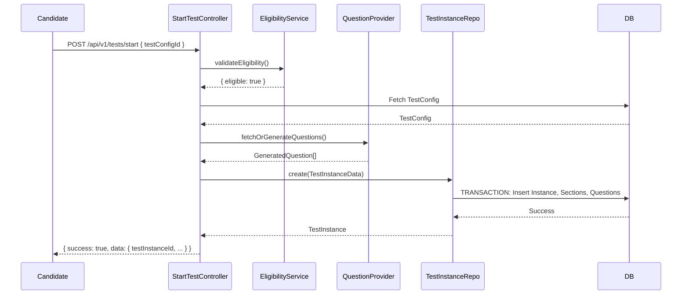

# Day 2 MVP: Start Test Flow

## Objective

Implement `POST /api/v1/tests/start` to initialize a new test instance for a candidate.

## Request Flow

1. **Candidate Dashboard** -> Clicks "Start Assessment".
2. **API Request** -> `POST /api/v1/tests/start` with `testConfigId`.
3. **Authentication** -> `JwtAuthGuard` extracts `userId`.
4. **Validation** -> `EligibilityService` validates user account, test limits, attempt limits, and config status.
5. **Fetch Configuration** -> Retrieves sections and metadata.
6. **Fetch/Generate Questions** -> Maps sections to concept/difficulty. Attempts to pull from Question Pool. If empty, throws error to trigger Generation Engine (abstraction).
7. **Assembly** -> Maps TestInstance sections and questions.
8. **Persistence** -> `TestInstanceService` runs DB transaction to insert `TestInstance`, `TestInstanceSection`, `TestInstanceQuestion`.
9. **Response** -> Returns standard response envelope with `testInstanceId` and `instructionsUrl`.

## Sequence Diagram

## Database Writes

- `TestInstance`: 1 row inserted.
- `TestInstanceSection`: N rows inserted (one per config section).
- `TestInstanceQuestion`: M rows inserted (per section requirement).

## Dependencies

- `@prisma/client` (TestInstance, TestConfig, User)
- `class-validator`
- `JwtAuthGuard`

## Error Catalog

- `TEST_CONFIG_NOT_FOUND`: Config does not exist.
- `USER_NOT_ELIGIBLE`: Account inactive or doesn't exist.
- `ACTIVE_TEST_EXISTS`: Candidate already has an ongoing test.
- `QUESTION_POOL_EMPTY`: No pre-generated questions available.
- `ASSEMBLY_FAILED`: Failed to structure sections.
- `TEST_CREATION_FAILED`: Transaction rollback/failure.
