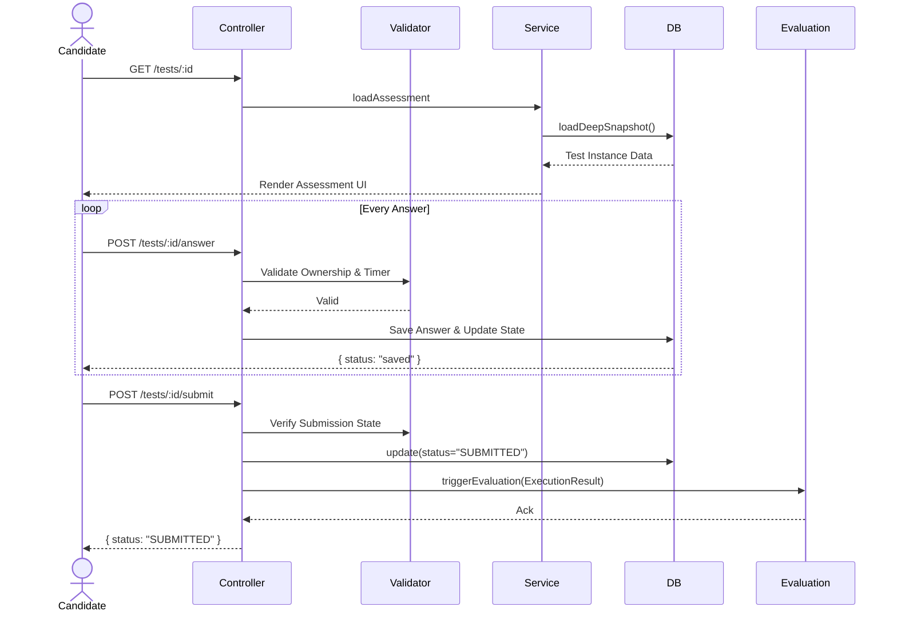

# Execution APIs (Day 4)

## Overview

This document outlines the API endpoints for the Assessment Execution Lifecycle.
All endpoints are protected by `JwtAuthGuard` and enforce ownership and timer rules.

## Standard Response Format

All endpoints return responses wrapped by the global `ResponseInterceptor` in the format:

```json
{
  "success": true,
  "data": { ... },
  "error": null,
  "meta": {
    "timestamp": "2026-06-12T04:40:00Z"
  }
}
```

## Endpoints

### 1. Load Assessment Snapshot

`GET /api/v1/tests/:id`

- **Purpose**: Load assembled assessment snapshot.
- **Rules**: Never regenerates questions. Validates ownership.
- **Returns**: Snapshot with sections and questions.

### 2. Resume Assessment

`GET /api/v1/tests/:id/resume`

- **Purpose**: Fetch current active state and saved answers for interrupted sessions.
- **Returns**: Execution state (remaining timer, current question index) and list of candidate answers.

### 3. Autosave Answer

`POST /api/v1/tests/:id/answer`

- **Purpose**: Autosave candidate answer.
- **Validations**: Active state, timer valid, question exists, ownership.
- **Payload**:

```json
{
  "questionId": "string",
  "answer": "string | object",
  "timeSpentSeconds": 15,
  "isMarkedForReview": false
}
```

- **Returns**: `{ "status": "saved" }`. If expired, it triggers auto-submission and returns `403 Forbidden` (`TIMER_EXPIRED`).

### 4. Submit Assessment

`POST /api/v1/tests/:id/submit`

- **Purpose**: Submit assessment, lock, and trigger evaluation.
- **Rules**: Executes in a single Prisma `$transaction`. Transitions status to `SUBMITTED`, locks further answers.
- **Returns**: `{ "submissionId": "string", "status": "SUBMITTED" }`

## Error Catalogue

- `ASSESSMENT_NOT_FOUND` (404)
- `FORBIDDEN` (403)
- `ASSESSMENT_ALREADY_SUBMITTED` (409)
- `TIMER_EXPIRED` (200) - Triggers auto-submit and returns `EXPIRED_AND_SUBMITTED`
- `INVALID_QUESTION` (400)
- `EXECUTION_STATE_INVALID` (400)

## Sequence Diagram

### Normal Execution & Submission Flow


