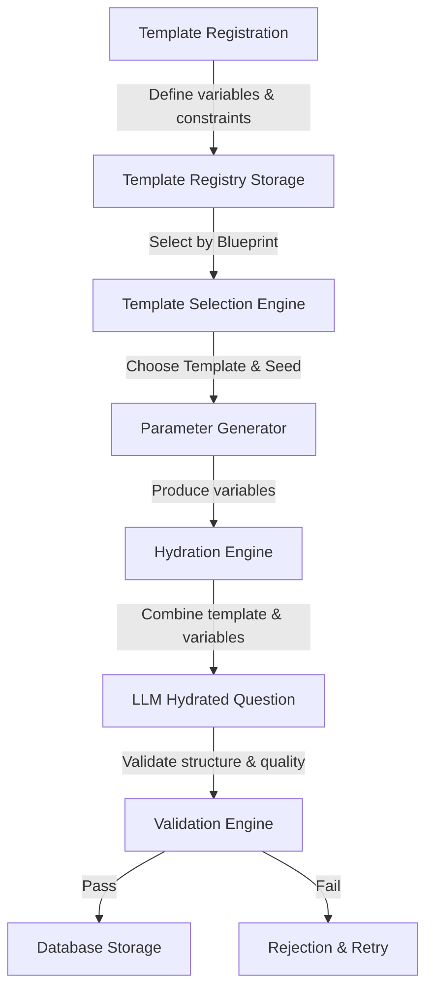

# Question Template Architecture

**Module:** 1.3.1 Template Repository  
**Objective:** Define the structure, lifecycle, validation, and storage of question templates.  
**Version:** 1.0.0

---

## 1. Overview

The **Question Template Repository** is the master library of structured question patterns. Rather than using freeform LLM prompting, the system uses templates composed of static text, variable placeholders, and strict schemas. This ensures that generated questions are:

- **Deterministic:** Using a seed yields reproducible questions.
- **Consistent:** Output matches high standards of style and syntax.
- **Validatable:** Variables and final outputs are checked against schemas.
- **Versionable:** Changes to templates can be tracked over time.

---

## 2. Template Lifecycle Flow

The following diagram details the end-to-end lifecycle of a template from definition to generated question storage:

---

## 3. Lifecycle Stages

### Stage 1: Template Definition & Registration

- **Input:** A developer defines the `QuestionTemplate` metadata, the static text, and the `VariableSchema`.
- **Action:** The template is validated to ensure it has no duplicate variables, matches supported difficulty/type matrices, and is syntactically sound.
- **Output:** Saved into the registry (e.g. JSON files or database).

### Stage 2: Selection

- **Input:** Exam configuration requirements (e.g., Topic: Arrays, Concept: Sliding Window, Difficulty: Medium).
- **Action:** The system filters templates by matching `topicId`, `conceptId`, `difficulty`, and `templateType` attributes.
- **Output:** Selected template ID.

### Stage 3: Parameter Generation (Hydration)

- **Input:** A seed (e.g. hash of config + candidate ID) is fed into a SFC32 Pseudo-Random Number Generator (PRNG).
- **Action:** The system selects random variable values within constraints (e.g. picking names from array, generating random integers between 10 and 50).
- **Output:** Hydrated parameters (variables).

### Stage 4: AI Hydration & Compilation (Module 2)

- **Input:** The template string and the generated parameters.
- **Action:** The LLM fills in the placeholders and generates the options, correct answer, and explanation.
- **Output:** Concrete candidate question.

### Stage 5: Validation & Storage

- **Input:** The candidate question.
- **Action:** Checked against the `GeneratedQuestion` contract. Verify that correct answers match options, formatting is valid, and metadata matches.
- **Output:** Saved to persistent storage.

---

## 4. Versioning and Deprecation

- Every template has a `version` field (integer, starts at `1`).
- Editing a template increments its version.
- Old versions of templates are marked as `active: false` (deprecated) so they are no longer selected for new exams, but remain in the database to allow auditing of historical candidate questions.
