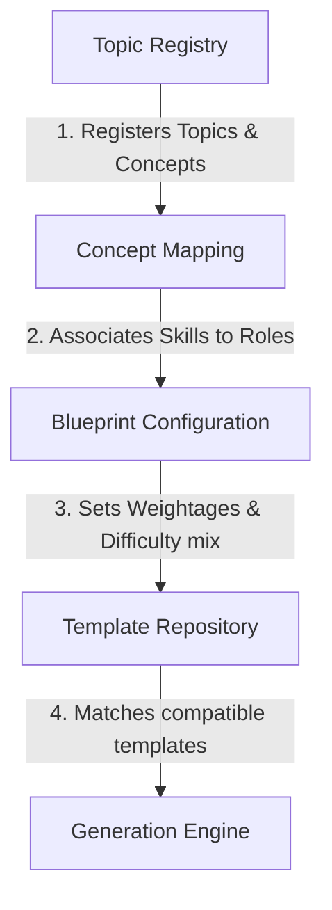

# Template Dependency Mapping

**Module:** 1.3.1 Template Repository  
**Objective:** Map dependencies across registration, blueprints, templates, and execution.  
**Version:** 1.0.0

---

## 1. Pipeline Dependency Flow

The assessment engine relies on a strict order of operations. Downstream generation cannot execute unless the upstream registry and template contracts are validated:

---

## 2. Dependency Descriptions

### 1. Topic Registry (Root Dependency)

- **Outputs:** Canonical topics, subtopics, and concepts.
- **Impact:** If a concept or topic is missing here, it cannot be targeted in blueprints or templates.

### 2. Concept Mapping

- **Outputs:** Mappings of concepts to professional roles (e.g., Frontend, Backend).
- **Dependency:** Consumes topics/concepts directly from the **Topic Registry**.

### 3. Blueprint Configuration

- **Outputs:** Exam structure, section weightages, and difficulty quotas.
- **Dependency:** Reconciles the required skills from **Concept Mapping** with the **Topic Registry** to set constraints on what needs to be generated.

### 4. Template Repository

- **Outputs:** Validated templates matching the required topic/concept/difficulty mix.
- **Dependency:** Reads blueprint parameters and matches them against registered `QuestionTemplate` contracts.

### 5. Generation Engine (Consumer)

- **Outputs:** Hydrated and validated `GeneratedQuestion` outputs.
- **Dependency:** Retrieves templates and variable schemas from the **Template Repository**, runs parameters hydration, and executes LLM mapping.
