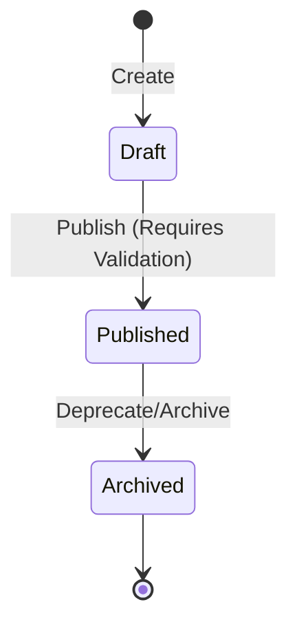

# Template Repository Architecture

**Module:** 1.3.1 Template Repository  
**Objective:** Define the hierarchy, relationship, and lifecycle states of question templates.  
**Version:** 1.0.0

---

## 1. Hierarchy Flow

The template engine relies on a strict parent-child relational hierarchy. Downstream question generation resolves dependencies in the following linear direction:

```
[ Topic (Topic Registry) ]
          │
          ▼
[ Concept (Concept Registry) ]
          │
          ▼
[ Question Template ]
          │
          ▼
[ Variable Schema Constraints ]
          │
          ▼
[ Hydrated Variables ]
          │
          ▼
[ Generated Question ]
```

### Definitions:
1.  **Topic:** The broad subject of assessment (e.g., `"Software Engineering Basics"`, `"JavaScript Basics"`).
2.  **Concept:** The sub-skill or specific mechanism tested under the Topic (e.g., `"Closures & Scope"`, `"Array Indexing"`).
3.  **Question Template:** The structured, parameterized design pattern mapping to a Concept. It contains static text, placeholder variables, and expected difficulty ratings.
4.  **Variable Schema Constraints:** A set of constraints defined inside the template that specifies the ranges, types, and choices available for every template parameter.
5.  **Hydrated Variables:** Concrete parameter mappings generated dynamically for a candidate's exam session using a seed.
6.  **Generated Question:** The final hydrated, validated question presented to the candidate.

---

## 2. Template Lifecycle States

Every template must reside in one of three lifecycle states. Transitions between these states are governed by strict editing and immutability rules:



### 1. Draft
*   **Definition:** An in-development, unverified template.
*   **Rules:**
    *   **Mutable:** Fields can be edited freely.
    *   **Not Selectable:** Cannot be chosen by the exam selection engine for active assessments.
    *   **Version:** Stays at `version: 1` during development.

### 2. Published
*   **Definition:** An active, verified template available for assessment generation.
*   **Rules:**
    *   **Immutable:** To guarantee assessment consistency, a Published template **cannot** be modified in place.
    *   **Versioning Trigger:** Any attempt to edit a Published template creates a new version record. The old record is archived or kept as a historical snapshot.
    *   **Selectable:** Available for inclusion in blueprints.

### 3. Archived
*   **Definition:** A deprecated or retired template.
*   **Rules:**
    *   **Immutable:** Cannot be modified.
    *   **Not Selectable:** Removed from the pool of templates selectable for new assessments.
    *   **Audit-Ready:** Retained in the database to allow historical grades and past assessments to remain auditable.
