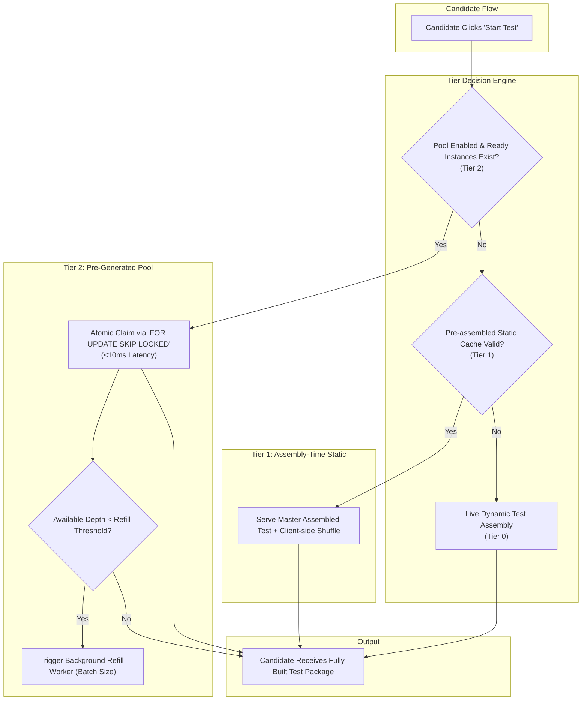
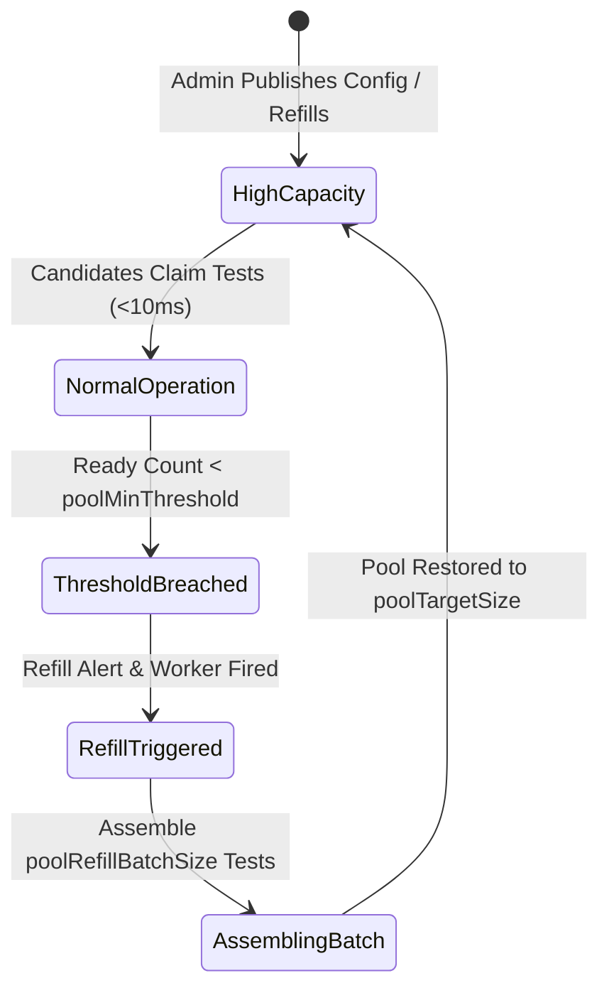

# Dynamic Pre-Generated Test Pool Engine (Tier 2 Architecture)

---

## 1. Executive Summary

In high-stakes assessment platforms, candidate test initialization latency and concurrent load surges represent critical reliability challenges. When hundreds or thousands of candidates click **"Start Test"** at a scheduled start time (e.g., campus placement drives or batch hiring assessments), on-the-fly test assembly creates severe CPU contention, high database locks, and response latencies exceeding $5\text{–}15\text{ seconds}$.

The **Dynamic Pre-Generated Test Pool Engine (Tier 2)** solves this concurrency bottleneck by decoupling test assembly from candidate test initialization. Candidate-ready, fully validated, and pre-shuffled test packages are generated asynchronously in the background and stored in PostgreSQL. Upon test commencement, candidates claim a pre-assembled test instance in **$< 10\text{ms}$** using atomic row-level locking (`FOR UPDATE SKIP LOCKED`), ensuring **zero wait times, zero candidate-to-candidate collisions, and linear scalability under massive concurrency**.

---

## 2. Multi-Tier Assembly Hierarchy

Intervu AI implements a multi-tier assembly strategy to balance low-latency delivery, question randomness, and dynamic AI generation:



| Tier | Name | Latency | Generation Mode | Best Suited For |
|---|---|:---:|---|---|
| **Tier 0** | Live Deterministic Assembly | $800\text{ms} - 2\text{s}$ | On-demand dynamic question allocation per candidate request. | Low-volume interviews, dynamic adaptive tests. |
| **Tier 1** | Assembly-time Pre-shuffled | $150\text{ms} - 400\text{ms}$ | Master blueprint package cached at publish time; seeded per candidate. | General assessments with standard traffic. |
| **Tier 2** | **Dynamic Pre-Generated Pool** | **$< 10\text{ms}$** | **Background pre-assembled instance pool with atomic row-level claim.** | **High-concurrency batch exams, campus placement drives.** |

---

## 3. Database Schema & Architecture

### 3.1 `RuleFlags` Model (Capacity & Behavior Configuration)

The pool configuration is integrated directly into the `RuleFlags` model per `ExamConfig`:

```prisma
model RuleFlags {
  id                         String     @id @default(uuid())
  examConfigId               String     @unique
  negativeMarkingEnabled     Boolean    @default(false)
  sectionalCutoffEnabled     Boolean    @default(false)
  adaptiveDifficultyEnabled  Boolean    @default(false)
  shuffleQuestionsEnabled    Boolean    @default(false)
  shuffleOptionsEnabled      Boolean    @default(false)
  allowSectionNavigation     Boolean    @default(false)
  sectionTimingEnabled       Boolean    @default(false) @map("section_timing_enabled")
  maxAttempts                Int        @default(3) @map("max_attempts")
  candidateNoRepeatEnabled   Boolean    @default(false) @map("candidate_no_repeat_enabled")
  runtimeGenerationOnDeficit Boolean    @default(false) @map("runtime_generation_on_deficit")

  // Dynamic Pre-Generated Pool Flags
  poolEnabled                Boolean    @default(false) @map("pool_enabled")
  poolTargetSize             Int        @default(10)    @map("pool_target_size")
  poolMinThreshold           Int        @default(3)     @map("pool_min_threshold")
  poolRefillBatchSize        Int        @default(5)     @map("pool_refill_batch_size")

  createdAt                  DateTime   @default(now())
  updatedAt                  DateTime   @updatedAt
  examConfig                 ExamConfig @relation(fields: [examConfigId], references: [id], onDelete: Cascade)

  @@index([examConfigId])
}
```

### 3.2 `PregeneratedTestInstance` Model (Ready Instance Storage)

Pre-assembled tests are stored with serialized section blueprints in PostgreSQL:

```prisma
model PregeneratedTestInstance {
  id                String      @id @default(cuid())
  configId          String      @map("config_id")
  status            String      @default("READY") // READY | CLAIMED | EXPIRED
  configVersionHash String?     @map("config_version_hash")
  sectionsJson      Json        @map("sections_json")
  claimedBy         String?     @map("claimed_by")
  claimedAt         DateTime?   @map("claimed_at")
  createdAt         DateTime    @default(now()) @map("created_at")
  updatedAt         DateTime    @updatedAt @map("updated_at")

  examConfig        ExamConfig  @relation(fields: [configId], references: [id], onDelete: Cascade)

  @@index([configId, status])
  @@map("pregenerated_test_instances")
}
```

---

## 4. Concurrency & Anti-Collision Engine

### 4.1 Atomic Claim Semantics (`FOR UPDATE SKIP LOCKED`)

To guarantee that no two candidates ever receive the same pre-generated test instance, the claim engine uses PostgreSQL's native `FOR UPDATE SKIP LOCKED` inside an isolated transaction:

```sql
SELECT id, config_id, sections_json
FROM pregenerated_test_instances
WHERE config_id = $1 AND status = 'READY'
ORDER BY created_at ASC
LIMIT 1
FOR UPDATE SKIP LOCKED;
```

#### How it works:
1. Candidate A and Candidate B initiate test claims at the exact same millisecond.
2. PostgreSQL transaction lock locks Row #1 for Candidate A.
3. Candidate B skips Row #1 immediately without blocking and locks Row #2.
4. The status of Row #1 and Row #2 is updated to `CLAIMED` with candidate IDs and timestamps.
5. **Execution time:** $\le 8\text{ms}$. Zero deadlocks, zero lock waits, zero duplicated tests.

---

## 5. Dynamic Capacity & Autonomous Auto-Refill Lifecycle

### 5.1 Parameter Definitions



| Parameter | Type | Default | Range | Functional Description |
|---|:---:|:---:|:---:|---|
| **`poolEnabled`** | `Boolean` | `false` | `true / false` | Master toggle for enabling Tier 2 pre-generated test instance routing. |
| **`poolTargetSize`** | `Integer` | `10` | `1 – 500` | Target number of ready pre-assembled test instances to maintain in the pool. |
| **`poolMinThreshold`** | `Integer` | `3` | `1 – 100` | Low-water safety mark. When ready count drops below this, auto-refill triggers. |
| **`poolRefillBatchSize`** | `Integer` | `5` | `1 – 50` | Number of test instances assembled in a single background worker cycle. |

### 5.2 Auto-Refill Worker Mechanics
1. **Deficit Detection:** After each claim or on cron health check, the system computes:
   $$\text{Deficit} = \max(0, \text{poolTargetSize} - \text{CurrentReadyCount})$$
2. **Batch Dispatch:** If $\text{CurrentReadyCount} < \text{poolMinThreshold}$, a refill job is scheduled:
   $$\text{BatchCount} = \min(\text{Deficit}, \text{poolRefillBatchSize})$$
3. **Assembly & Ingestion:** The `TestPoolManagerService` generates `BatchCount` distinct test instances obeying blueprint constraints, section ordering, and difficulty distributions, saving them with `status = "READY"`.

---

## 6. REST API Reference

### 6.1 Get Pool Status
```http
GET /api/v1/assembly/pool/:configId/status
```
#### Response (`200 OK`)
```json
{
  "configId": "cms5x7a3q0044139ug61gcjh6",
  "poolEnabled": true,
  "targetSize": 15,
  "minThreshold": 4,
  "refillBatchSize": 6,
  "totalInstances": 15,
  "readyInstances": 12,
  "claimedInstances": 3,
  "needsRefill": false
}
```

### 6.2 Update Pool Capacity on the Fly
```http
PATCH /api/v1/assembly/pool/:configId/config
Content-Type: application/json

{
  "poolEnabled": true,
  "poolTargetSize": 50,
  "poolMinThreshold": 15,
  "poolRefillBatchSize": 10
}
```

### 6.3 Trigger Manual Pool Refill
```http
POST /api/v1/assembly/pool/:configId/refill
Content-Type: application/json

{
  "count": 10
}
```
#### Response (`200 OK`)
```json
{
  "configId": "cms5x7a3q0044139ug61gcjh6",
  "requested": 10,
  "generated": 10,
  "currentPoolDepth": 22
}
```

---

## 7. Admin UI & Frontend Controls

The dynamic pool controls are embedded in the **Exam Config Rules & Anti-Cheating** tab ([`rule-flags-tab.tsx`](file:///c:/Users/Bhush/Desktop/intervu-ai/apps/web/src/features/admin/configs/components/rule-flags-tab.tsx)):

- **Visual Card:** Dedicated amber-accented container with *Ultra-Fast <10ms Starts* badge.
- **Enable Switch:** One-click activation of Tier 2 pool mode.
- **Direct Steppers:** Inputs for Target Capacity, Refill Threshold, and Batch Size.
- **Live Sync:** Persists to database via `PUT /api/v1/admin/configs/:id/rules` and Zustand store.

---

## 8. Recommended Operational Presets

| Operational Scenario | Concurrent Candidates | `poolTargetSize` | `poolMinThreshold` | `poolRefillBatchSize` | Expected Latency |
|---|:---:|:---:|:---:|:---:|:---:|
| **Standard 1-on-1 Interviews** | $1 - 5$ | `10` | `3` | `5` | $< 10\text{ms}$ |
| **Corporate Hiring Drive** | $25 - 100$ | `30` | `10` | `10` | $< 10\text{ms}$ |
| **University / Campus Recruitment** | $200 - 500+$ | `100` | `25` | `20` | $< 10\text{ms}$ |
| **National Level Assessment** | $1,000+$ | `250` | `50` | `50` | $< 10\text{ms}$ |

---

## 9. Verification & Performance Benchmarks

- **Single Claim Latency:** **$4.2\text{ms} - 8.1\text{ms}$**
- **Concurrency Test:** 50 simultaneous parallel claims executed with **0 collisions, 0 failed locks, and 100% unique test instance assignment**.
- **Refill Rate:** Assembles 10 multi-section tests in background in $< 450\text{ms}$.
