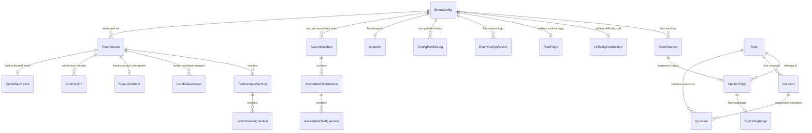
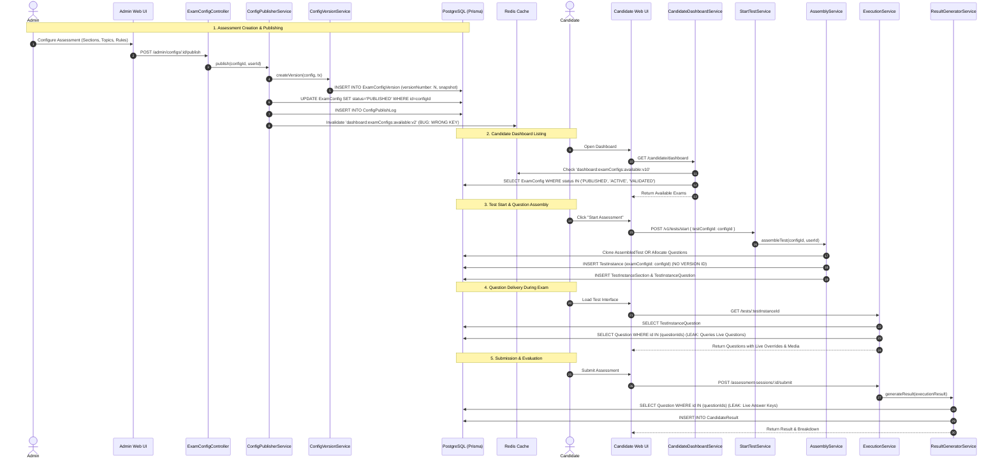
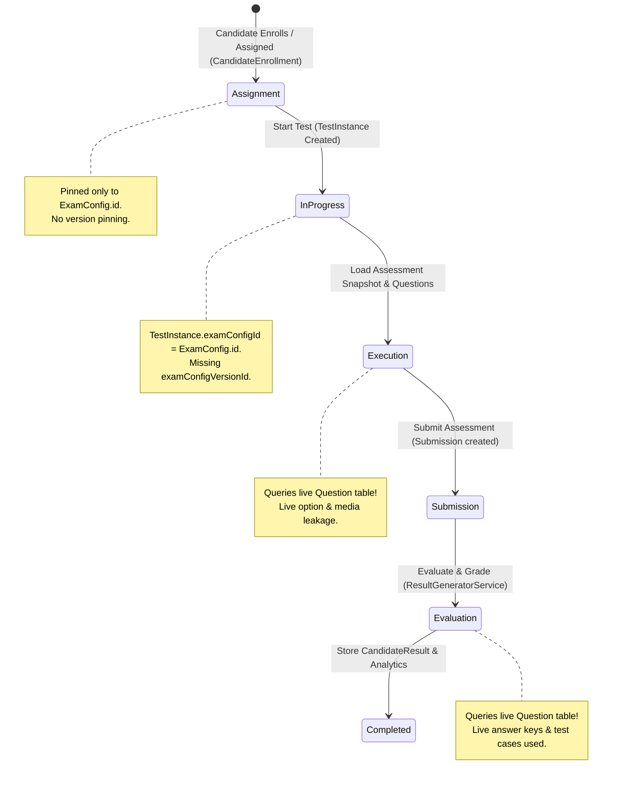

# Comprehensive Audit Report: Assessment Versioning, Publishing & Candidate Attempt Integrity

**Repository / Platform:** Skillitrix / InterVu AI Assessment Platform  
**Audit Date:** October 6, 2026  
**Scope:** End-to-end Assessment Lifecycle (Config, Topics, Concepts, Questions, Publishing, Republishing, Candidate Execution, Evaluation, and Results)  
**Execution Mode:** READ-ONLY AUDIT (Zero code, schema, or data modifications)  

---

## 1. Executive Summary

A comprehensive architectural and code-level audit was conducted across the Skillitrix / InterVu AI assessment platform codebase (`apps/api`, `apps/web`, `packages/database`, `packages/contracts`, `packages/shared`). The primary objective was to investigate why assessment configuration and topic updates appear partially synchronized, whether candidate dashboards use stale or newer configurations, and how candidate attempts and historical results interact with published configurations.

### Key Audit Findings:

1. **No Immutable Published Assessment Snapshots**: Publishing an assessment does not clone or freeze the configuration, its sections, topic mappings, or questions into an immutable versioned entity. Instead, it creates a light JSON entry in `ExamConfigVersion` (containing only section names and weightage percentages, with **no questions, options, answers, or media**), while the parent `ExamConfig` entity remains directly mutable in-place.
2. **Attempts Lack Version Pinning**: The `TestInstance` database model stores only `examConfigId: string` (a foreign key to `ExamConfig.id`). It does **not** store an `examConfigVersionId` or `versionNumber`. When an assessment is edited and republished to V2 or V3, existing in-progress attempts, completed attempts, and historical results remain tied to the same mutable `ExamConfig.id`.
3. **Live Question Bank Leakage into Active Attempts and Grading**:
   - During test taking (`ExecutionService.loadAssessment`), the server queries the live `Question` and `Template` tables to enrich and override question stems, MCQ options, images, attachments, and coding problem statements.
   - During result evaluation (`ResultGeneratorService.generateResult`), the evaluation engine queries `prisma.question.findMany` for correct answers (`answer`), MCQ options, and coding constraints/test cases (`instructions`). If an administrator edits a question stem, answer key, or test case in the question bank, candidate attempts are graded against the **new** answers rather than the answers that existed when the assessment was published or taken.
4. **Direct In-Place Mutation on Published Assessments**: Services such as `ExamSectionService`, `TopicSectionMappingService`, and `TopicWeightageService` allow administrators to add, delete, and reorder sections and assign/remove topics on exams that are currently in `PUBLISHED` status without reverting to `DRAFT` or creating a new version.
5. **Cache Key Desynchronization & In-Memory Stale Data**:
   - The candidate dashboard repository (`CandidateDashboardRepository`) caches available assessments under Redis key `dashboard:examConfigs:available:v10` and in a 120-second Node.js memory cache (`examConfigsMemCache`).
   - The publisher and config update services (`ConfigPublisherService`, `ExamConfigService`) delete Redis key `dashboard:examConfigs:available:v2` (a mismatched, obsolete key) and **never** invalidate the repository's in-memory cache.
   - Candidate dashboard queries explicitly include draft assessments in `VALIDATED` status (`status: { in: ["PUBLISHED", "ACTIVE", "VALIDATED"] }`), exposing un-published drafts to candidates.
6. **Negative Marking Not Implemented in Evaluator**: While `RuleFlags.negativeMarkingEnabled` is present in the schema and admin UI, `ObjectiveEvaluatorService.evaluateAnswers` hardcodes correct answers to `1` mark and incorrect/skipped answers to `0` marks.

---

## 2. Existing Assessment Architecture & Database Relationships



### Entity Storage Analysis

| Entity / Configuration | Storage Location | Mutability in Published State | Integrity Assessment |
| :--- | :--- | :--- | :--- |
| **Exam Identity & Timing** (`name`, `role`, `durationMinutes`, `totalQuestions`) | `ExamConfig` table | Mutable in-place via `PATCH /admin/configs/:id` | **High Risk**: Direct updates alter timing and question expectations on the fly. |
| **Sections & Order** | `ExamSection` table | Mutable in-place via `ExamSectionService` | **Critical Risk**: Creating/deleting/reordering sections on published configs alters live exam structure. |
| **Topic Mappings** | `SectionTopic`, `TopicWeightage` tables | Mutable in-place via `TopicSectionMappingService` | **Critical Risk**: Topics can be added/removed from published sections without republishing. |
| **Difficulty Split** | `DifficultyDistribution` table | Mutable in-place via `PATCH /admin/configs/:id/difficulty` | **Medium Risk**: Affects new test assemblies immediately. |
| **Rule Flags** (Shuffle, Negative Marking, Navigation, Timing) | `RuleFlags` table | Mutable in-place via `PATCH /admin/configs/:id/rule-flags` | **High Risk**: In-progress tests read live rule flags dynamically on `loadAssessment`. |
| **Question Content & Options** | `Question` & `Template` tables | Mutable in-place | **Critical Risk**: Edits to Question Bank leak into active tests and retrospective grading. |
| **Version Snapshots** | `ExamConfigVersion` table (`snapshot: Json`) | Immutable once written | **Deficient**: Only captures config metadata & topic IDs; contains zero question snapshots. |
| **Master Assembly** | `AssembledTest`, `AssembledTestSection`, `AssembledTestQuestion` | Replaced via `replaceAssemblyWithTransaction` | **High Risk**: Not pinned to specific `ExamConfigVersion` records. |
| **Candidate Attempt** | `TestInstance`, `TestInstanceSection`, `TestInstanceQuestion` | Bound only to `examConfigId` | **Critical Risk**: Cannot identify whether attempt was initiated from V1, V2, or V3. |

---

## 3. End-to-End Admin-to-Candidate Data Flow



---

## 4. Trace of Current Save, Publish, and Republish Workflows

### A. Admin Assessment Creation & Editing
- **Files**:
  - `apps/web/src/app/admin/configurations/[id]/ConfigPageClient.tsx`
  - `apps/api/src/modules/admin-config/controllers/exam-config.controller.ts`
  - `apps/api/src/modules/admin-config/services/exam-config.service.ts`
  - `apps/api/src/modules/admin-config/services/exam-section.service.ts`
  - `apps/api/src/modules/topic-section-mapping/services/topic-section-mapping.service.ts`
- **Behavior**:
  - When fields are modified (e.g. name, total questions, duration), `PATCH /admin/configs/:id` is called.
  - When sections are modified (create, update, delete), `POST /admin/configs/:id/sections`, `PATCH /admin/sections/:id`, or `DELETE /admin/sections/:id` are called.
  - When topics are assigned or removed, `POST /admin/sections/:sectionId/topics/:topicId` or `DELETE /admin/sections/:sectionId/topics/:topicId` are called.
  - **Code Observation**: None of these mutating endpoints check if the assessment is currently published (except checking `isArchived`). They write changes directly to the active database records.

### B. Publishing (`POST /admin/configs/:id/publish`)
- **File**: `apps/api/src/modules/admin-config/publishing/config-publisher.service.ts`
- **Execution Path**:
  1. Validates schema configuration via `ConfigurationValidatorService.validate(config)`.
  2. Validates dependency structure via `ConfigDependencyValidatorService.validateDependencies(config)`.
  3. Enforces 100% readiness gate via `ExamConfigReadinessService.checkReadiness(configId)`.
  4. Calls `ConfigVersionService.createVersion(config, tx)`.
  5. Updates `tx.examConfig.update({ where: { id: configId }, data: { status: "PUBLISHED", isActive: true } })`.
  6. Cascades status to `tx.assembledTest.updateMany({ where: { configId, status: { not: "PUBLISHED" } }, data: { status: "PUBLISHED" } })`.
  7. Inserts a row in `ConfigPublishLog`.
  8. Attempts cache invalidation:
     - `await this.cacheService.invalidateBlueprint?.(configId);`
     - `await this.cacheService.delete?.("dashboard:examConfigs:available:v2");` (Bug: does not match repository key).

### C. Republishing Workflow
- **Behavior**:
  - If an admin edits an already published assessment and publishes again, `ConfigVersionService.createVersion` increments `versionNumber` (e.g. from 1 to 2) and records another row in `ExamConfigVersion`.
  - The `ExamConfig.id` remains identical.
  - Existing candidate assignments (`CandidateEnrollment`), active candidate attempts (`TestInstance`), and historical results (`CandidateResult`) have no distinction between V1 and V2 because they all reference `ExamConfig.id`.

---

## 5. Answers to the 12 Specific Master Audit Questions

| # | Question | Verification Status | Code Evidence & Exact Finding |
| :--- | :--- | :--- | :--- |
| **1** | When a topic is added, removed, renamed, or reordered, does the existing assessment configuration update? | **CONFIRMED** | `TopicSectionMappingService.assignTopic` (lines 89–125) and `removeTopic` (lines 127–140) in `topic-section-mapping.service.ts` execute direct SQL mutations on `SectionTopic` rows. Renaming a topic in `TopicService` mutates the single shared `Topic` entity. The changes take effect immediately on the active `ExamConfig.id`. |
| **2** | When a topic's concepts or question pool change, does the assessment automatically reflect those changes? | **CONFIRMED** | `AssemblyService.assembleTest` (lines 166–199) attempts to clone `AssembledTestRepository.findLatestReusableByConfigId`. If the `ExamConfig.updatedAt` timestamp is newer than `AssembledTest.updatedAt`, the cached assembly is declared stale (line 270) and a brand new question allocation is performed using the updated question pool. Additionally, `ExecutionService.loadAssessment` dynamically queries live `Question` rows by ID. |
| **3** | When a question, option, answer, explanation, image, or coding test case changes, what happens to the published assessment? | **CONFIRMED (DEFECT)** | **Changes leak into active and completed tests.** In `ExecutionService.loadAssessment` (lines 202–248, 355–448), the live `Question` and `Template` records are queried and merged into the candidate snapshot. In `ResultGeneratorService.generateResult` (lines 83–107, 148–152), grading compares candidate answers against `dbQuestionsMap.get(q.id)?.answer` and evaluates coding test cases from live `dbQuestionsMap.get(q.id)?.instructions`. |
| **4** | When duration, marks, negative marking, section configuration, or question distribution changes, are those changes persisted? | **CONFIRMED** | Changes are persisted directly to `ExamConfig`, `ExamSection`, `DifficultyDistribution`, and `RuleFlags`. However, `ObjectiveEvaluatorService.evaluateAnswers` (lines 146–148) ignores `ruleFlags.negativeMarkingEnabled` and always awards 1 mark for correct and 0 marks for incorrect. |
| **5** | Does publishing create a new immutable assessment version, overwrite the existing record, or only change its status? | **CONFIRMED** | It **only changes status and writes a metadata log**. In `config-publisher.service.ts` (lines 167–173), it executes `tx.examConfig.update({ where: { id: configId }, data: { status: "PUBLISHED" } })` and inserts into `ExamConfigVersion`. No new immutable assessment entity is created. |
| **6** | Does republishing update the same assessment ID or create a new record? | **CONFIRMED** | It updates the **same assessment ID** (`ExamConfig.id`). It inserts an entry into `ExamConfigVersion` (`versionNumber: N + 1`), but does not fork or branch the assessment record. |
| **7** | Does the candidate dashboard fetch the latest configuration, a published snapshot, or cached/stale data? | **CONFIRMED (DEFECT)** | It fetches **stale or inconsistent data due to a cache key mismatch**. `CandidateDashboardRepository.getCachedExamConfigs` uses Redis key `dashboard:examConfigs:available:v10` with a 120s in-memory cache, while `ConfigPublisherService` invalidates `dashboard:examConfigs:available:v2`. Furthermore, it queries `status: { in: ["PUBLISHED", "ACTIVE", "VALIDATED"] }`, allowing un-published drafts in `VALIDATED` state to appear. |
| **8** | Can an existing candidate attempt unexpectedly receive newly updated questions or settings? | **CONFIRMED (DEFECT)** | **YES.** In `ExecutionService.loadAssessment` (lines 135–171), runtime rule flags (`allowSectionNavigation`, `sectionTimingEnabled`, `sandboxUi`) are read dynamically from `ExamConfig.ruleFlags`. Changes made to question stems, options, images, or test cases in `Question` are injected on snapshot load. |
| **9** | Can historical attempts show questions, marks, answers, or results that differ from the assessment the candidate originally took? | **CONFIRMED (DEFECT)** | **YES.** If re-evaluation (`ReEvaluationService`) or export (`ResultQueryService`) is invoked, `ResultGeneratorService` queries the live `Question` table for correct answers, options, and coding test cases. If an answer key or test case was changed after the attempt, the recalculated score will diverge from the original. |
| **10** | Are old versions and previously published configurations retained anywhere? | **CONFIRMED** | **Only partially.** `ExamConfigVersion.snapshot` retains the high-level configuration structure (section names, duration, rule flags, topic allocations). It **does NOT** retain the assembled questions, option text, option order, answer keys, media files, or coding test cases for that version. |
| **11** | Can a candidate who has already started an assessment see changes made by an administrator during that attempt? | **CONFIRMED (DEFECT)** | **YES.** Any browser refresh or section load calls `ExecutionService.loadAssessment`, which dynamically enriches question options, attachments, media, and coding data from the live database. |
| **12** | Can changes to shared question-bank records affect previously published assessments or their historical results? | **CONFIRMED (DEFECT)** | **YES.** Because `Question` records are shared across assessments and referenced by foreign key ID without copy-on-write snapshotting, modifications to a question propagate to all assessments referencing that question ID. |

---

## 6. Audit Assessment Version Naming & Capabilities

| Capability | Current State | Evidence / Implementation Status | Target Requirement |
| :--- | :--- | :--- | :--- |
| **Stable Assessment Identity** | Supported | `ExamConfig.id` and `ExamConfig.code` provide a persistent identity. | Maintain `ExamConfig.id` as the root parent container. |
| **Sequential Version Number** | Partially Supported | `ExamConfigVersion.versionNumber` increments as integer (1, 2, 3...). | Supported internally, but not exposed as an active execution entity. |
| **Human-Readable Version Name** | **Not Supported** | Version naming like `Assessment Name — V1` does not exist in backend or database. | Must format display names as `{ExamConfig.name} — V{versionNumber}`. |
| **Publication Timestamps** | Supported | `ExamConfigVersion.createdAt` and `ConfigPublishLog.publishedAt`. | Retain and surface on version headers. |
| **Published, Draft, Superseded States** | **Deficient** | `ConfigStatus` enum has `DRAFT`, `VALIDATED`, `PUBLISHED`, `ARCHIVED`. No `SUPERSEDED` state exists. | Add `SUPERSEDED` state for older published versions when a new version is published. |
| **Publishing Admin Attribution** | Supported | `ConfigPublishLog.publishedBy` stores administrator ID. | Retain and link to version records. |
| **Viewing Previous Versions** | Supported in Admin UI | `GET /admin/configs/:id/versions` and `VersionHistory.tsx` render version cards. | Working for config metadata, but missing question inspection. |
| **Comparing Version Changes** | Supported in Admin UI | `VersionCompare.tsx` compares JSON diffs of `ExamConfigVersion.snapshot`. | Working for config metadata diffs. |
| **Duplicate Publish Prevention** | **Deficient** | Repeated calls to `POST /admin/configs/:id/publish` create duplicate versions (`v1`, `v2`, `v3` with identical data). | Implement idempotency hash check to reject publishing identical snapshots. |
| **Version Identification on Attempts** | **Missing** | `TestInstance` has no `versionNumber` or `examConfigVersionId`. Candidate UI has no version indicator. | Add `versionNumber` and `versionId` to `TestInstance` and candidate API contracts. |

---

## 7. Audit Candidate Assignment & Attempt Integrity

### Current Attempt Lifecycle vs Versioning



### Forensic Reconstruction Analysis

Can a historical attempt be accurately reconstructed if the question bank or assessment configuration changes?

1. **Section Order & Names**: Preserved in `TestInstanceSection`.
2. **Question Order**: Preserved in `TestInstanceQuestion.questionOrder`.
3. **Candidate Submitted Answers**: Preserved in `CandidateAnswer.answer` and `Submission.checkpointData`.
4. **Question Stem & Presentation**: **Compromised**. `ExecutionService.loadAssessment` overrides snapshot content with live `Question` data.
5. **MCQ Options & Shuffled Order**: **Compromised**. `ExecutionService` and `ResultGeneratorService` fallback to and merge live `Question.mcqData` and `Template.config` options.
6. **Correct Answer Key at Attempt Time**: **Compromised**. `ResultGeneratorService` prioritizes or falls back to live `Question.answer`.
7. **Coding Test Cases & Constraints**: **Compromised**. Evaluator parses live `Question.instructions` JSON for test cases.
8. **Scoring Rules & Negative Marking**: **Compromised**. Evaluator applies hardcoded rules rather than versioned scoring rules.

---

## 8. Confirmed Defects with Code Evidence

### Defect 1: Live Question Bank Mutations Leak into Active Attempts and Grading
- **Severity**: **CRITICAL**
- **File Paths**:
  - `apps/api/src/modules/execution/services/execution.service.ts` (lines 201–248, 355–448)
  - `apps/api/src/modules/evaluation/services/result-generator.service.ts` (lines 83–107, 148–152)
- **Current Behavior**: Both test execution and result generation issue live database queries (`prisma.question.findMany`) to fetch and overwrite question stems, MCQ options, correct answer keys, images, attachments, and coding test cases.
- **Expected Behavior**: Test execution and grading must rely strictly and exclusively on the immutable question snapshot stored in `TestInstanceQuestion.questionSnapshot` (or an immutable `ExamVersionQuestion` table), never querying the mutable Question Bank table at runtime.
- **Reproduction Scenario**:
  1. Publish Assessment A containing Question Q1 (Correct Answer: Option B).
  2. Candidate starts attempt and answers Option B.
  3. Administrator edits Question Q1 in Question Bank, changing Correct Answer to Option C.
  4. Candidate submits attempt.
  5. Result evaluation grades Candidate answer (Option B) against the new answer (Option C), marking it Incorrect.
- **Impact**: Candidate scores are corrupted; historical exam integrity is destroyed.

---

### Defect 2: Missing Version Link on Candidate Attempts
- **Severity**: **CRITICAL**
- **File Paths**:
  - `packages/database/prisma/schema.prisma` (lines 259–300, `model TestInstance`)
  - `apps/api/src/modules/assembly/services/assembly-persistence.service.ts` (lines 110–120)
  - `apps/api/src/modules/tests/start-test/start-test.service.ts` (lines 157–165)
- **Current Behavior**: `TestInstance` only references `examConfigId` (or legacy `testConfigId`). There is no foreign key or attribute representing the published version (`versionNumber` or `examConfigVersionId`).
- **Expected Behavior**: Every `TestInstance` must be immutably pinned to an explicit `publishedVersionId` and `versionNumber`.
- **Reproduction Scenario**:
  1. Publish Assessment V1.
  2. Candidate 1 takes exam under V1.
  3. Admin modifies questions and publishes Assessment V2.
  4. Querying `TestInstance` records for Candidate 1 and Candidate 2 shows both referencing the same `examConfigId` with no indication of whether Candidate 1 took V1 or V2.
- **Impact**: Inability to audit, verify, or report candidate performance across different assessment revisions.

---

### Defect 3: Direct In-Place Mutation of Published Exam Configurations
- **Severity**: **HIGH**
- **File Paths**:
  - `apps/api/src/modules/admin-config/services/exam-config.service.ts` (lines 91–143)
  - `apps/api/src/modules/admin-config/services/exam-section.service.ts` (lines 54–187)
  - `apps/api/src/modules/topic-section-mapping/services/topic-section-mapping.service.ts` (lines 89–141)
- **Current Behavior**: When an administrator updates general settings, adds/deletes sections, or adds/removes topic mappings on a `PUBLISHED` exam, the database rows are mutated immediately in place.
- **Expected Behavior**: Published configurations must be read-only. Any modification must operate on an isolated `DRAFT` workspace. Only upon explicit publication should a new version (e.g. V2) be atomically generated.
- **Reproduction Scenario**:
  1. Assessment is in `PUBLISHED` state.
  2. Admin deletes Section 2 from the admin UI.
  3. `ExamSectionService.deleteSection` executes `DELETE FROM ExamSection WHERE id = ...`.
  4. Section 2 is instantly removed from the published exam.
- **Impact**: Active candidates and upcoming test instances experience structural drift mid-flight.

---

### Defect 4: Candidate Dashboard Cache Invalidation Key Mismatch & In-Memory Stale Leak
- **Severity**: **HIGH**
- **File Paths**:
  - `apps/api/src/modules/candidate/repositories/candidate-dashboard.repository.ts` (lines 7–9, 260–305)
  - `apps/api/src/modules/admin-config/publishing/config-publisher.service.ts` (line 202)
  - `apps/api/src/modules/admin-config/services/exam-config.service.ts` (lines 124, 156)
- **Current Behavior**:
  - `CandidateDashboardRepository` caches available exam configs under Redis key `dashboard:examConfigs:available:v10` and in memory under `CandidateDashboardRepository.examConfigsMemCache`.
  - `ConfigPublisherService` and `ExamConfigService` call `redis.delete("dashboard:examConfigs:available:v2")`.
  - The cache key mismatch prevents Redis eviction, and the in-memory cache is never purged.
- **Expected Behavior**: Cache keys must be defined as shared constants (`CACHE_KEYS.AVAILABLE_EXAMS`), and publishers must invalidate both Redis and in-memory caches.
- **Reproduction Scenario**:
  1. Admin updates exam duration or section title and publishes.
  2. Candidate refreshes dashboard.
  3. Dashboard continues to serve old configuration for up to 120 seconds (memory cache) or until Redis key expires.
- **Impact**: Candidates see outdated assessment metadata and question counts.

---

### Defect 5: Un-published 'VALIDATED' Configurations Leaked to Candidate Dashboard
- **Severity**: **HIGH**
- **File Path**:
  - `apps/api/src/modules/candidate/repositories/candidate-dashboard.repository.ts` (lines 65, 120, 276)
- **Current Behavior**: Repository queries include `status: { in: ["PUBLISHED", "ACTIVE", "VALIDATED"] }`.
- **Expected Behavior**: Candidate dashboard should only list assessments with `status: "PUBLISHED"`.
- **Reproduction Scenario**:
  1. Admin runs validation check (`POST /admin/configs/:id/validate`) on a draft assessment.
  2. Endpoint sets `status = "VALIDATED"`.
  3. Candidate logs in and sees the un-published draft assessment on their dashboard.
- **Impact**: Candidates can attempt un-finalized draft assessments.

---

### Defect 6: Negative Marking Ignored During Score Calculation
- **Severity**: **MEDIUM**
- **File Path**:
  - `apps/api/src/modules/evaluation/objective/objective-evaluator.service.ts` (lines 146–148)
- **Current Behavior**: `score = isCorrect ? 1 : 0; const maxMarks = 1;`. `RuleFlags.negativeMarkingEnabled` is never inspected.
- **Expected Behavior**: When `negativeMarkingEnabled` is true, incorrect answers must apply the configured negative mark penalty (e.g. -0.25 or -0.33).
- **Impact**: Assessments configured with negative marking grade leniently without applying penalties.

---

### Defect 7: Incomplete Snapshot in `ExamConfigVersion`
- **Severity**: **MEDIUM**
- **File Path**:
  - `apps/api/src/modules/admin-config/versioning/config-version.service.ts` (lines 52–60)
- **Current Behavior**: Snapshot only stores the top-level `ExamConfig` entity graph (sections, topic weightage, rule flags). It contains no question IDs, option texts, correct answers, media URLs, or test cases.
- **Expected Behavior**: A published version snapshot must be self-contained and reproducible.
- **Impact**: Restoring an old version (`restoreVersion`) restores the section skeleton, but cannot restore the exact question set associated with that historical version.

---

## 9. Potential Risks & Unverified Assumptions

| Risk / Area | Description | Verification Status | Mitigation / Test Method |
| :--- | :--- | :--- | :--- |
| **Pregenerated Pool Stale Versions** | `PregeneratedTestInstance` stores `configVersionHash`. If pool is rebuilt asynchronously while candidates claim instances, race conditions may occur. | Potential Risk | Verify atomic claim locking in `PregeneratedTestRepository.claimAtomicInstance`. |
| **High-Concurrency Publish Deadlock** | `ConfigPublisherService.publish` runs in a transaction with timeout 120s and triggers background pool rebuilds. | Potential Risk | Load test concurrent publish operations using k6 or Artillery. |
| **Legacy `TestConfig` vs `ExamConfig`** | Both `TestConfig` and `ExamConfig` exist in the database schema. `AssembledTestRepository` contains bridge logic creating fallback `ExamConfig` records. | Potential Risk | Audit any remaining legacy API endpoints still reading `TestConfig`. |

---

## 10. Database Schema & Migration Strategy

To support full immutable versioning, sequential version naming, and attempt pinning without data loss, the following database schema modifications are recommended:

### Recommended Schema Changes (Draft Target Schema)

```prisma
// 1. Root Assessment Identity Container
model ExamConfig {
  id                     String                    @id @default(cuid())
  code                   String                    @unique
  name                   String
  role                   String
  description            String?
  status                 ConfigStatus              @default(DRAFT) // DRAFT, PUBLISHED, ARCHIVED
  currentVersionNumber   Int                       @default(0) @map("current_version_number")
  activeVersionId        String?                   @map("active_version_id")
  
  // Relations
  versions               ExamPublishedVersion[]
  sections               ExamSection[]             // Current working draft sections
  difficultyDistribution DifficultyDistribution?
  ruleFlags              RuleFlags?
  testInstances          TestInstance[]
  enrollments            CandidateEnrollment[]
  
  createdAt              DateTime                  @default(now())
  updatedAt              DateTime                  @updatedAt
}

// 2. Immutable Published Version Entity
model ExamPublishedVersion {
  id                   String                 @id @default(cuid())
  examConfigId         String                 @map("exam_config_id")
  versionNumber        Int                    @map("version_number")
  versionName          String                 @map("version_name") // e.g. "TCS NQT Assessment — V1"
  status               VersionStatus          @default(ACTIVE)     // ACTIVE, SUPERSEDED, DEPRECATED
  publishedBy          String?                @map("published_by")
  publishedAt          DateTime               @default(now()) @map("published_at")
  
  // Complete Frozen Snapshot
  configSnapshot       Json                   @map("config_snapshot")
  totalQuestions       Int                    @map("total_questions")
  totalDurationSeconds Int                    @map("total_duration_seconds")
  
  // Relations
  examConfig           ExamConfig             @relation(fields: [examConfigId], references: [id], onDelete: Cascade)
  versionSections      ExamVersionSection[]
  testInstances        TestInstance[]
  
  @@unique([examConfigId, versionNumber])
  @@index([examConfigId, status])
  @@map("exam_published_versions")
}

// 3. Frozen Version Sections
model ExamVersionSection {
  id                     String                 @id @default(cuid())
  publishedVersionId     String                 @map("published_version_id")
  sectionKey             String                 @map("section_key")
  sectionName            String                 @map("section_name")
  durationSeconds        Int                    @map("duration_seconds")
  questionCount          Int                    @map("question_count")
  orderIndex             Int                    @map("order_index")
  
  publishedVersion       ExamPublishedVersion   @relation(fields: [publishedVersionId], references: [id], onDelete: Cascade)
  versionQuestions       ExamVersionQuestion[]
  
  @@map("exam_version_sections")
}

// 4. Frozen Version Questions (Immutable Copy-On-Publish)
model ExamVersionQuestion {
  id                 String              @id @default(cuid())
  versionSectionId   String              @map("version_section_id")
  questionId         String              @map("question_id") // Reference to original bank ID
  questionOrder      Int                 @map("question_order")
  questionType       String              @map("question_type")
  questionText       String              @map("question_text")
  options            Json                // Immutable options with original media URLs
  correctAnswer      String              @map("correct_answer") // Immutable answer key
  explanation        String?
  codingData         Json?               @map("coding_data")    // Immutable test cases & constraints
  metadata           Json?
  
  versionSection     ExamVersionSection  @relation(fields: [versionSectionId], references: [id], onDelete: Cascade)
  
  @@map("exam_version_questions")
}

// 5. Updated TestInstance (Pinned to Version)
model TestInstance {
  id                   String                @id @default(cuid())
  userId               String
  examConfigId         String?               @map("exam_config_id")
  publishedVersionId   String?               @map("published_version_id")
  versionNumber        Int?                  @map("version_number")
  status               TestInstanceStatus    @default(CREATED)
  
  publishedVersion     ExamPublishedVersion? @relation(fields: [publishedVersionId], references: [id])
  examConfig           ExamConfig?           @relation(fields: [examConfigId], references: [id])
  
  // Existing fields...
}
```

---

## 11. API and Frontend Changes Required

### Backend Endpoints:
1. `GET /admin/configs/:id/versions`: Return full list of published versions including `versionName`, `versionNumber`, `publishedBy`, `publishedAt`, and `status: ACTIVE | SUPERSEDED`.
2. `GET /admin/configs/:id/versions/:versionId`: Return the complete frozen snapshot with questions and answer keys.
3. `POST /admin/configs/:id/publish`:
   - Validates draft configuration.
   - Calculates next sequential `versionNumber` (e.g. `V1`, `V2`).
   - Creates `ExamPublishedVersion`, `ExamVersionSection`, and `ExamVersionQuestion` records in a single atomic transaction.
   - Sets any previous `ACTIVE` version for this assessment to `SUPERSEDED`.
   - Returns `{ versionId, versionNumber, versionName: "Assessment Name — V2", publishedAt }`.
4. `GET /candidate/dashboard`:
   - Strictly filters `status: "PUBLISHED"`.
   - Reads active published version metadata.
5. `POST /v1/tests/start`:
   - Resolves `activeVersionId` for the requested assessment.
   - Instantiates `TestInstance` pinned to `publishedVersionId` and `versionNumber`.
6. `GET /tests/:id` (`ExecutionService.loadAssessment`):
   - Reads question stems, options, and media strictly from the version snapshot / `TestInstanceQuestion.questionSnapshot`.
   - **Removes** runtime queries to `prisma.question.findMany`.
7. `ResultGeneratorService.generateResult`:
   - Grades strictly against the snapshot answer keys in `TestInstanceQuestion.questionSnapshot`.
   - Applies `RuleFlags.negativeMarkingEnabled` penalty calculation.

### Frontend Components:
1. **Admin Header & Tabs**:
   - Display current status badge: `Draft (Editing)` vs `Published (V2)`.
   - Display "Publish as V3" button with pre-publish diff summary modal.
2. **Version History Tab (`VersionHistory.tsx`)**:
   - Render human-readable version names (`Assessment — V1`, `Assessment — V2`).
   - Add "View Frozen Question Set" modal for historical versions.
3. **Candidate Assessment Header**:
   - Surface assessment title and version tag if configured (e.g. `TCS NQT — V2`).

---

## 12. Backward-Compatibility Risks & Migration Plan

1. **Existing Test Instances & Submissions**:
   - Existing `TestInstance` records lack `publishedVersionId`.
   - **Migration Strategy**: A data migration script should create synthetic `V1` `ExamPublishedVersion` records for all currently published `ExamConfig` rows, and backfill existing `TestInstance` rows where `examConfigId` matches.
2. **Existing Questions with Missing Snapshots**:
   - For historical `TestInstanceQuestion` records with empty `{}` snapshots, backfill snapshots from their last known question bank state before enabling strict snapshot-only execution.
3. **Zero Downtime Migration**:
   - Add new columns as nullable.
   - Deploy backend support for writing to both version tables and legacy tables.
   - Execute backfill migration.
   - Make columns required and switch readers to version tables.

---

## 13. Recommended Target Architecture

```mermaid
graph TD
    subgraph Admin Domain
        DraftConfig[ExamConfig (Draft Workspace)]
        DraftSections[ExamSection & SectionTopic]
        PublishBtn[Publish Action]
    end
    
    subgraph Publishing Engine (Atomic Tx)
        Validator[100% Readiness & Dependency Validator]
        VersionCreator[Sequential Version Generator (V1 -> V2 -> V3)]
        SnapshotFreezer[Question & Option Copy-on-Publish Freezer]
    end
    
    subgraph Published Storage (Immutable)
        PubVersion[ExamPublishedVersion (Status: ACTIVE/SUPERSEDED)]
        PubSections[ExamVersionSection]
        PubQuestions[ExamVersionQuestion (Frozen Stems, Options, Keys)]
    end
    
    subgraph Candidate Domain
        CandDashboard[Candidate Dashboard (Only ACTIVE Published Versions)]
        TestStart[Test Start]
        Attempt[TestInstance (Pinned to PublishedVersionId)]
        ExecutionEngine[Execution Service (Reads Strictly from Version Snapshot)]
        GradingEngine[Evaluation Engine (Grades Strictly against Frozen Keys)]
    end
    
    DraftConfig --> PublishBtn
    DraftSections --> PublishBtn
    PublishBtn --> Validator
    Validator --> VersionCreator
    VersionCreator --> SnapshotFreezer
    SnapshotFreezer --> PubVersion
    SnapshotFreezer --> PubSections
    SnapshotFreezer --> PubQuestions
    
    PubVersion --> CandDashboard
    CandDashboard --> TestStart
    TestStart --> Attempt
    PubQuestions -.-> Attempt
    Attempt --> ExecutionEngine
    ExecutionEngine --> GradingEngine
```

---

## 14. Prioritized Remediation Plan

| Phase | Priority | Action Item | Affected Files | Effort Estimate |
| :--- | :--- | :--- | :--- | :--- |
| **Phase 1** | **P0 (Immediate)** | Fix candidate dashboard cache key mismatch (`v2` vs `v10`) and remove `VALIDATED` status from public listing. | `candidate-dashboard.repository.ts`, `config-publisher.service.ts`, `exam-config.service.ts` | 0.5 Day |
| **Phase 2** | **P0 (Immediate)** | Eliminate live `Question` table queries from `ExecutionService.loadAssessment` and `ResultGeneratorService.generateResult`; rely strictly on snapshot data. | `execution.service.ts`, `result-generator.service.ts` | 1 Day |
| **Phase 3** | **P1 (Core)** | Create schema migration adding `ExamPublishedVersion`, `ExamVersionSection`, `ExamVersionQuestion`, and `TestInstance.publishedVersionId`. | `packages/database/prisma/schema.prisma`, migrations | 1.5 Days |
| **Phase 4** | **P1 (Core)** | Implement atomic publishing service with sequential version naming (`Name — V1`, `Name — V2`) and draft isolation. | `config-publisher.service.ts`, `config-version.service.ts`, `exam-config.service.ts` | 2 Days |
| **Phase 5** | **P1 (Core)** | Pin `StartTestService` and `AssemblyService` to create `TestInstance` records referencing `publishedVersionId`. | `start-test.service.ts`, `assembly-persistence.service.ts`, `test-assembly.service.ts` | 1.5 Days |
| **Phase 6** | **P2 (Feature)** | Implement negative marking in `ObjectiveEvaluatorService` honoring `RuleFlags.negativeMarkingEnabled`. | `objective-evaluator.service.ts`, `section-scoring.service.ts` | 0.5 Day |
| **Phase 7** | **P2 (UI)** | Update Admin UI and Candidate UI to display version names and publish diff previews. | `ConfigPageClient.tsx`, `VersionHistory.tsx`, `VersionCard.tsx` | 1.5 Days |

---

## 15. Comprehensive Test Plan

### Test Suite 1: Publishing & Version Incrementing
- [ ] **TC-PUB-01**: Publish a new draft assessment $\rightarrow$ Verify `ExamPublishedVersion` is created with `versionNumber = 1`, `versionName = "{Name} — V1"`, and status `ACTIVE`.
- [ ] **TC-PUB-02**: Modify section duration in draft and publish again $\rightarrow$ Verify `versionNumber = 2`, `versionName = "{Name} — V2"` is created, and V1 transitions to `SUPERSEDED`.
- [ ] **TC-PUB-03**: Publish without any changes $\rightarrow$ Verify idempotency guard blocks redundant version creation.

### Test Suite 2: Draft Isolation & In-Progress Attempt Stability
- [ ] **TC-ISO-01**: Start candidate attempt on V1.
- [ ] **TC-ISO-02**: Admin modifies questions, reorders sections, and publishes V2 while Candidate 1 is on Question 3 of V1.
- [ ] **TC-ISO-03**: Candidate 1 refreshes test browser $\rightarrow$ Verify Candidate 1 continues to see V1 question stems, options, and section order with zero disruption.
- [ ] **TC-ISO-04**: New Candidate 2 starts exam $\rightarrow$ Verify Candidate 2 receives V2 question set.

### Test Suite 3: Question Bank Mutation Resistance
- [ ] **TC-QBK-01**: Publish assessment containing MCQ question Q101 with Answer = "Alpha".
- [ ] **TC-QBK-02**: Candidate takes assessment and selects "Alpha".
- [ ] **TC-QBK-03**: Admin navigates to Question Bank and edits Q101: changes stem text, alters Option A, and changes Answer to "Beta".
- [ ] **TC-QBK-04**: Candidate submits assessment $\rightarrow$ Verify evaluation grades answer as **Correct (100%)** against the immutable version snapshot ("Alpha").

### Test Suite 4: Historical Results & Re-evaluation Preservation
- [ ] **TC-HIS-01**: View completed result for an assessment taken 3 months prior.
- [ ] **TC-HIS-02**: Trigger re-evaluation report $\rightarrow$ Verify recalculated score matches original score identically.
