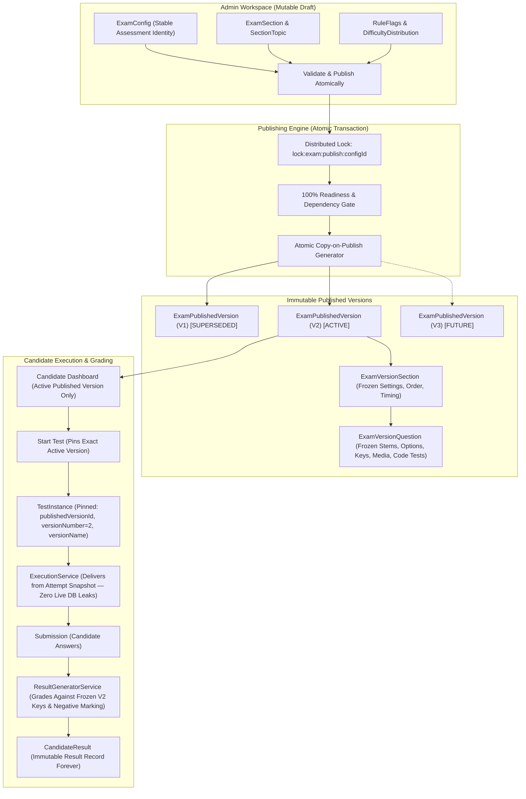
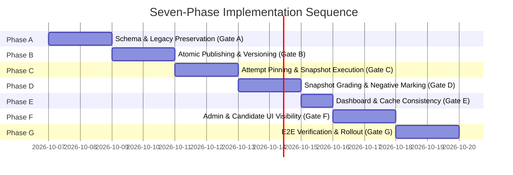

# Final Implementation Plan: Assessment Versioning, Publishing & Candidate Attempt Preservation

**Repository:** Skillitrix / InterVu AI (`apps/api`, `apps/web`, `packages/database`, `packages/contracts`, `packages/shared`)  
**Audit Reference:** [`docs/audits/assessment-versioning-audit.md`](file:///c:/Users/Vaibhav/Desktop/Work/Qloax%20Intern/intervu-ai/docs/audits/assessment-versioning-audit.md)  
**Execution Status:** PLANNING BLUEPRINT ONLY (No code, schema, migrations, or database state modified)  
**Author:** Antigravity AI Engineering Team  
**Date:** October 6, 2026  

---

## 1. Target Architecture & Core Principles

### Core Invariant:
**Publishing a new version must never modify a previous version or any existing candidate attempt or historical result.**

---

## 2. Required Data Models

The Prisma schema in `packages/database/prisma/schema.prisma` will be updated with the following models:

| Model | Responsibility | Key Attributes |
| :--- | :--- | :--- |
| **`ExamPublishedVersion`** | Immutable master record for a published version | `id`, `examConfigId`, `versionNumber`, `versionName` (`"TCS NQT — V2"`), `status` (`ACTIVE \| SUPERSEDED \| ARCHIVED`), `publishedBy`, `publishedAt`, `changeSummary`, `versionHash`, `configSnapshot`, `scoringRulesSnapshot` |
| **`ExamVersionSection`** | Frozen section configuration | `id`, `publishedVersionId`, `sectionKey`, `sectionName`, `durationMinutes`, `durationSeconds`, `questionCount`, `orderIndex`, `isRequired`, `topicDistributionJson` |
| **`ExamVersionQuestion`** | Frozen question content & grading keys | `id`, `versionSectionId`, `questionId` (source reference), `questionOrder`, `questionType`, `difficulty`, `questionText`, `questionStatement`, `instructions`, `questionImage`, `attachments`, `options`, `correctAnswer`, `codingData`, `metadata` |
| **`TestInstance`** | Pinned candidate test attempt | Added columns: `publishedVersionId: String?`, `versionNumber: Int?`, `versionName: String?`, `isLegacy: Boolean @default(false)` |
| **`TestInstanceQuestion`** | Candidate-delivered question order & options | `id`, `testInstanceId`, `sectionId`, `questionId`, `questionOrder`, `questionSnapshot` (stores candidate-shuffled copy of `ExamVersionQuestion`) |

### Comprehensive Snapshot Scope:
Every setting affecting delivery, presentation, timing, or scoring is captured in the frozen snapshot:
1. Assessment identity, instructions, and duration.
2. Section ordering, section timing flags, and section navigation rules.
3. Question stems, rich text, images, diagrams, and media attachments.
4. Options array, option order, and mode (`diagram-only`, `text`, etc.).
5. Correct answer keys and explanations.
6. Negative marking flags and penalty weightings.
7. Coding problem statements, starter templates, hidden test cases, execution limits, and scoring rubrics.
8. Candidate eligibility and scheduling access parameters.

---

## 3. Seven-Phase Implementation Sequence with Review Gates

---

### Phase A: Schema Migration and Legacy Preservation
- **Tasks**:
  1. Update `packages/database/prisma/schema.prisma` with `ExamPublishedVersion`, `ExamVersionSection`, `ExamVersionQuestion`, and nullable `publishedVersionId` on `TestInstance`.
  2. Generate Prisma migration SQL following established repository review practices.
  3. Create idempotent backfill script `packages/database/src/scripts/backfill-published-versions.ts`:
     - **Strict Legacy Rule**: Only link historical attempts where the historical version can be established with 100% cryptographic or transactional certainty.
     - Where attempt snapshots are incomplete or unverified, flag `isLegacy: true`, `versionName: "Legacy (Unversioned)"`, and `publishedVersionId: null`. **Do not falsely claim legacy attempts took V1.**
     - Preserve all original timestamps, submission records, answers, and scores untouched.
  4. Test migration and rollback procedure against a production-like staging database backup.
- **Review Gate A**: Schema and migration strategy reviewed; legacy records categorized and preserved without synthetic misattribution.

---

### Phase B: Atomic Publishing and Version Naming
- **Tasks**:
  1. Refactor [`ConfigPublisherService.publish`](file:///c:/Users/Vaibhav/Desktop/Work/Qloax%20Intern/intervu-ai/apps/api/src/modules/admin-config/publishing/config-publisher.service.ts):
     - Calculate next sequential version: `versionNumber = max(existing) + 1`.
     - Assign human-readable version name: `"${config.name} — V${versionNumber}"`.
     - Freeze validated configuration, sections, and resolved questions atomically into `ExamPublishedVersion`, `ExamVersionSection`, and `ExamVersionQuestion`.
     - Transition previous `ACTIVE` version to `SUPERSEDED` and set new version to `ACTIVE`.
     - Enforce SHA256 `versionHash` idempotency (preventing duplicate versions from repeated publish requests).
  2. Implement Draft Workspace Isolation in [`ExamSectionService`](file:///c:/Users/Vaibhav/Desktop/Work/Qloax%20Intern/intervu-ai/apps/api/src/modules/admin-config/services/exam-section.service.ts) and [`TopicSectionMappingService`](file:///c:/Users/Vaibhav/Desktop/Work/Qloax%20Intern/intervu-ai/apps/api/src/modules/topic-section-mapping/services/topic-section-mapping.service.ts):
     - Modifications to sections, topics, and rules apply strictly to working draft records and never mutate previously published versions.
- **Review Gate B**: V2 can be published without changing V1; editing drafts does not modify active or superseded versions.

---

### Phase C: Attempt Pinning and Snapshot-Only Execution
- **Tasks**:
  1. Update [`StartTestService.startTest`](file:///c:/Users/Vaibhav/Desktop/Work/Qloax%20Intern/intervu-ai/apps/api/src/modules/tests/start-test/start-test.service.ts):
     - Resolve the active `ExamPublishedVersion` for the candidate.
     - Store `publishedVersionId`, `versionNumber`, and `versionName` on `TestInstance`.
     - Clone `ExamVersionQuestion` into `TestInstanceQuestion.questionSnapshot`, applying candidate-specific question/option shuffling.
  2. Refactor [`ExecutionService.loadAssessment`](file:///c:/Users/Vaibhav/Desktop/Work/Qloax%20Intern/intervu-ai/apps/api/src/modules/execution/services/execution.service.ts):
     - Eliminate all live `prisma.question.findMany` queries.
     - Deliver questions, options, media, and coding test cases strictly from `TestInstanceQuestion.questionSnapshot`.
  3. Verify that an in-progress V1 attempt continues executing under V1 if an admin publishes V2 while the test is active.
- **Review Gate C**: Running and resumed attempts always load their original pinned version.

---

### Phase D: Snapshot-Only Grading and Negative Marking
- **Tasks**:
  1. Refactor [`ResultGeneratorService.generateResult`](file:///c:/Users/Vaibhav/Desktop/Work/Qloax%20Intern/intervu-ai/apps/api/src/modules/evaluation/services/result-generator.service.ts):
     - Eliminate live `prisma.question.findMany` queries for answer keys and coding test cases.
     - Grade candidate answers strictly against `TestInstanceQuestion.questionSnapshot.correctAnswer`.
  2. Update [`ObjectiveEvaluatorService.evaluateAnswers`](file:///c:/Users/Vaibhav/Desktop/Work/Qloax%20Intern/intervu-ai/apps/api/src/modules/evaluation/objective/objective-evaluator.service.ts):
     - Support configurable negative marking penalty (e.g. -0.25) when `ruleFlags.negativeMarkingEnabled` is `true`.
  3. Ensure [`ResultQueryService`](file:///c:/Users/Vaibhav/Desktop/Work/Qloax%20Intern/intervu-ai/apps/api/src/modules/results/services/result-query.service.ts) reviews, exports, and certificates read exclusively from preserved attempt snapshots.
- **Review Gate D**: Question Bank edits cannot alter historical grades or review screens.

---

### Phase E: Candidate Dashboard and Cache Consistency
- **Tasks**:
  1. In [`CandidateDashboardRepository.fetchDashboardData`](file:///c:/Users/Vaibhav/Desktop/Work/Qloax%20Intern/intervu-ai/apps/api/src/modules/candidate/repositories/candidate-dashboard.repository.ts):
     - Filter strictly by `status: "PUBLISHED", isActive: true, isArchived: false` (excluding `VALIDATED` drafts).
     - Surface the active `ExamPublishedVersion` metadata.
  2. Cache Key Alignment:
     - Standardize around shared constant `CACHE_KEYS.AVAILABLE_EXAMS` (`dashboard:examConfigs:available:v10`).
     - In [`ConfigPublisherService`](file:///c:/Users/Vaibhav/Desktop/Work/Qloax%20Intern/intervu-ai/apps/api/src/modules/admin-config/publishing/config-publisher.service.ts), evict Redis cache and clear in-memory cache upon publication.
- **Review Gate E**: Candidates see the correct published version and eligibility without draft leakage.

---

### Phase F: Admin and Candidate UI Visibility
- **Tasks**:
  1. In [`ConfigPageClient.tsx`](file:///c:/Users/Vaibhav/Desktop/Work/Qloax%20Intern/intervu-ai/apps/web/src/app/admin/configurations/%5Bid%5D/ConfigPageClient.tsx):
     - Add Pre-Publish Confirmation Modal with Target Version Name (`TCS NQT — V2`), diff summary, and change notes.
     - Display dual status: `Published (V1)` vs `Draft: Modified`.
  2. In [`VersionHistory.tsx`](file:///c:/Users/Vaibhav/Desktop/Work/Qloax%20Intern/intervu-ai/apps/web/src/modules/admin/configuration/VersionHistory.tsx):
     - Display version cards with `ACTIVE`, `SUPERSEDED`, and `ARCHIVED` badges.
     - Add "Inspect Frozen Questions" modal for historical versions.
  3. In Candidate UI:
     - Display version names on assessment cards, attempt history, and certificates (`TCS NQT Assessment — V1`).
     - For legacy attempts without verified versions, display `"Legacy"` or `"Unversioned"`.
- **Review Gate F**: Admins can inspect historical question sets and candidates can clearly identify the version they took.

---

### Phase G: End-to-End Testing and Staged Rollout
- **Tasks**:
  1. Run automated regression and E2E test suites in staging environment.
  2. Test multi-version coexistence (V1, V2, V3), in-progress attempt stability, Question Bank mutation resistance, and cache eviction.
  3. Execute staged deployment with monitored error rates and version mismatch telemetry.
- **Review Gate G**: All 11 release readiness checklist items verified before production deployment.

---

## 4. Candidate-Side Version Behavior Matrix

| Event | Expected Candidate Behavior |
| :--- | :--- |
| **First publish (V1)** | Eligible candidates see `Assessment Name — V1` on dashboard. |
| **Admin edits draft** | Candidates continue to see active `V1` with zero disruption. |
| **Admin publishes V2** | New eligible attempts are initialized with `Assessment Name — V2`. |
| **Candidate taking V1** | In-progress attempt continues executing under `V1` settings and questions. |
| **Candidate completes V1** | Result, certificate, and review remain permanently tied to `V1`. |
| **Admin edits Question Bank** | Previously completed and in-progress attempts remain completely unchanged. |
| **Admin publishes V3** | New attempts receive `V3`; `V1` and `V2` remain preserved for historical review. |

*Note on Retake Policy*: Retakes follow the configured assignment policy (defaulting to the latest active published version unless explicitly assigned to a specific revision).

---

## 5. Critical Pre-Implementation Safeguards

1. **Legacy Data Integrity**: Synthetic versions will **not** be assigned to legacy attempts without cryptographic or audit proof. Legacy attempts will be preserved with `isLegacy: true` and explicit unversioned badges.
2. **Copy-on-Publish Immutability**: All question stems, options, keys, test cases, and media references are cloned into `ExamVersionQuestion` at publish time. Later Question Bank modifications cannot touch these records.
3. **Atomic Transaction Boundaries**: Publishing runs within an atomic Prisma `$transaction` (timeout: 60s). If version creation or question freezing fails, the entire transaction rolls back.
4. **Post-Commit Cache Eviction**: Cache purging occurs immediately following successful transaction commit, coupled with distributed Redis Pub/Sub events to evict in-memory node caches.
5. **Production Migration Safety**: Migrations will follow the repository's standard review workflow, verified on a production backup before execution.

---

## 6. Final Acceptance Checklist (11 Release Readiness Items)

- [ ] **1. Sequential Version Identity**: V1, V2, and V3 have sequential, distinct version identities and display names (`"{Name} — V1"`, `"{Name} — V2"`).
- [ ] **2. Question Immutability**: Publishing a new version does not modify prior frozen question content.
- [ ] **3. Draft Isolation**: Draft edits never change the active published version.
- [ ] **4. Attempt Pinning**: New attempts pin the correct version according to candidate eligibility and assignment policy.
- [ ] **5. In-Progress Stability**: In-progress attempts remain pinned through publishing, refreshes, and resume actions.
- [ ] **6. Snapshot-Only Delivery**: Execution, grading, reviews, exports, and certificates use preserved attempt snapshot data.
- [ ] **7. Question Bank Resistance**: Question Bank edits do not change completed scores or historical reviews.
- [ ] **8. Accurate Negative Marking**: Negative marking follows configured rules and is validated by automated tests.
- [ ] **9. Clean Candidate Dashboard**: Candidate dashboards exclude drafts and invalidate stale caches immediately upon publish.
- [ ] **10. Legacy Reconciliation**: Legacy attempts remain intact and are not falsely assigned an unverified historical version.
- [ ] **11. Migration & Rollback Verified**: Migration, rollback/recovery, and staged deployment are verified in staging.

---

## 7. Implementation Authorization

Implementation will proceed strictly in sequence from **Phase A through Phase G**, with an explicit review gate between each phase.

**Scope of Phase A (Immediate Next Step upon Approval):**
1. Update `packages/database/prisma/schema.prisma` with `ExamPublishedVersion`, `ExamVersionSection`, `ExamVersionQuestion`, and `TestInstance` version fields.
2. Generate migration SQL.
3. Prepare non-destructive legacy backfill script `packages/database/src/scripts/backfill-published-versions.ts`.
4. Validate schema compilation and migration safety.

*This document represents the finalized implementation plan. No source code, database records, schemas, or migrations have been modified.*
