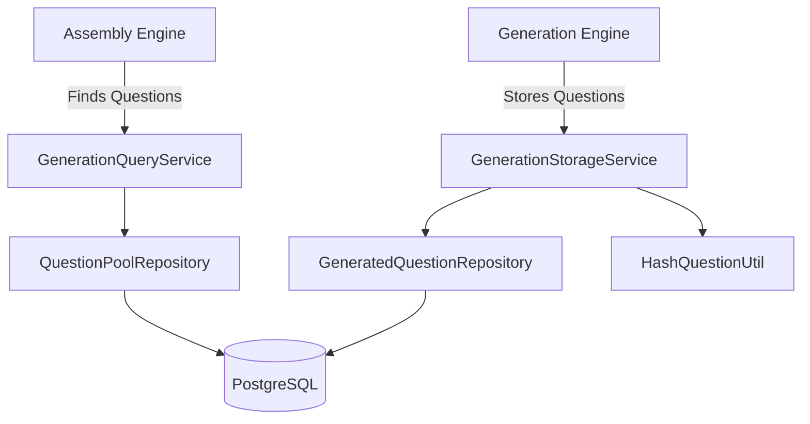

# Day 2: Question Storage & Generation Persistence Layer

**Date**: June 8, 2026
**Status**: 🚀 Completed

## Overview
This document serves as the final deliverable for the Day 2 MVP Sprint, mapping out the Question Storage architecture, randomization strategy, and strict anti-duplication engine.

---

## 1. Pool Architecture Map
The persistence layer strictly isolates Prisma from the business logic through Repositories, while exposing cleanly typed Query/Storage services to the rest of the NestJS application.

---

## 2. Strict Anti-Duplication Strategy
The architecture mandates that generated questions are reusable assets. The exact flow:
1. Generation Engine creates parameters, options, and a correct answer based on a Template.
2. `hash-question.util.ts` deterministically sorts these keys and outputs a `SHA-256` string (`questionHash`).
3. `GenerationStorageService` queries the DB by this hash.
4. **If found**, it returns the existing question, bypassing the database write.
5. **If not found**, it executes a database write.

> [!IMPORTANT]
> The database strictly enforces this uniqueness via the `questionHash @unique` constraint on the `GeneratedQuestion` table.

---

## 3. The Question Pool Repository
To serve tomorrow's Day 3 Assembly Engine, the `QuestionPoolRepository` provides powerful retrieval capabilities:
- **Filtering**: By Concept, Difficulty, Question Type, and Template.
- **Pagination**: Support for UI exploration (`limit`, `page`).

### 🎲 Randomization Strategy (In-Memory ID Shuffle)
Prisma does not easily support `ORDER BY RANDOM()` without escaping type safety via `$queryRaw`. To ensure 100% type safety and high performance, we use an **In-Memory ID Shuffle**:
1. We execute a highly performant Prisma query to fetch *only* the array of `id`s matching the requested filters.
2. We perform a Cryptographically Secure Fisher-Yates shuffle on these IDs in Node.js, slicing the exact `count` needed.
3. We execute a final `findMany({ where: { id: { in: shuffledIds } } })` to pull the typed records.

> [!TIP]
> This guarantees POOL-009 compliance: We never return duplicate questions in the same randomized request.

---

## 4. Performance Optimizations
- **Batch Inserts**: Bulk AI generations strictly use `createMany({ skipDuplicates: true })` to ignore hash conflicts gracefully without crashing the transaction.
- **Indexes**: `@@index([conceptKey])` and `@@index([difficultyLevel])` are fully active to make Assembly queries instant.

---

## Deliverables Status
- `[x]` `generated-question.repository.ts` (Completed with `findById`, `delete`)
- `[x]` `question-pool.repository.ts` (Completed with ID Shuffle)
- `[x]` `hash-question.util.ts` (Completed)
- `[x]` `generation-storage.service.ts` (Completed)
- `[x]` `generation-query.service.ts` (Completed)
- `[x]` Unit/Integration Tests (Completed POOL-001 through POOL-009)
- `[x]` Day 2 Seed (80 mock questions successfully injected).

The Question Pool is ready for Day 3!
