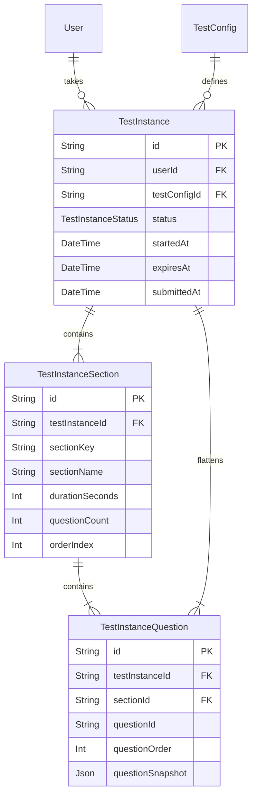
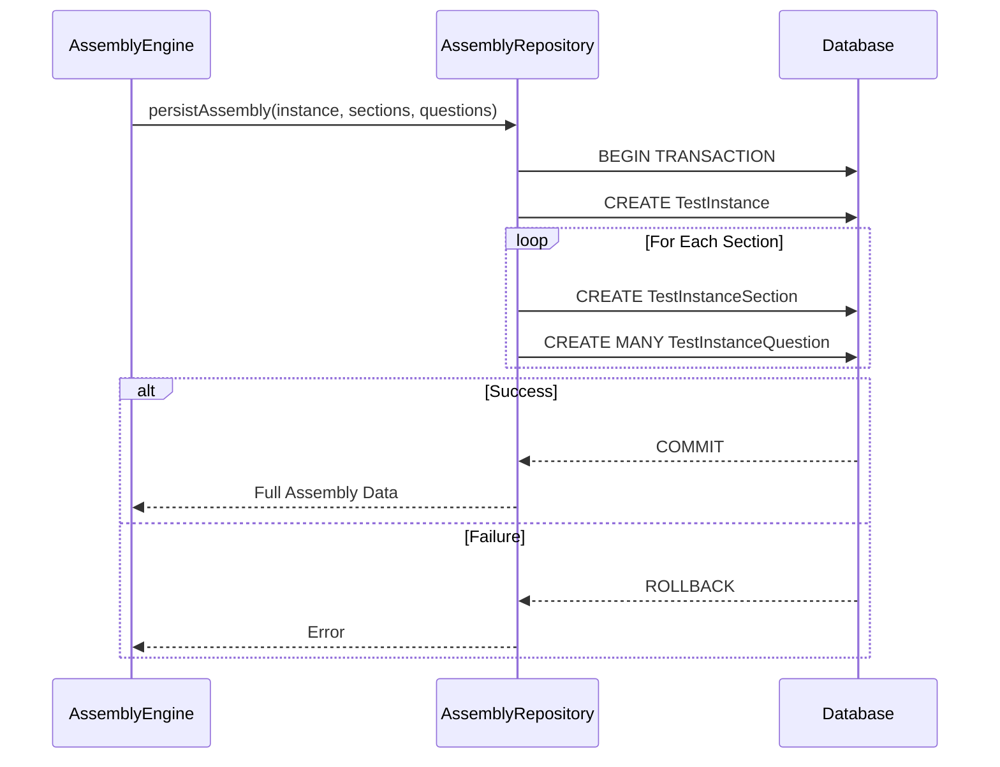

# Day 3: Test Instance Persistence & Assembly Foundation

## Overview
This document outlines the architecture for the Module 3 Test Assembly Engine persistence layer. The database must persistently represent an entire assembled test, enabling workflows like execution, resuming, auto-saving, and final submission.

## Architecture & Relationships

We have explicitly retained the legacy `Test` table for backwards compatibility (Day 1 dashboards). The new MVP relies solely on the `TestInstance` tree.

## Immutable Snapshot Strategy

The `TestInstanceQuestion.questionSnapshot` field guarantees that the exact state of the question at the time of assembly is frozen. 
- Execution **must never** query the Question Pool table (`GeneratedQuestion`).
- If a source question is edited in the future, the in-flight candidate tests remain 100% unaffected.

## Transaction Assembly Flow

The `AssemblyRepository` uses a strict `prisma.$transaction()` flow to guarantee absolute integrity.

## Assembly Read Model

A dedicated `getAssemblyData()` method fetches the fully nested structure in one highly-optimized query. This prevents N+1 query problems and serves as the single entrypoint for the Day 4 Execution Engine to initialize candidate browsers.
