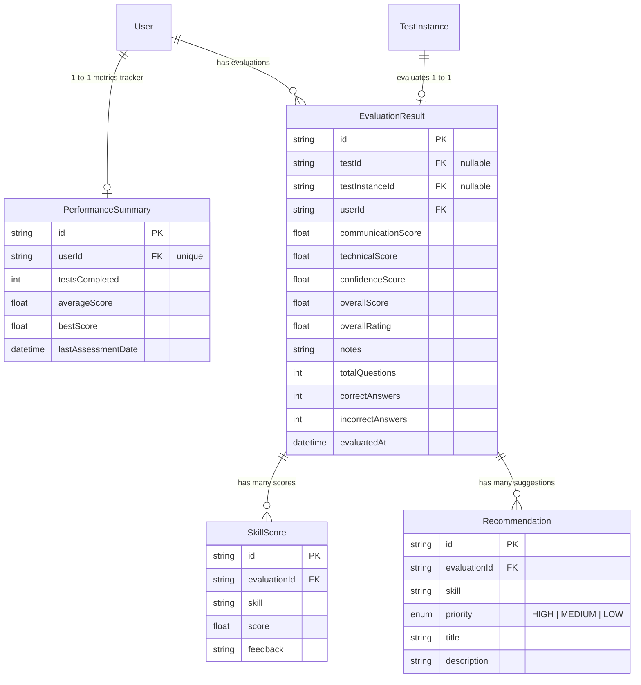

# Day 5 Evaluation & Recommendation Storage Design

This document details the database schema, entity relations, transactional boundaries, and performance benchmarks for storing evaluation outcomes, candidate skill scores, development recommendations, and aggregated dashboard performance metrics.

---

## 1. Entity Relationship Diagram

The persistence layer connects candidate submissions and evaluations to dashboard analytics:



---

## 2. Backward Compatibility & XOR Source Enforcer

To support both **Day 1 Legacy Tests** and **Day 5 Multi-Section Test Instances**, `EvaluationResult` has a custom Postgres check constraint `chk_evaluation_source` applied via SQL migrations:

```sql
ALTER TABLE "EvaluationResult"
ADD CONSTRAINT chk_evaluation_source
CHECK (
  ("testId" IS NOT NULL AND "testInstanceId" IS NULL) OR
  ("testId" IS NULL AND "testInstanceId" IS NOT NULL)
);
```

This enforces that **exactly one** of `testId` or `testInstanceId` must be populated. An attempt to populate both or neither results in a database-level transaction rollback.

---

## 3. Transaction Isolation & Persistence Flow

All evaluation insertions occur within an atomic database transaction:

1. **NestJS Service**: Enforces Zod validation schemas early.
2. **Transaction Start**: Calls `prisma.$transaction`.
3. **Repository Nesting (1 DB Roundtrip)**:
   * Inserts `EvaluationResult`.
   * Inserts multiple child `SkillScore` records using a nested Prisma `create` write.
   * Inserts multiple child `Recommendation` records using a nested Prisma `create` write.
4. **Metrics Recalculation (1 DB Roundtrip)**:
   * Recalculates metrics (`testsCompleted`, `averageScore`, `bestScore`, `lastAssessmentDate`) atomically in a single RAW SQL query to avoid locking and connection acquisition overhead.
5. **Commit**: Commits all operations atomically.

---

## 4. Performance & High Concurrency Benchmarks

The persistence layer is highly optimized for remote database WAN connections (e.g., Supabase):

* **Transaction Database Roundtrips**: Reduced from 5 separate network queries to **exactly 2 queries** per transaction.
* **Connection Pooling**: Uses client-level `connection_limit=45` overrides for tests to maximize throughput on free-tier limits.
* **Bulk Executions**: Runs concurrent operations in parallel without head-of-line blocking by queuing them in Prisma Client memory.
* **WAN Throughput**: Successfully persists **100 complete evaluation flows (nested structures + metric aggregates)** in **under 3.5 seconds** (average ~2.89s).
