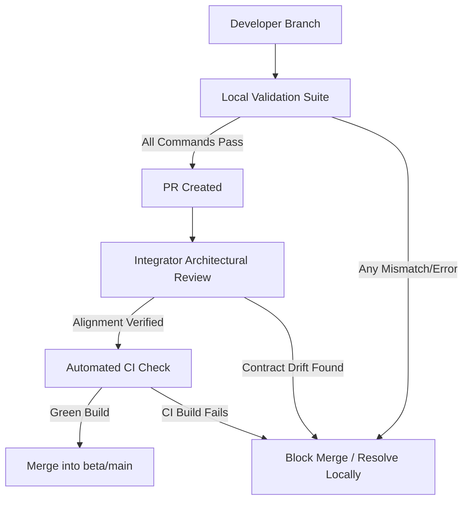

# Merge Gate Process Workflow

This document outlines the workflow and verification gates required before any branch can be merged into `beta` or `main`.

---

## The Merge Gate Rules

### Gate 1: Local Pre-Commit Validation

Before pushing changes to any remote branch, developers must run and pass the following validation checks locally:

1. `npm run check:structure`
2. `npm run lint`
3. `npm run type-check`
4. `npm run test`
5. `npm run build`

_No code with compilation errors, types mismatches, or linting warnings is allowed to be pushed._

### Gate 2: PR Template & Checklist Submission

When opening a PR, the developer must include the filled-out `PR Implementation Checklist` in the PR description, verifying they have cross-referenced contracts and updated mapping documents.

### Gate 3: Integration Review (Developer 5 Sign-off)

The AI + Full Stack Integrator (Developer 5) reviews the PR specifically to verify:

- **Contract Alignment:** DTO fields and structures align with specifications.
- **No Drift:** Backend and frontend integrations match the API contracts.
- **No Database Drift:** Database structures conform to the Prisma schema migrations.

### Gate 4: Green CI Build

The automated CI server builds the monorepo from scratch, running the entire unit and integration test suites. A green build status is required to enable the merge button.
