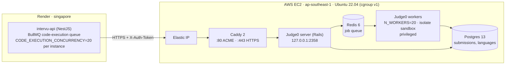

# Judge0 on AWS EC2: Implementation, Specification and Cost Plan

| | |
| :--- | :--- |
| **System** | Intervu AI assessment platform |
| **Component** | Code execution sandbox (Judge0 CE `1.13.1`) |
| **Hosting** | AWS EC2, single instance, `ap-southeast-1` (Singapore) |
| **Caller** | `intervu-api` on Render (`singapore`), [judge.service.ts](../../apps/api/src/modules/coding/services/judge.service.ts) |
| **Deploy files** | [deploy/judge0/](../../deploy/judge0/) |
| **Replaces** | Local Docker + ngrok tunnel (`start-judge0-tunnel.bat`) |
| **Pricing basis** | AWS on-demand Linux, `ap-southeast-1`, checked October 2026 |

This document covers four things:

1. What we built and why (sections 1–3).
2. The exact specification in use (section 4).
3. How to deploy, verify and operate it (sections 5–8).
4. Capacity and cost, sized by request volume (sections 9–10).

Section 11 lists known gaps and the changes we recommend next.

---

## 1. Background: why we moved off ngrok

Before this deployment, the production API on Render sent code to a Judge0 instance running on a local machine, exposed through an ngrok tunnel. That setup had four problems:

- **Reliability.** The tunnel dropped when the machine slept, restarted or hit ngrok limits. When that happened, every coding question in a live exam failed. `judge.service.ts` still has special handling for `ERR_NGROK_3200` from this period.
- **Latency.** Every request went from Render (Singapore) to a home or office network and back.
- **Capacity.** One laptop cannot run tens of sandboxed compilations in parallel.
- **Security.** Untrusted candidate code ran on a developer machine.

The new setup runs Judge0 on a dedicated EC2 instance in the same region as the API, behind TLS and token authentication.

---

## 2. Architecture



### Components

| Service | Image | Role | Exposure |
| :--- | :--- | :--- | :--- |
| `caddy` | `caddy:2` | TLS termination with automatic Let's Encrypt certificates; gzip; reverse proxy to `server:2358` | Public `:80`, `:443` |
| `server` | `judge0/judge0:1.13.1` | Judge0 REST API (`/submissions`, `/languages`, `/about`, `/workers`); checks auth tokens; enqueues jobs | `127.0.0.1:2358` only |
| `workers` | `judge0/judge0:1.13.1` | Runs `./scripts/workers`; pulls jobs from Redis and compiles and runs code inside `isolate` | None |
| `redis` | `redis:6.0` | Job queue; `maxmemory 1024mb`, `allkeys-lru`, no persistence | Docker network only |
| `db` | `postgres:13.0` | Submission records and language definitions | Docker network only |

All five run from one [docker-compose.yml](../../deploy/judge0/docker-compose.yml) with `restart: always`, so they come back on their own after an instance stop/start or reboot.

### Request flow for one candidate action

The API does not talk to Judge0 directly from the HTTP request. The flow is:

1. Candidate clicks **Run** or **Submit**. The API puts a job on the BullMQ `code-execution` queue (max depth `CODE_EXECUTION_MAX_QUEUE_DEPTH=500`).
2. [code-execution-queue-processor.service.ts](../../apps/api/src/modules/coding/services/code-execution-queue-processor.service.ts) consumes the queue with concurrency `CODE_EXECUTION_CONCURRENCY=20` per API instance.
3. For each test case, **one after another**, `JudgeService.submitAndPoll()`:
   - `POST /submissions?base64_encoded=true&wait=true`, with a 15 s timeout and up to 3 attempts.
   - If the result is still queued or processing, polls `GET /submissions/:token` every 500 ms, up to 60 times.
   - Fires `DELETE /submissions/:token` (with `X-Auth-User`) to keep Postgres small.

The number of Judge0 submissions per action is what drives capacity and cost:

| Candidate action | Test cases executed | Judge0 submissions |
| :--- | :--- | :--- |
| **Run** | 2 public | **2** |
| **Submit** | 2 public + 3 hidden + 1 boundary + 1 stress | **7** |

These counts come from [test-suite-generator.service.ts](../../apps/api/src/modules/coding/generators/test-suite-generator.service.ts). Each submission sends the full source code, so compiled languages (Java, C++) are **compiled again for every test case**.

---

## 3. Why EC2 and not Fargate, App Runner or Lambda

Judge0 1.13.x runs candidate code inside `isolate`, which has two hard requirements:

1. **Privileged containers.** `isolate` creates namespaces, mounts and cgroups. Fargate, App Runner and Lambda do not allow `--privileged`.
2. **cgroup v1.** Judge0 1.13.x reads limits from the v1 hierarchy. Amazon Linux 2023 and Ubuntu 22.04 boot with cgroup v2 by default. On v2, every submission fails with status 13 (Internal Error).

Running our own EC2 host gives us kernel control. We use **Ubuntu 22.04 LTS** and switch it to cgroup v1 through GRUB (`systemd.unified_cgroup_hierarchy=0`). [bootstrap-ec2.sh](../../deploy/judge0/bootstrap-ec2.sh) automates this.

---

## 4. Specification in use

### 4.1 AWS resources

| Resource | Production | Staging |
| :--- | :--- | :--- |
| Region | `ap-southeast-1` (Singapore), next to Render `singapore` | same |
| AMI | Ubuntu Server 22.04 LTS, x86_64 | same |
| Instance type | `c6i.4xlarge`: 16 vCPU, 32 GiB, compute optimised | `c6i.2xlarge`: 8 vCPU, 16 GiB |
| Storage | 40 GiB `gp3` (3,000 IOPS, 125 MB/s baseline), encrypted | 30–40 GiB `gp3` |
| Public address | Elastic IP (survives stop/start) | Elastic IP |
| DNS | `<elastic-ip-with-dashes>.sslip.io`, or an `A` record on our own domain | same |
| VPC | Default VPC, public subnet | same |

### 4.2 Security group (inbound)

| Port | Source | Purpose |
| :--- | :--- | :--- |
| 22 | Admin IP `/32` only | SSH |
| 80 | `0.0.0.0/0` | Let's Encrypt HTTP-01 challenge |
| 443 | `0.0.0.0/0` (tighten to Render's Singapore outbound IPs, see section 11) | Judge0 API over HTTPS |

Port **2358 must never be opened**. It is bound to `127.0.0.1` for on-box debugging only. Postgres (5432) and Redis (6379) are not published to the host at all.

### 4.3 Authentication

| Secret on EC2 (`/opt/judge0/.env`) | Secret on Render (`intervu-api`) | Header | Effect |
| :--- | :--- | :--- | :--- |
| `AUTHN_TOKEN` | `JUDGE0_AUTH_TOKEN` | `X-Auth-Token` | Required on every request; missing or wrong returns **401** |
| `AUTHZ_TOKEN` | `JUDGE0_AUTHZ_TOKEN` | `X-Auth-User` | Required for `DELETE /submissions/:token`; missing returns **403** |
| `POSTGRES_PASSWORD` | n/a | n/a | Internal DB password |

Generate each with `openssl rand -hex 32` (256-bit). Never commit `.env`. TLS is Caddy's default policy (TLS 1.2 and 1.3) with certificates renewed automatically.

### 4.4 Judge0 engine settings ([judge0.conf](../../deploy/judge0/judge0.conf))

| Setting | Value | Meaning |
| :--- | :--- | :--- |
| `N_WORKERS` | `20` | Submissions executed in parallel |
| `MAX_QUEUE_SIZE` | `2000` | Judge0 rejects new submissions beyond this backlog |
| `CPU_TIME_LIMIT` / `MAX_CPU_TIME_LIMIT` | `5.0` s / `15.0` s | Default / ceiling CPU time per run |
| `CPU_EXTRA_TIME` | `1.0` s | Grace before a run is killed |
| `MEMORY_LIMIT` / `MAX_MEMORY_LIMIT` | `512000` KB / `2048000` KB | ~500 MB default / ~2 GB ceiling |
| `STACK_LIMIT` / `MAX_STACK_LIMIT` | `128000` KB / `256000` KB | Stack size |
| `MAX_PROCESSES_AND_OR_THREADS` | `120` (max `240`) | Needed for JVM threads |
| `MAX_FILE_SIZE` | `4096` KB | Max file a program may write |
| `NUMBER_OF_RUNS` | `1` | One run per submission |

The API overrides two of these per submission: `cpu_time_limit: 5` and `memory_limit: 2048000` (the 2 GB ceiling).

### 4.5 Languages wired in the API

| Language | Judge0 ID | Runtime in 1.13.1 |
| :--- | :--- | :--- |
| Python | 71 | Python 3.8 |
| Java | 62 | OpenJDK 13 (metaspace patch applied, section 7) |
| C++ | 54 | GCC 9.2 |
| C | 50 | GCC 9.2 |
| JavaScript | 63 | Node.js 12 |
| TypeScript | 74 | TypeScript 3.7 |
| Go | 60 | Go 1.13 |
| Rust | 73 | Rust 1.40 |
| C# | 51 | Mono 6.6 |

### 4.6 Render-side settings ([render.yaml](../../render.yaml))

| Variable | Value |
| :--- | :--- |
| `JUDGE0_URL` | `https://<JUDGE0_DOMAIN>` (base URL, no `/submissions`) |
| `JUDGE0_AUTH_TOKEN` | same as `AUTHN_TOKEN` |
| `JUDGE0_AUTHZ_TOKEN` | same as `AUTHZ_TOKEN` |
| `CODE_EXECUTION_CONCURRENCY` | `20` per API instance |
| `CODE_EXECUTION_MAX_QUEUE_DEPTH` | `500` |
| API scaling | `standard` plan, 3–6 instances, so **60–120** jobs can be in flight against Judge0 |

---

## 5. Deployment procedure

### Step 1: Launch the instance

1. In the AWS console, region `ap-southeast-1`, launch an instance named `intervu-judge0-production` with the spec in 4.1 and the security group in 4.2.
2. Allocate an Elastic IP and associate it with the instance.
3. Pick a hostname that resolves to the Elastic IP:
   - Our own domain: `A` record `judge0.<domain>` pointing to the Elastic IP, or
   - No domain: `<a-b-c-d>.sslip.io` for Elastic IP `a.b.c.d` (for example `13-250-1-2.sslip.io`).

### Step 2: Switch the host to cgroup v1

```bash
scp -i ~/.ssh/<key>.pem -r deploy/judge0 ubuntu@<ELASTIC_IP>:~/
ssh -i ~/.ssh/<key>.pem ubuntu@<ELASTIC_IP>

bash ~/judge0/bootstrap-ec2.sh   # 1st run: installs Docker, sets GRUB flag
sudo reboot

# reconnect
bash ~/judge0/bootstrap-ec2.sh   # 2nd run: confirms cgroup v1, creates /opt/judge0
stat -fc %T /sys/fs/cgroup       # must print "tmpfs", not "cgroup2fs"
```

### Step 3: Configure

```bash
cp -r ~/judge0/. /opt/judge0/
cd /opt/judge0
cp .env.example .env
nano .env   # set JUDGE0_DOMAIN, POSTGRES_PASSWORD, AUTHN_TOKEN, AUTHZ_TOKEN
```

### Step 4: Start

```bash
docker compose up -d
docker compose ps   # server, workers, db, redis, caddy all "Up"
```

Caddy fetches a certificate on first start. This only works once `JUDGE0_DOMAIN` resolves to the Elastic IP and port 80 is open.

### Step 5: Apply the Java patch

Run the SQL in section 7, then `docker compose restart server workers`.

### Step 6: Point the API at it

Set the variables in 4.6 on `intervu-api` in Render, redeploy, and run one coding question end to end. After that, retire the ngrok tunnel.

---

## 6. Verification

On the host:

```bash
curl -s http://localhost:2358/about
curl -s -X POST "http://localhost:2358/submissions?wait=true" \
  -H "Content-Type: application/json" \
  -H "X-Auth-Token: $(grep AUTHN_TOKEN /opt/judge0/.env | cut -d= -f2)" \
  -d '{"source_code":"print(42)","language_id":71}'
# expect "stdout":"42\n" and "status":{"id":3,"description":"Accepted"}
```

From outside (laptop or CI):

```bash
# No token: expect 401
curl -s -o /dev/null -w '%{http_code}\n' -X POST https://<JUDGE0_DOMAIN>/submissions \
  -H 'Content-Type: application/json' -d '{}'

# With token over TLS: expect Accepted
curl -s -X POST "https://<JUDGE0_DOMAIN>/submissions?wait=true" \
  -H "Content-Type: application/json" -H "X-Auth-Token: <AUTHN_TOKEN>" \
  -d '{"source_code":"print(\"ok\")","language_id":71}'
```

Multi-language check (Java, Python, C++; prime test and string reverse):

```powershell
$env:JUDGE0_URL="https://<JUDGE0_DOMAIN>"
$env:JUDGE0_AUTH_TOKEN="<AUTHN_TOKEN>"
npx ts-node scratch/verify-judge0-all-languages.ts
```

### Go-live checklist

- [ ] `stat -fc %T /sys/fs/cgroup` prints `tmpfs`
- [ ] Port 2358 is not in the security group; `curl https://<JUDGE0_DOMAIN>` returns a valid certificate
- [ ] Unauthenticated `POST /submissions` returns 401
- [ ] Java metaspace patch applied; Java test passes
- [ ] `verify-judge0-all-languages.ts` passes for Java, Python and C++
- [ ] Render has `JUDGE0_URL`, `JUDGE0_AUTH_TOKEN`, `JUDGE0_AUTHZ_TOKEN`
- [ ] One full Run and Submit from the candidate UI succeeds
- [ ] ngrok tunnel stopped

---

## 7. Java metaspace fix

**Symptom.** Java submissions (ID 62) failed with:

```
Error occurred during initialization of VM
Could not allocate metaspace: 1073741824 bytes
```

Judge0 reports this as a compilation error (status 6). `JudgeService.normalizeResult()` reclassifies it as status 13 so candidates are not told their code failed to compile.

**Cause.** OpenJDK 13 reserves 1 GB of address space for compressed class space at start-up. `isolate` limits the address space, so the reservation fails.

**Fix.** Cap the JVM's reservations in Judge0's language table:

```bash
docker compose exec db psql -U judge0 -d judge0 -c "
UPDATE languages SET
  compile_cmd = '/usr/local/openjdk13/bin/javac -J-XX:CompressedClassSpaceSize=64m -J-XX:MaxMetaspaceSize=128m -J-Xmx256m %s Main.java',
  run_cmd     = '/usr/local/openjdk13/bin/java -XX:CompressedClassSpaceSize=64m -XX:MaxMetaspaceSize=128m -Xmx256m Main'
WHERE id = 62;"
docker compose restart server workers
```

This change lives in the Postgres volume. It survives restarts and image pulls, but **must be re-applied if the `postgres-data` volume is ever recreated**.

---

## 8. Operations runbook

### Everyday commands (in `/opt/judge0`)

```bash
docker compose logs -f server workers          # live logs
docker compose restart workers                 # recover stuck workers
docker compose pull && docker compose up -d    # update images (version is pinned)
curl -s -H "X-Auth-Token: <AUTHN_TOKEN>" http://localhost:2358/workers   # queue size and busy workers
htop                                           # CPU saturation during an exam
```

### Exam-window lifecycle

```bash
# Before the exam (instance comes up with all containers via restart: always)
aws ec2 start-instances --instance-ids <ID> --region ap-southeast-1
aws ec2 wait instance-running --instance-ids <ID> --region ap-southeast-1

# After the exam
aws ec2 stop-instances --instance-ids <ID> --region ap-southeast-1
```

Start the instance at least 30 minutes before the exam. Run the on-host `print(42)` check as a smoke test.

### Resizing for a bigger exam

The instance type can change without losing data or the IP:

```bash
aws ec2 stop-instances --instance-ids <ID> --region ap-southeast-1
aws ec2 wait instance-stopped --instance-ids <ID> --region ap-southeast-1
aws ec2 modify-instance-attribute --instance-id <ID> --instance-type '{"Value":"c6i.12xlarge"}' --region ap-southeast-1
aws ec2 start-instances --instance-ids <ID> --region ap-southeast-1
```

Then set `N_WORKERS` in `judge0.conf` to the new vCPU count and run `docker compose restart server workers`. The whole resize takes about 5 minutes.

### Logging

Judge0 1.13.1 hard-codes `config.log_level = :debug` and only filters `password` from request logs. Out of the box, every submission therefore logged the full source code three times (request params, nested `submission` params, SQL insert), plus hidden test inputs and expected outputs. Java submissions also carry the ~13 KB driver the API generates.

Two controls are in place:

| Control | Where | Effect |
| :--- | :--- | :--- |
| Rails initializer | [log-filter.rb](../../deploy/judge0/log-filter.rb), mounted into `server` and `workers` as `config/initializers/zz_intervu_logging.rb` | `source_code`, `stdin`, `expected_output`, `stdout`, `stderr`, `compile_output` logged as `[FILTERED]`; level `INFO`, so no SQL lines |
| Log rotation | `x-logging` anchor in [docker-compose.yml](../../deploy/judge0/docker-compose.yml) | Each container capped at 3 × 10 MB (~150 MB total) |

Both need `docker compose up -d` to take effect, because `restart` keeps the old container configuration. Check disk use with `df -h /` and `sudo du -sh /var/lib/docker/containers/*/*-json.log`.

### Troubleshooting

| Symptom | Likely cause | Action |
| :--- | :--- | :--- |
| Status 13 on every submission, cgroup message | Host booted on cgroup v2 | `stat -fc %T /sys/fs/cgroup`; re-run `bootstrap-ec2.sh` and reboot |
| Java: "Could not allocate metaspace" | Patch missing (e.g. DB volume recreated) | Re-apply section 7 |
| 401 from Judge0 | Token mismatch | Compare Render `JUDGE0_AUTH_TOKEN` with `AUTHN_TOKEN` in `.env` |
| 403 on DELETE | `AUTHZ_TOKEN` / `JUDGE0_AUTHZ_TOKEN` missing or mismatched | Set both to the same value |
| 502 from Caddy | `server` container down | `docker compose logs server`; check `db` is up |
| Certificate error | DNS not pointing at the Elastic IP, or port 80 closed | Fix DNS / security group, then `docker compose restart caddy` |
| API logs "Code execution timed out" or connection attempts failing under load | Workers saturated; requests exceed the 15 s client timeout | Check `/workers` and `htop`; resize up (section 9) |
| Spurious "Time Limit Exceeded" under load | More workers than vCPUs | Set `N_WORKERS` ≤ vCPU count |

---

## 9. Capacity model (sizing by requests)

### 9.1 Demand per candidate

```
Judge0 submissions per coding question = 2 × (number of Runs) + 7
Judge0 submissions per candidate       = Q × (2R + 7)
```

**Planning baseline:** Q = 2 coding questions, R = 5 Runs per question, 1 Submit per question. That gives **34 Judge0 submissions per candidate per exam**.

Load is not even across the exam. Candidates run more often and submit near the end. With a 90-minute exam and a **2× peak factor**:

```
peak submissions/sec per active candidate = 34 / 5,400 s × 2 ≈ 0.0126
```

### 9.2 Supply per instance

Each submission occupies one worker for compile + run + sandbox setup. We plan with an **average of 1.5 worker-seconds per submission** across the language mix. Python is usually under 1 s. Java and C++ take 1.5–3 s because they are compiled for every test case. We plan with **one effective worker per vCPU**.

```
throughput (submissions/sec) ≈ vCPU / 1.5
```

> These two figures (1.5 s average and the 2× peak) are planning assumptions, not measurements. Before a large exam, run a load test with the real language mix, then replace them in the tables below. A heavier Java/C++ mix pushes every row down a size.

### 9.3 Sizing table

| Instance | vCPU / RAM | `N_WORKERS` | Throughput | Max concurrent candidates (≤80% load) | Submissions per 90-min exam at that size |
| :--- | :--- | :--- | :--- | :--- | :--- |
| `c6i.xlarge` | 4 / 8 GiB | 4 | ~2.7/s (160/min) | **~150** | ~5,100 |
| `c6i.2xlarge` | 8 / 16 GiB | 8 | ~5.3/s (320/min) | **~300** | ~10,200 |
| `c6i.4xlarge` (current) | 16 / 32 GiB | 16 | ~10.7/s (640/min) | **~650** | ~22,100 |
| `c6i.8xlarge` | 32 / 64 GiB | 32 | ~21.3/s (1,280/min) | **~1,300** | ~44,200 |
| `c6i.12xlarge` | 48 / 96 GiB | 48 | ~32/s (1,920/min) | **~2,000** | ~68,000 |

**Conclusion.** Under these assumptions, the current `c6i.4xlarge` is comfortable up to about **650 concurrent candidates**. It is **not** sized for the 2,000-candidate target in `judge0.conf`. For 2,000, resize to `c6i.12xlarge` for the exam window, or cut per-candidate load first (section 11, item 1).

The API side is not the bottleneck here. With 3–6 Render instances × 20, up to 60–120 jobs are in flight, and the remainder waits in the BullMQ queue.

---

## 10. Cost plan

### 10.1 Unit prices (`ap-southeast-1`, on-demand, Linux)

| Item | Price |
| :--- | :--- |
| `c6i.xlarge` | $0.196 / hour |
| `c6i.2xlarge` | $0.392 / hour |
| `c6i.4xlarge` | $0.784 / hour |
| `c6i.8xlarge` | $1.568 / hour |
| `c6i.12xlarge` | $2.352 / hour |
| EBS `gp3` | $0.096 / GB-month |
| Public IPv4 (Elastic IP, charged whether running or stopped) | $0.005 / hour |
| Data transfer out to internet | $0.12 / GB (first 100 GB/month free across the account) |

EC2 is billed per second (60-second minimum). A **stopped** instance costs nothing for compute; only the disk and IP continue.

### 10.2 Fixed monthly cost (always paid)

| Item | Calculation | Monthly |
| :--- | :--- | :--- |
| 40 GB `gp3` volume | 40 × $0.096 | $3.84 |
| Elastic IP | 730 h × $0.005 | $3.65 |
| **Fixed total** | | **≈ $7.50** |

### 10.3 Cost per exam, by size

Billed window = 90-minute exam + 30 minutes warm-up + 30 minutes buffer = **2.5 hours**.

| Concurrent candidates | Instance | Compute per exam | Judge0 submissions | Cost per candidate |
| :--- | :--- | :--- | :--- | :--- |
| up to 150 | `c6i.xlarge` | $0.49 | ~5,100 | $0.0033 |
| up to 300 | `c6i.2xlarge` | $0.98 | ~10,200 | $0.0033 |
| up to 650 | `c6i.4xlarge` | $1.96 | ~22,100 | $0.0030 |
| up to 1,300 | `c6i.8xlarge` | $3.92 | ~44,200 | $0.0030 |
| up to 2,000 | `c6i.12xlarge` | $5.88 | ~68,000 | $0.0029 |

Data transfer is negligible. Each submission round trip is about 10 KB, so a 2,000-candidate exam moves under 1 GB (≈ $0.08, usually inside the free 100 GB).

At full utilisation, compute works out to roughly **$0.02 per 1,000 Judge0 submissions** at every size. That holds because price and vCPU scale together in the c6i family.

### 10.4 Monthly scenarios

| Scenario | Usage | Monthly cost |
| :--- | :--- | :--- |
| **A. Pilot** | 4 exams × 300 candidates, stopped between exams (`c6i.2xlarge`) | 4 × $0.98 + $7.50 ≈ **$11** |
| **B. Growth** | 10 exams × 650 candidates, stopped between exams (`c6i.4xlarge`) | 10 × $1.96 + $7.50 ≈ **$27** |
| **C. Scale** | 20 exams × 2,000 candidates, resized per exam (`c6i.12xlarge`) | 20 × $5.88 + $7.50 ≈ **$125** |
| **D. Always-on small + exam bursts** | `c6i.xlarge` 24×7 for practice/demo traffic (~150 concurrent), resized up for exams as in B | $143.08 + $7.50 + $19.60 ≈ **$170** |
| **E. Current config left running 24×7** | `c6i.4xlarge` never stopped | 730 × $0.784 + $7.50 ≈ **$580** |
| **E with 1-year Compute Savings Plan** | same, committed usage | roughly 25–35% off E (≈ $380–430); confirm in the AWS Pricing Calculator |
| **Staging on Spot** | `c6i.2xlarge` Spot, ~$0.18/h, 8 h/day × 22 days | ≈ $32 + $7.50 ≈ **$40** |

### 10.5 Recommendation

- **Default to stop-between-exams (scenarios A–C).** It costs 5–50× less than running 24×7 and needs no code changes. Its only cost is a scheduled start/stop step, which can be automated with EventBridge Scheduler.
- **Move to scenario D only once candidates need 24×7 practice access.**
- **Don't run live exams on Spot.** An interruption mid-exam fails every in-flight submission. Spot is fine for staging.
- **Buy a Savings Plan only once there is a steady 24×7 baseline.** A commitment wastes money if the instance is stopped most of the month.

---

## 11. Known gaps and recommended next steps

These come from reading the current code and config against the sizing above. They are ordered by impact.

1. **Every test case is a separate submission, compiled again each time.** A Submit costs 7 compilations of the same code. Sending all test cases in one submission (a harness that loops over inputs), or using `POST /submissions/batch`, would cut Judge0 load several-fold for Java/C++. That moves every row in 9.3 up one instance size at the same cost. This is the largest cost lever available.
2. **`wait=true` holds a Judge0 server thread per request.** Judge0's Rails server has a small thread pool by default (`RAILS_SERVER_PROCESSES` × `RAILS_MAX_THREADS`; check the defaults in the 1.13.1 config reference). With 60–120 jobs in flight, requests can wait for a thread before even reaching the queue. Either raise those two settings in `judge0.conf`, or submit with `wait=false` and rely on the polling loop that `submitAndPoll()` already has.
3. **The 15 s client timeout retries by resubmitting.** When Judge0 is saturated, a slow `wait=true` call aborts and the API sends the same code again. That adds load at exactly the wrong time. With `wait=false` (item 2), the POST returns a token immediately and this goes away.
4. **Memory overcommit.** The API asks for `memory_limit: 2048000` (2 GB) on every submission. 20 workers × 2 GB = 40 GB, above the 32 GB on `c6i.4xlarge`. Lower the API default to 512 MB. Java is already capped at 256 MB heap by the section 7 patch.
5. **`N_WORKERS=20` on 16 vCPUs.** Set it equal to the vCPU count to avoid CPU contention that turns into false Time Limit Exceeded verdicts.
6. **Health check may report unhealthy.** `JudgeService.checkHealth()` calls `/system_info` without `X-Auth-Token`. With authentication enabled, Judge0 may answer 401. Send the auth headers there too.
7. **Single instance, single AZ, no monitoring.** Add an EC2 status-check alarm with auto-recovery, and a CloudWatch CPU alarm. Take an EBS snapshot after setup (~$1–2/month) so a replacement host can be restored in minutes.
8. **Port 443 is open to the internet.** Token auth protects it, but restricting the security group to Render's published Singapore outbound IPs removes the public attack surface.
9. **Judge0 1.13.1 and its runtimes are old** (Python 3.8, OpenJDK 13, GCC 9). Upgrading needs a new image and re-testing the cgroup and Java setup. Plan it as a separate piece of work.

---

## Appendix: file reference

| File | Purpose |
| :--- | :--- |
| [deploy/judge0/docker-compose.yml](../../deploy/judge0/docker-compose.yml) | Five-service stack |
| [deploy/judge0/judge0.conf](../../deploy/judge0/judge0.conf) | Worker count and sandbox limits |
| [deploy/judge0/Caddyfile](../../deploy/judge0/Caddyfile) | TLS + reverse proxy |
| [deploy/judge0/log-filter.rb](../../deploy/judge0/log-filter.rb) | Filters code/test data from Judge0 logs; INFO level |
| [deploy/judge0/.env.example](../../deploy/judge0/.env.example) | Secrets template |
| [deploy/judge0/bootstrap-ec2.sh](../../deploy/judge0/bootstrap-ec2.sh) | Docker install + cgroup v1 switch |
| [deploy/judge0/README.md](../../deploy/judge0/README.md) | Short quick-start |
| [apps/api/src/modules/coding/services/judge.service.ts](../../apps/api/src/modules/coding/services/judge.service.ts) | Judge0 client |
| [apps/api/src/modules/coding/services/code-execution-queue-processor.service.ts](../../apps/api/src/modules/coding/services/code-execution-queue-processor.service.ts) | API-side concurrency limit |
| [scratch/verify-judge0-all-languages.ts](../../scratch/verify-judge0-all-languages.ts) | Multi-language smoke test |
