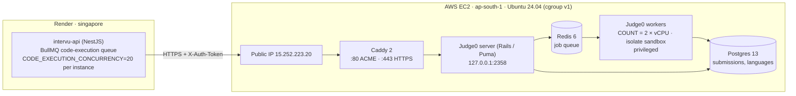

# Judge0 on AWS EC2: Implementation, Specification and Cost Plan

| | |
| :--- | :--- |
| **System** | Intervu AI assessment platform |
| **Component** | Code execution sandbox (Judge0 CE `1.13.1`) |
| **Hosting** | AWS EC2, single instance `m7i-flex.large`, `ap-south-1` (Mumbai) |
| **Endpoint** | `https://15-252-223-20.sslip.io` |
| **Caller** | `intervu-api` on Render (`singapore`), [judge.service.ts](../../apps/api/src/modules/coding/services/judge.service.ts) |
| **Deploy files** | [deploy/judge0/](../../deploy/judge0/), installed on the host in `~/judge0` |
| **Replaces** | Local Docker + ngrok tunnel (`start-judge0-tunnel.bat`) |
| **Pricing basis** | AWS on-demand Linux, `ap-south-1`, checked October 2026 |

This document covers four things:

1. What we built and why (sections 1–3).
2. The exact specification in use (section 4).
3. How to deploy, verify and operate it (sections 5–8).
4. Capacity and cost, sized by request volume (sections 9–10).

Section 11 lists known gaps and the changes we recommend next.

---

## 1. Background: why we moved off ngrok

Before this deployment, the production API on Render sent code to a Judge0 instance running on a local machine, exposed through an ngrok tunnel. That setup had four problems:

- **Reliability.** The tunnel dropped when the machine slept, restarted or hit ngrok limits. When that happened, every coding question in a live exam failed. `judge.service.ts` still has special handling for `ERR_NGROK_3200` from this period.
- **Latency.** Every request went from Render (Singapore) to a home or office network and back.
- **Capacity.** One laptop cannot run tens of sandboxed compilations in parallel.
- **Security.** Untrusted candidate code ran on a developer machine.

The new setup runs Judge0 on a dedicated EC2 instance behind TLS and token authentication. The instance is in Mumbai while the API is in Singapore, which adds roughly 60 ms per request (section 11).

---

## 2. Architecture



### Components

| Service | Image | Role | Exposure |
| :--- | :--- | :--- | :--- |
| `caddy` | `caddy:2` | TLS termination with automatic Let's Encrypt certificates; gzip; reverse proxy to `server:2358` | Public `:80`, `:443` |
| `server` | `judge0/judge0:1.13.1` | Judge0 REST API (`/submissions`, `/submissions/batch`, `/languages`, `/about`, `/workers`); checks auth tokens; enqueues jobs | `127.0.0.1:2358` only |
| `workers` | `judge0/judge0:1.13.1` | Runs `./scripts/workers`; pulls jobs from Redis and compiles and runs code inside `isolate` | None |
| `redis` | `redis:6.0` | Job queue; `maxmemory 1024mb`, `allkeys-lru`, no persistence | Docker network only |
| `db` | `postgres:13.0` | Submission records and language definitions | Docker network only |

All five run from one [docker-compose.yml](../../deploy/judge0/docker-compose.yml) with `restart: always`, so they come back on their own after an instance stop/start or reboot.

### Where code actually runs: `wait=true` versus batch

Judge0 has two ways to run a submission, and they use different processes:

| Request style | Where the code runs | How many at once |
| :--- | :--- | :--- |
| `POST /submissions?wait=true` | Inside the **web server** thread handling the request (`IsolateJob.perform_now`) | `RAILS_SERVER_PROCESSES × RAILS_MAX_THREADS` = 2 × vCPU (**4** on the current 2-vCPU host) |
| `POST /submissions/batch` (no wait), then poll | In the **workers** container, via the Redis queue | `COUNT` = 2 × vCPU worker processes |

The API originally used `wait=true` for every test case, one after another. Each call held one of the 4 web threads for the whole compile and run. It also gave up after 15 s and sent the same code again, up to 3 times. Under load that tripled the work.

The API now uses the batch style (see the request flow below).

### Request flow for one candidate action

1. Candidate clicks **Run** or **Submit**. The API puts a job on the BullMQ `code-execution` queue (max depth `CODE_EXECUTION_MAX_QUEUE_DEPTH=500`; beyond that it answers 503 "at capacity").
2. [code-execution-queue-processor.service.ts](../../apps/api/src/modules/coding/services/code-execution-queue-processor.service.ts) consumes the queue with concurrency `CODE_EXECUTION_CONCURRENCY=20` per API instance.
3. [test-case-runner.service.ts](../../apps/api/src/modules/coding/services/test-case-runner.service.ts) prepares the program with [code-harness.service.ts](../../apps/api/src/modules/coding/services/code-harness.service.ts):
   - **Function-style Java and Python** (the normal case): the generated driver runs **every test case of the action in one execution**. That means one compile and one sandbox per Run or Submit. Each test case reports its own result line, and anything the candidate prints is captured per case.
   - **Anything else** (a candidate's own `main()`/stdin program, other languages): one submission per test case.
4. `JudgeService.submitBatch()` sends the execution(s) in one `POST /submissions/batch` (no `wait`). It then polls `GET /submissions/batch?tokens=…` (300 ms, backing off to 1.5 s) until every result is in, or the budget runs out: 40 s for Run, 110 s for Submit.
5. Creation is retried only when Judge0 provably did not accept the batch (network error before a response, 502, 503). An accepted batch is never re-sent.
6. Each finished submission is deleted (`DELETE /submissions/:token` with `X-Auth-User`) so Judge0's Postgres does not keep candidate code and hidden test data.

The number of Judge0 executions per action is what drives capacity and cost:

| Candidate action | Test cases | Executions (Java/Python driver) | Executions (own `main()` / other languages) |
| :--- | :--- | :--- | :--- |
| **Run** | 2 public | **1** | 2 |
| **Submit** | 2 public + 3 hidden + 1 boundary + 1 stress | **1** | 7 |

Test-case counts come from [test-suite-generator.service.ts](../../apps/api/src/modules/coding/generators/test-suite-generator.service.ts).

**Limits inside one execution.** Each test case gets **5 s of CPU**, enforced by the driver itself. If a case exceeds it, that case is reported as Time Limit Exceeded and the remaining cases as "Not run". The whole execution gets `5 s × cases + 1 s` of CPU, capped at Judge0's 15 s maximum, and that plus 5 s of wall time, capped at 20 s. Memory is measured once for the whole execution, so every case reports the same memory figure.

---

## 3. Why EC2 and not Fargate, App Runner or Lambda

Judge0 1.13.x runs candidate code inside `isolate`, which has two hard requirements:

1. **Privileged containers.** `isolate` creates namespaces, mounts and cgroups. Fargate, App Runner and Lambda do not allow `--privileged`.
2. **cgroup v1.** Judge0 1.13.x reads limits from the v1 hierarchy. Amazon Linux 2023 and current Ubuntu releases boot with cgroup v2 by default. On v2, every submission fails with status 13 (Internal Error).

Running our own EC2 host gives us kernel control. The production host runs **Ubuntu 24.04 LTS (kernel 6.17)**, switched to cgroup v1 through GRUB (`systemd.unified_cgroup_hierarchy=0`). [bootstrap-ec2.sh](../../deploy/judge0/bootstrap-ec2.sh) automates this.

> **Do not run `do-release-upgrade`.** Newer Ubuntu releases ship a systemd without cgroup v1 support. After such an upgrade every submission fails. Routine `apt upgrade` security updates are fine, but schedule them outside exam windows, because kernel updates need a reboot.

---

## 4. Specification in use

### 4.1 AWS resources

| Resource | Current production | Exam-day sizes (section 9) |
| :--- | :--- | :--- |
| Region | `ap-south-1` (Mumbai) | same |
| AMI | Ubuntu Server 24.04 LTS, x86_64 | same instance, resized |
| Instance type | `m7i-flex.large`: 2 vCPU, 8 GiB | `c6i.2xlarge` (8 vCPU) to `c6i.12xlarge` (48 vCPU) |
| Storage | 40 GiB `gp3` (3,000 IOPS, 125 MB/s baseline) | same |
| Public address | `15.252.223.20`. Confirm in EC2 → Elastic IPs that this is an **Elastic IP**; a plain public IP changes on every stop/start and breaks the hostname below. | same |
| DNS | `15-252-223-20.sslip.io` (sslip.io maps it to the IP; no DNS record to manage) | same |
| VPC | Default VPC, public subnet | same |

`m7i-flex` instances give full CPU most of the time, but they are meant for workloads that don't run every core at 100% for long periods. A busy exam does exactly that. Use a `c6i` size for exams (section 9).

### 4.2 Security group (inbound)

| Port | Source | Purpose |
| :--- | :--- | :--- |
| 22 | Admin home/office IP `/32` | SSH and `scp` |
| 22 | EC2 Instance Connect prefix list (`pl-0fa83cebf909345ca`) | Browser terminal in the AWS console |
| 80 | `0.0.0.0/0` | Let's Encrypt HTTP-01 challenge |
| 443 | `0.0.0.0/0` (tighten to Render's outbound IPs, section 11) | Judge0 API over HTTPS |

Port **2358 must never be opened**. It is bound to `127.0.0.1` for on-box debugging only. Postgres (5432) and Redis (6379) are not published to the host at all.

The admin IP changes when your ISP reassigns it, or when a VPN/Cloudflare WARP is on. If SSH starts timing out, edit the port-22 rule and pick **My IP** again. Never use `0.0.0.0/0` for SSH.

### 4.3 Authentication

| Secret on EC2 (`~/judge0/.env`) | Secret on Render (`intervu-api`) | Header | Effect |
| :--- | :--- | :--- | :--- |
| `AUTHN_TOKEN` | `JUDGE0_AUTH_TOKEN` | `X-Auth-Token` | Required on every request; missing or wrong returns **401** |
| `AUTHZ_TOKEN` | `JUDGE0_AUTHZ_TOKEN` | `X-Auth-User` | Required for `DELETE /submissions/:token` (the API deletes each submission after reading the result); missing or wrong returns **403** |
| `POSTGRES_PASSWORD` | n/a | n/a | Internal DB password |

Generate each with `openssl rand -hex 32` (256-bit). Never commit `.env`. TLS is Caddy's default policy (TLS 1.2 and 1.3) with certificates renewed automatically.

Each key must appear **once** in `.env`. If a key appears twice, Docker silently uses the **last** line. That is how the API and server once ended up with different `AUTHZ_TOKEN` values.

### 4.4 Judge0 engine settings ([judge0.conf](../../deploy/judge0/judge0.conf))

| Setting | Value | Meaning |
| :--- | :--- | :--- |
| `MAX_QUEUE_SIZE` | `2000` | Judge0 rejects new submissions with 503 beyond this backlog |
| `CPU_TIME_LIMIT` / `MAX_CPU_TIME_LIMIT` | `5.0` s / `15.0` s | Default / ceiling CPU time per run |
| `CPU_EXTRA_TIME` | `1.0` s | Grace before a run is killed |
| `MEMORY_LIMIT` / `MAX_MEMORY_LIMIT` | `512000` KB / `2048000` KB | ~500 MB default / ~2 GB ceiling |
| `STACK_LIMIT` / `MAX_STACK_LIMIT` | `128000` KB / `256000` KB | Stack size |
| `MAX_PROCESSES_AND_OR_THREADS` | `120` (max `240`) | Needed for JVM threads |
| `MAX_FILE_SIZE` | `4096` KB | Max file a program may write |
| `NUMBER_OF_RUNS` | `1` | One run per submission |
| `ENABLE_SUBMISSION_DELETE` | `true` | Allows the API cleanup `DELETE`; Judge0 defaults to `false` and returns 400, leaving every submission (code and test data) in Postgres |

Concurrency is **deliberately not set**, so it follows the instance size after a resize:

| Setting | Judge0 default | On `m7i-flex.large` (2 vCPU) | On `c6i.4xlarge` (16 vCPU) |
| :--- | :--- | :--- | :--- |
| `RAILS_SERVER_PROCESSES` | `2` | 2 | 2 |
| `RAILS_MAX_THREADS` | `nproc` | 2 (so 4 web threads) | 16 (so 32 web threads) |
| `COUNT` (worker processes) | `2 × nproc` | 4 | 32 |

Earlier versions of `judge0.conf` set `N_WORKERS=20` and `ENABLE_PER_PROCESS_CPU_TIME_LIMIT`. Judge0 1.13.1 reads neither, so both were removed.

The API overrides two limits per submission: `cpu_time_limit: 5` and `memory_limit: 2048000` (the 2 GB ceiling; see section 11, item 3).

### 4.5 Languages wired in the API

| Language | Judge0 ID | Runtime in 1.13.1 | Driver generated by the API |
| :--- | :--- | :--- | :--- |
| Python | 71 | Python 3.8 | Yes (reads JSON test input, calls the function; all test cases in one run) |
| Java | 62 | OpenJDK 13 (metaspace patch applied, section 7) | Yes (`Main` class, reflection call into `Solution`; all test cases in one run) |
| C++ | 54 | GCC 9.2 | No |
| C | 50 | GCC 9.2 | No |
| JavaScript | 63 | Node.js 12 | No |
| TypeScript | 74 | TypeScript 3.7 | No |
| Go | 60 | Go 1.13 | No |
| Rust | 73 | Rust 1.40 | No |
| C# | 51 | Mono 6.6 | No |

Languages without a driver only work if the candidate writes a full program that reads stdin.

### 4.6 Render-side settings ([render.yaml](../../render.yaml))

| Variable | Value |
| :--- | :--- |
| `JUDGE0_URL` | `https://15-252-223-20.sslip.io` (base URL, no `/submissions`) |
| `JUDGE0_AUTH_TOKEN` | same as `AUTHN_TOKEN` |
| `JUDGE0_AUTHZ_TOKEN` | same as `AUTHZ_TOKEN` |
| `CODE_EXECUTION_CONCURRENCY` | `20` per API instance |
| `CODE_EXECUTION_MAX_QUEUE_DEPTH` | `500` |
| API scaling | `standard` plan, 3–6 instances, so **60–120** Runs/Submits can be in flight against Judge0 |

Only `intervu-api` needs the `JUDGE0_*` variables. `intervu-worker` does not call Judge0.

---

## 5. Deployment procedure

### Step 1: Launch the instance

1. In the AWS console, region `ap-south-1`, launch an instance with the spec in 4.1 and the security group in 4.2.
2. Allocate an Elastic IP and associate it with the instance.
3. Pick a hostname that resolves to the Elastic IP:
   - Our own domain: `A` record `judge0.<domain>` pointing to the Elastic IP, or
   - No domain: `<a-b-c-d>.sslip.io` for Elastic IP `a.b.c.d`.

### Step 2: Switch the host to cgroup v1

From the repo root on your machine (PowerShell or bash):

```bash
scp -i ~/.ssh/judge0-key.pem -r deploy/judge0 ubuntu@<ELASTIC_IP>:~/
ssh -i ~/.ssh/judge0-key.pem ubuntu@<ELASTIC_IP>

bash ~/judge0/bootstrap-ec2.sh   # 1st run: installs Docker, sets GRUB flag
sudo reboot

# reconnect
bash ~/judge0/bootstrap-ec2.sh   # 2nd run: confirms cgroup v1
stat -fc %T /sys/fs/cgroup       # must print "tmpfs", not "cgroup2fs"
```

On Windows, if `ssh` rejects the key with "bad permissions", run once:
`icacls "$HOME\.ssh\judge0-key.pem" /inheritance:r /grant:r "$($env:USERNAME):(R)"`.

The bootstrap script also creates `/opt/judge0`. The production host runs from `~/judge0` instead, and every command in this guide uses `~/judge0`.

### Step 3: Configure

```bash
cd ~/judge0
cp .env.example .env
nano .env   # set JUDGE0_DOMAIN, POSTGRES_PASSWORD, AUTHN_TOKEN, AUTHZ_TOKEN (each once)
```

### Step 4: Start

```bash
docker compose up -d
docker compose ps   # server, workers, db, redis, caddy all "Up"
```

Caddy fetches a certificate on first start. This only works once `JUDGE0_DOMAIN` resolves to the Elastic IP and port 80 is open.

### Step 5: Apply the Java patch

Run the SQL in section 7, then `docker compose restart server workers`.

### Step 6: Point the API at it

Set the variables in 4.6 on `intervu-api` in Render, redeploy, and run one coding question end to end. After that, retire the ngrok tunnel.

### Updating files later

```bash
# from the repo root on your machine
scp -i ~/.ssh/judge0-key.pem deploy/judge0/<file> ubuntu@<ELASTIC_IP>:~/judge0/

# on the host
cd ~/judge0
docker compose up -d --force-recreate server workers   # let it finish; never Ctrl+C
```

`docker compose restart` does **not** reload `.env`, `judge0.conf` or compose changes. Docker also does not notice edits to mounted files such as `judge0.conf`, so use `--force-recreate`.

---

## 6. Verification

On the host:

```bash
curl -s http://localhost:2358/about
curl -s -X POST "http://localhost:2358/submissions?wait=true" \
  -H "Content-Type: application/json" \
  -H "X-Auth-Token: $(grep '^AUTHN_TOKEN=' ~/judge0/.env | cut -d= -f2)" \
  -d '{"source_code":"print(42)","language_id":71}'
# expect "stdout":"42\n" and "status":{"id":3,"description":"Accepted"}
```

From outside (laptop or CI):

```bash
# No token: expect 401
curl -s -o /dev/null -w '%{http_code}\n' -X POST https://<JUDGE0_DOMAIN>/submissions \
  -H 'Content-Type: application/json' -d '{}'

# With token over TLS: expect Accepted
curl -s -X POST "https://<JUDGE0_DOMAIN>/submissions?wait=true" \
  -H "Content-Type: application/json" -H "X-Auth-Token: <AUTHN_TOKEN>" \
  -d '{"source_code":"print(\"ok\")","language_id":71}'
```

Small end-to-end check through the API's own code path (2 Runs, about 4 submissions):

```bash
cd apps/api
npx ts-node --transpile-only scripts/load-test-judge0.ts --runs 2 --lang python --confirm
```

### Go-live checklist

Ticked items were verified on 7 October 2026.

- [x] cgroup v1 active (the `isolate --cg` sandbox runs Java and Python)
- [x] Port 2358 is not in the security group; `https://15-252-223-20.sslip.io` serves a valid certificate
- [x] Unauthenticated requests return 401
- [x] Java metaspace patch applied; Java test cases pass
- [ ] `verify-judge0-all-languages.ts` passes for C++ (Java and Python verified)
- [x] Render `JUDGE0_URL`, `JUDGE0_AUTH_TOKEN`, `JUDGE0_AUTHZ_TOKEN` set; token fingerprints match the host
- [x] `DELETE` cleanup returns 200 (`ENABLE_SUBMISSION_DELETE=true`, tokens match)
- [x] Logs filtered (`[FILTERED]`, INFO level) and capped at 3 × 10 MB per container
- [x] A Run from the candidate UI succeeds
- [ ] A Submit from the candidate UI succeeds
- [ ] Public IP confirmed to be an Elastic IP
- [ ] ngrok tunnel stopped

---

## 7. Java metaspace fix

**Symptom.** Java submissions (ID 62) failed with:

```
Error occurred during initialization of VM
Could not allocate metaspace: 1073741824 bytes
```

Judge0 reports this as a compilation error (status 6). `JudgeService.normalizeResult()` reclassifies it as status 13 so candidates are not told their code failed to compile.

**Cause.** OpenJDK 13 reserves 1 GB of address space for compressed class space at start-up. `isolate` limits the address space, so the reservation fails.

**Fix.** Cap the JVM's reservations in Judge0's language table:

```bash
docker compose exec db psql -U judge0 -d judge0 -c "
UPDATE languages SET
  compile_cmd = '/usr/local/openjdk13/bin/javac -J-XX:CompressedClassSpaceSize=64m -J-XX:MaxMetaspaceSize=128m -J-Xmx256m %s Main.java',
  run_cmd     = '/usr/local/openjdk13/bin/java -XX:CompressedClassSpaceSize=64m -XX:MaxMetaspaceSize=128m -Xmx256m Main'
WHERE id = 62;"
docker compose restart server workers
```

This change lives in the Postgres volume. It survives restarts and image pulls, but **must be re-applied if the `postgres-data` volume is ever recreated**.

---

## 8. Operations runbook

### Everyday commands (in `~/judge0`)

```bash
docker compose ps                              # all five should be "Up"
docker compose logs -f --tail=50 server        # live logs; Ctrl+C only stops watching
docker compose restart workers                 # recover stuck workers
curl -s -H "X-Auth-Token: <AUTHN_TOKEN>" http://localhost:2358/workers   # queue size and busy workers
htop                                           # CPU saturation during an exam
df -h /                                        # disk

# Token fingerprints (never print the token itself); compare with the same
# check run in the Render shell
docker compose exec server printenv AUTHN_TOKEN | tr -d '\n' | wc -c
docker compose exec server printenv AUTHN_TOKEN | tr -d '\n' | sha256sum | cut -c1-12
docker compose exec server printenv AUTHZ_TOKEN | tr -d '\n' | wc -c
docker compose exec server printenv AUTHZ_TOKEN | tr -d '\n' | sha256sum | cut -c1-12
```

Render shell equivalent:
`node -e 'const t=process.env.JUDGE0_AUTHZ_TOKEN||"";console.log(t.length, require("crypto").createHash("sha256").update(t).digest("hex").slice(0,12))'`

Rules that have caused outages before:

- **Paste each command block once.** Running `up -d --force-recreate` twice, or interrupting it with Ctrl+C, can leave `server` stopped while its replacement is only "Created". Judge0 then returns 502 to every request.
- **Ctrl+C is only safe on `docker compose logs -f`.** It is not safe on `docker compose up` without `-d`, or during a recreate.
- **No recreate or restart during an exam.** Each takes Judge0 offline for 10–20 seconds.

### Exam-window lifecycle

```bash
# Before the exam (instance comes up with all containers via restart: always)
aws ec2 start-instances --instance-ids <ID> --region ap-south-1
aws ec2 wait instance-running --instance-ids <ID> --region ap-south-1

# After the exam
aws ec2 stop-instances --instance-ids <ID> --region ap-south-1
```

Start the instance at least 30 minutes before the exam. Then run the on-host `print(42)` check as a smoke test.

### Resizing for a bigger exam

The instance type can change without losing data or the Elastic IP:

```bash
aws ec2 stop-instances --instance-ids <ID> --region ap-south-1
aws ec2 wait instance-stopped --instance-ids <ID> --region ap-south-1
aws ec2 modify-instance-attribute --instance-id <ID> --instance-type '{"Value":"c6i.4xlarge"}' --region ap-south-1
aws ec2 start-instances --instance-ids <ID> --region ap-south-1
```

No config change is needed afterwards. Judge0 sizes its web threads and workers from `nproc` when the containers start. The whole resize takes about 5 minutes. Resize back down after the exam.

### Load testing

[load-test-judge0.ts](../../apps/api/scripts/load-test-judge0.ts) simulates N candidate Runs through the API's own code path (harness + batch client) against the configured Judge0. It reports the success rate, latency percentiles and throughput. It sends real load, so it needs `--confirm` and must never run during an exam.

```bash
cd apps/api
npx ts-node --transpile-only scripts/load-test-judge0.ts --runs 50 --lang java --concurrency 60 --confirm
```

Use `--cases 7` to simulate Submits. `--concurrency` mirrors the API's in-flight limit (20 × API instances).

### Logging

Judge0 1.13.1 hard-codes `config.log_level = :debug` and only filters `password` from request logs. Out of the box, every submission therefore logged the full source code three times (request params, nested `submission` params, SQL insert), plus hidden test inputs and expected outputs.

Two controls are in place:

| Control | Where | Effect |
| :--- | :--- | :--- |
| Rails initializer | [log-filter.rb](../../deploy/judge0/log-filter.rb), mounted into `server` and `workers` as `config/initializers/zz_intervu_logging.rb` | `source_code`, `stdin`, `expected_output`, `stdout`, `stderr`, `compile_output` logged as `[FILTERED]`; level `INFO`, so no SQL lines |
| Log rotation | `x-logging` anchor in [docker-compose.yml](../../deploy/judge0/docker-compose.yml) | Each container capped at 3 × 10 MB (~150 MB total) |

`FATAL ActiveRecord::RecordNotFound` lines after a `GET` for an already-deleted submission are expected. Judge0 logs every 404 at FATAL level.

### Troubleshooting

| Symptom | Likely cause | Action |
| :--- | :--- | :--- |
| 502 from Caddy on every request | `server` container not running | `docker compose ps -a`, `docker compose logs --tail=60 server`, then `docker compose up -d` |
| `server` shows `Exited (137)` and a `<hash>_judge0-server-1` shows `Created` | A recreate was interrupted (137 = force-stopped by Docker, not a crash) | `docker compose up -d` finishes it; `--force-recreate server` once more restores the normal name |
| Status 13 on every submission, cgroup message | Host booted on cgroup v2 (for example after an OS upgrade) | `stat -fc %T /sys/fs/cgroup`; re-run `bootstrap-ec2.sh` and reboot |
| Java: "Could not allocate metaspace" | Patch missing (e.g. DB volume recreated) | Re-apply section 7 |
| Java: "Could not find or load main class Main" | API deployed without the code harness | Deploy the current `intervu-api` |
| One test case "Time Limit Exceeded", the rest "Not run: an earlier test case exceeded the time limit" | That case used more than 5 s of CPU (often an infinite loop). Java/Python run all cases in one execution, so the rest cannot continue. | Expected behaviour; the candidate's code needs fixing |
| 401 from Judge0 | Token mismatch | Compare `AUTHN_TOKEN` fingerprints (host vs Render) |
| `DELETE /submissions/...` → 403, log says `:authorize_request` | `AUTHZ_TOKEN` not set in the container, different from Render, or duplicated in `.env` | Compare fingerprints; make sure `grep -c '^AUTHZ_TOKEN=' .env` prints 1; then `docker compose up -d --force-recreate server workers` |
| `DELETE /submissions/...` → 400 `delete not allowed` | `ENABLE_SUBMISSION_DELETE` not `true` | Set it in `judge0.conf`, then recreate `server` and `workers` |
| 503 "at capacity" | API queue (500) or Judge0 queue (`MAX_QUEUE_SIZE`) full | Resize up (section 9); check `/workers` |
| Test results say "Code execution timed out" under load | Not enough CPU for the burst | Resize up (section 9); load-test first |
| Certificate error | DNS not pointing at the IP, or port 80 closed | Fix DNS / security group, then `docker compose restart caddy` |
| `ssh`/`scp`: "Connection timed out" | Your IP is not the one in the port-22 rule (ISP change, VPN, WARP) | Security group → port 22 → **My IP**; or use the browser terminal |

---

## 9. Capacity model (sizing by requests)

### 9.1 Measurements

All on the current `m7i-flex.large` (2 vCPU), 7 October 2026, with [load-test-judge0.ts](../../apps/api/scripts/load-test-judge0.ts). "In flight" is the number of Runs sent at once (60 = 3 API instances × 20).

| Test | Before (one submission per test case) | After (one execution per Run) |
| :--- | :--- | :--- |
| 20 Java Runs at once | 0.50 Runs/s, **14/20 ok**, 6 timed out; p50 31.4 s | **0.64 Runs/s, 20/20 ok**; p50 19 s, max 31.5 s |
| 100 Python Runs, 60 in flight | 1.98 Runs/s, 100/100 ok; p50 26.2 s | **3.93 Runs/s**, 100/100 ok; p50 13.5 s, max 18.3 s |

Single executions on an idle server: Java Submit (7 cases) ~2.1 s, Java Run ~1.8 s, Python Submit ~0.5 s.

`vmstat 1` during both tests showed **0% CPU idle and 0% I/O wait**, with up to 14 runnable processes on 2 vCPUs. Judge0 is **CPU-bound**. More workers (`COUNT`) would only lengthen the queue, so a bigger instance is the way to add capacity. Python spends ~30% of CPU in the kernel, on sandbox setup and teardown for each execution. Java spends ~95% in user space (`javac` and the JVM).

`docker stats` under-reports here (it showed 40–55% for the workers). The sandboxed processes run in `isolate`'s own cgroups, outside the container's accounting. Use `vmstat 1` or `top` on the host instead.

The JVM flag `-XX:TieredStopAtLevel=1` on `javac` was tested and gave no measurable gain (0.65 vs 0.63 Runs/s), so it is **not** applied.

Planning figures derived from these measurements:

| Language | CPU per execution (Run or Submit) |
| :--- | :--- |
| Java | **~3 s** (`javac` on the candidate code plus the ~13 KB driver, and JVM start-up) |
| Python | **~0.5 s** |

```
throughput (executions/sec) ≈ vCPU / CPU seconds per execution
```

### 9.2 Demand per candidate

With the Java/Python drivers, each Run and each Submit is one execution:

```
executions per coding question = R + 1        (R Runs + 1 Submit)
executions per candidate       = Q × (R + 1)
```

**Planning baseline:** Q = 2 coding questions, R = 5 Runs per question. That gives **12 executions per candidate per exam**, down from 34 with one submission per test case.

Load is not even across the exam. Candidates run more often and submit near the end. With a 90-minute exam and a **2× peak factor**:

```
peak executions/sec per active candidate = 12 / 5,400 s × 2 ≈ 0.0044
```

### 9.3 Sizing table (load spread over the exam, Java-heavy)

| Instance | vCPU / RAM | Throughput at 3 s/execution | Max concurrent candidates (≤80% load) |
| :--- | :--- | :--- | :--- |
| `m7i-flex.large` (current) | 2 / 8 GiB | ~0.67/s (measured 0.64) | **~120** |
| `c6i.xlarge` | 4 / 8 GiB | ~1.3/s | **~240** |
| `c6i.2xlarge` | 8 / 16 GiB | ~2.7/s | **~480** |
| `c6i.4xlarge` | 16 / 32 GiB | ~5.3/s | **~960** |
| `c6i.8xlarge` | 32 / 64 GiB | ~10.7/s | **~1,920** |
| `c6i.12xlarge` | 48 / 96 GiB | ~16/s | **~2,880** |

Python-heavy exams get about 6× these figures. This table assumes clicks are spread over the exam. Exams also have synchronised moments, such as the first minutes and the last minutes before the deadline, so check the burst table too.

### 9.4 Worst case: everyone clicks Run at the same moment

Every Run must finish within its 40 s budget, or the candidate sees "timed out".

**500 simultaneous Runs = 500 executions:**

| Instance | Java (~3 s each) | Python (~0.5 s each) | Outcome for 500 simultaneous Runs |
| :--- | :--- | :--- | :--- |
| `m7i-flex.large` (2 vCPU) | ~12 min | ~2 min | Java: ~26 finish in time. Python: ~160 finish in time. |
| `c6i.4xlarge` (16 vCPU) | ~94 s | ~16 s | Java: ~210 finish in time. Python: all finish. |
| `c6i.8xlarge` (32 vCPU) | ~47 s | ~8 s | Java: most finish, the last ones time out. Python: all finish. |
| `c6i.12xlarge` (48 vCPU) | ~31 s | ~5 s | Both finish |

The API also stops more than 500 Runs/Submits from being in its queue at once (503 "at capacity"). It sends at most 60–120 to Judge0 at a time, so a burst is served in waves.

> The burst rows are extrapolated from the 2-vCPU measurements, assuming throughput scales with vCPU. Run the load test on the exam-day size before relying on them.

**Conclusions:**
- The current `m7i-flex.large` suits development, demos and small groups. Expect timeouts if more than ~25 candidates click Run in Java at the same moment.
- For a 500-candidate exam, use `c6i.4xlarge` if clicks are spread out or the exam is Python-heavy, and `c6i.12xlarge` for a Java-heavy exam with synchronised moments. Load-test that size first.
- The next software lever for Java is the per-execution `javac` cost (section 11).

---

## 10. Cost plan

### 10.1 Unit prices (`ap-south-1`, on-demand, Linux)

| Item | Price |
| :--- | :--- |
| `m7i-flex.large` (current) | ≈ $0.10 / hour |
| `c6i.xlarge` | $0.17 / hour |
| `c6i.2xlarge` | $0.34 / hour |
| `c6i.4xlarge` | $0.68 / hour |
| `c6i.8xlarge` | $1.36 / hour |
| `c6i.12xlarge` | $2.04 / hour |
| EBS `gp3` | ≈ $0.091 / GB-month |
| Public IPv4 (Elastic IP, charged whether running or stopped) | $0.005 / hour |
| Data transfer out to internet | ≈ $0.11 / GB (first 100 GB/month free across the account) |

EC2 is billed per second (60-second minimum). A **stopped** instance costs nothing for compute; only the disk and IP continue. Confirm current prices in the AWS Pricing Calculator before committing to a budget.

### 10.2 Fixed monthly cost (always paid)

| Item | Calculation | Monthly |
| :--- | :--- | :--- |
| 40 GB `gp3` volume | 40 × $0.091 | $3.65 |
| Public IPv4 / Elastic IP | 730 h × $0.005 | $3.65 |
| **Fixed total** | | **≈ $7.30** |

### 10.3 Current running cost

The `m7i-flex.large` left running 24×7 costs about 730 h × $0.10 + $7.30 ≈ **$80 / month**.

### 10.4 Cost per exam, by size

Billed window = 90-minute exam + 30 minutes warm-up + 30 minutes buffer = **2.5 hours**.

| Candidates in the exam | Recommended instance | Compute per exam | Judge0 executions | Cost per candidate |
| :--- | :--- | :--- | :--- | :--- |
| up to 150 | `c6i.xlarge` | $0.43 | ~1,800 | $0.0028 |
| up to 300 | `c6i.2xlarge` | $0.85 | ~3,600 | $0.0028 |
| up to 650 | `c6i.4xlarge` | $1.70 | ~7,800 | $0.0026 |
| up to 1,300 | `c6i.8xlarge` | $3.40 | ~15,600 | $0.0026 |
| up to 2,000 | `c6i.12xlarge` | $5.10 | ~24,000 | $0.0026 |

These sizes keep about 1.5× headroom over the Java-heavy spread-out model in 9.3. Java-heavy exams with synchronised moments need one size up (9.4). Confirm the size with a load test before the first exam at that scale.

Data transfer is negligible. Each execution round trip is about 15–20 KB with the Java driver, so a 2,000-candidate exam moves well under 1 GB (≈ $0.11 at most, usually inside the free 100 GB).

### 10.5 Monthly scenarios

| Scenario | Usage | Monthly cost |
| :--- | :--- | :--- |
| **Today** | `m7i-flex.large` running 24×7 | ≈ **$80** |
| **A. Pilot** | 4 exams × 300 candidates, stopped between exams (`c6i.2xlarge`) | 4 × $0.85 + $7.30 ≈ **$11** |
| **B. Growth** | 10 exams × 650 candidates, stopped between exams (`c6i.4xlarge`) | 10 × $1.70 + $7.30 ≈ **$24** |
| **C. Scale** | 20 exams × 2,000 candidates, resized per exam (`c6i.12xlarge`) | 20 × $5.10 + $7.30 ≈ **$109** |
| **D. Always-on small + exam bursts** | `m7i-flex.large` 24×7 for practice/demo traffic, resized to `c6i.4xlarge` for 10 exams | $80 + 10 × ($1.70 − $0.25) ≈ **$95** |
| **E. `c6i.4xlarge` left running 24×7** | never stopped | 730 × $0.68 + $7.30 ≈ **$504** |

### 10.6 Recommendation

- **If candidates need 24×7 practice access, keep today's small instance (scenario D)** and resize only for exam windows. Otherwise **stop it between exams (A–C)**, which brings the monthly cost under $25 at pilot and growth volumes.
- **Never run a large exam on the 2-vCPU instance.** Resize before the exam and run the load test on the new size.
- **Don't run live exams on Spot.** An interruption mid-exam fails every in-flight submission.
- **Buy a Savings Plan only once there is a steady 24×7 baseline** larger than the current small instance.

---

## 11. Known gaps and recommended next steps

Ordered by impact.

1. **Memory overcommit on large instances.** The API asks for `memory_limit: 2048000` (2 GB) on every submission. With `COUNT = 2 × vCPU`, `c6i.4xlarge` runs 32 workers × 2 GB = 64 GB on 32 GiB of RAM. Lower the API default to 512 MB, which already covers the Java heap cap of 256 MB from section 7.
2. **Cross-region latency.** Judge0 is in Mumbai and the API in Singapore, so every create, poll and delete pays about 60 ms. Moving Judge0 to `ap-southeast-1` (a new instance plus the section 5 setup) would remove this.
3. **Health check reports unhealthy.** `JudgeService.checkHealth()` calls `/system_info` without `X-Auth-Token`, and Judge0 answers 401. Send the auth headers there too.
4. **Single instance, no monitoring or backup.** Add an EC2 status-check alarm with auto-recovery, a CloudWatch CPU alarm and a billing budget alert. Create an AMI of the working host so a replacement can be launched in minutes.
5. **Port 443 is open to the internet.** Token auth protects it. Restricting the security group to Render's outbound IPs (requests arrive from `74.220.52.32`–`.33`; take the full list from the Render dashboard) removes the public attack surface.
6. **Public IP type.** Confirm `15.252.223.20` is an Elastic IP before relying on stop/start between exams.
7. **Judge0 1.13.1 and its runtimes are old** (Python 3.8, OpenJDK 13, GCC 9), and they depend on cgroup v1, which current Linux distributions are dropping. Upgrading needs a new image and re-testing the sandbox and the Java setup. Plan it as a separate piece of work.
8. **Languages other than Java and Python have no driver** (section 4.5). They still run one submission per test case, and C++ still compiles once per test case.
9. **Java still costs ~3 s of CPU per execution.** `javac` compiles the ~13 KB generated driver along with the candidate's code every time. A smaller driver would cut this; it needs its own load test.
10. **Per-test-case memory is not reported** for Java/Python. Memory is measured once for the whole execution, so every test case shows the same figure.

Already resolved (October 2026): the 401 token mismatch; duplicate `AUTHZ_TOKEN` in `.env` (403 on cleanup); `ENABLE_SUBMISSION_DELETE` missing; unfiltered debug logs and unbounded log files; `wait=true` execution in web threads and resubmission after timeouts (replaced by batch + poll); `N_WORKERS` not being a real Judge0 setting; Java/Python compiling and sandboxing once per test case (now once per Run/Submit).

---

## Appendix: file reference

| File | Purpose |
| :--- | :--- |
| [deploy/judge0/docker-compose.yml](../../deploy/judge0/docker-compose.yml) | Five-service stack, log rotation, log-filter mount |
| [deploy/judge0/judge0.conf](../../deploy/judge0/judge0.conf) | Sandbox limits, queue size, submission delete |
| [deploy/judge0/Caddyfile](../../deploy/judge0/Caddyfile) | TLS + reverse proxy |
| [deploy/judge0/log-filter.rb](../../deploy/judge0/log-filter.rb) | Filters code/test data from Judge0 logs; INFO level |
| [deploy/judge0/.env.example](../../deploy/judge0/.env.example) | Secrets template |
| [deploy/judge0/bootstrap-ec2.sh](../../deploy/judge0/bootstrap-ec2.sh) | Docker install + cgroup v1 switch |
| [deploy/judge0/README.md](../../deploy/judge0/README.md) | Short quick-start |
| [apps/api/src/modules/coding/services/judge.service.ts](../../apps/api/src/modules/coding/services/judge.service.ts) | Judge0 client (`submitBatch`) |
| [apps/api/src/modules/coding/services/code-harness.service.ts](../../apps/api/src/modules/coding/services/code-harness.service.ts) | Java/Python drivers and JSON stdin |
| [apps/api/src/modules/coding/services/code-execution-queue-processor.service.ts](../../apps/api/src/modules/coding/services/code-execution-queue-processor.service.ts) | API-side concurrency limit |
| [apps/api/scripts/load-test-judge0.ts](../../apps/api/scripts/load-test-judge0.ts) | Load test through the API's code path |
| [scratch/verify-judge0-all-languages.ts](../../scratch/verify-judge0-all-languages.ts) | Multi-language smoke test |
