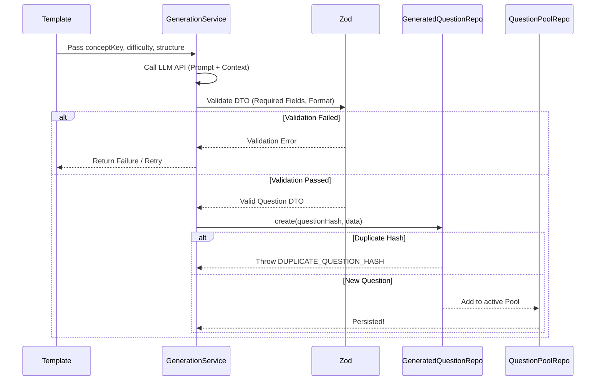

# Generation & Storage Flow

This document outlines the end-to-end process of generating questions via the AI Core and persisting them safely to the Question Pool, avoiding duplicates.

## Flow Description

1. **Templates**: Supply the deterministic seed structure, including `conceptKey` and constraints.
2. **GenerationService**: Reaches out to the LLM backend to construct the question.
3. **DTO Validation**: Zod is used to immediately validate the output structure and verify that metadata matches requirements.
4. **Question Storage**: The `GeneratedQuestionRepository` hashes the question to ensure strict duplicate prevention (using Prisma's `P2002` error).
5. **Pool Management**: Questions successfully saved are immediately available in the `QuestionPoolRepository` for retrieval by test configs.
