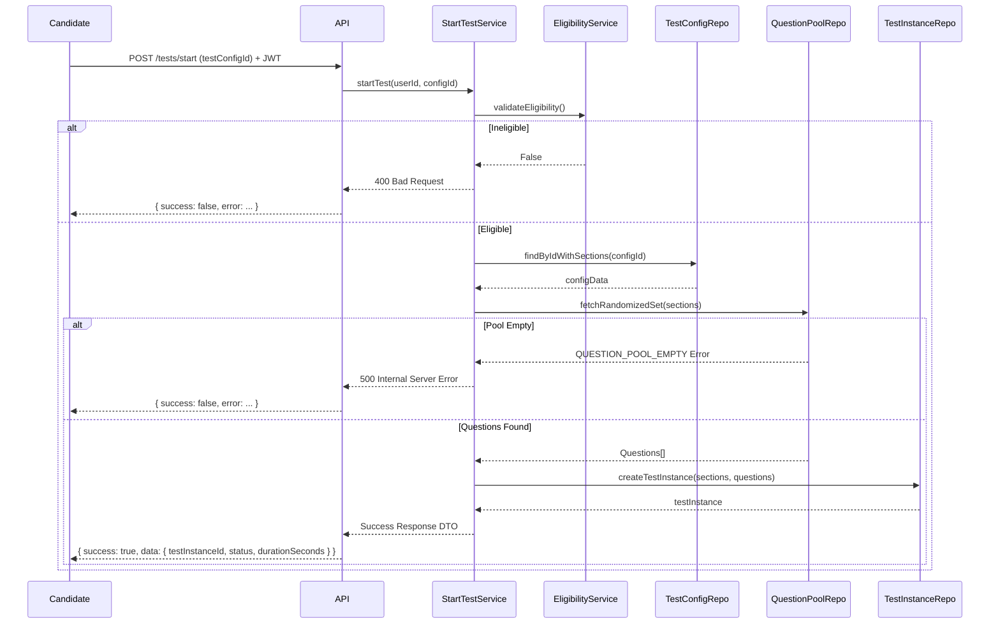

# Test Start Flow

This document details the HTTP sequence and internal service coordination for a candidate initiating an assessment via `POST /tests/start`.

## Error Scenarios Checked

1. **Unauthorized / Invalid Token**: Fails at `JwtAuthGuard` before reaching the controller.
2. **User Not Eligible**: `EligibilityService` denies access (e.g., test already taken).
3. **Invalid Config**: The `testConfigId` doesn't exist in the database.
4. **Insufficient Question Pool**: The database does not contain enough generated questions matching the config section criteria.
