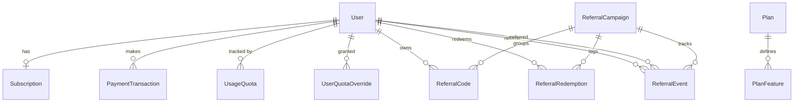
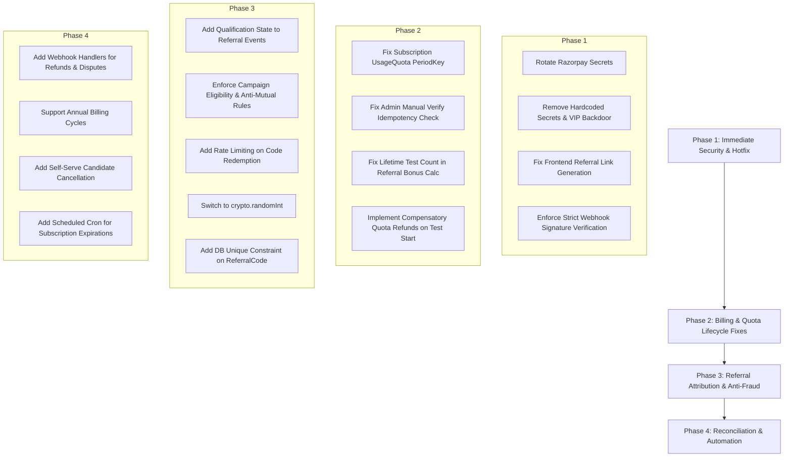

# Comprehensive Technical Audit: Referral & Subscription Systems
**SkillitriX InterVu AI Platform**  
**Target Modules:** `apps/api/src/modules/billing`, `apps/api/src/modules/referrals`, `apps/web/src/app/plans`, `apps/web/src/app/candidate/referrals`, `apps/web/src/modules/candidate/components/CandidateReferralCard.tsx`, `packages/database/prisma/schema.prisma`

---

## Table of Contents
1. [Executive Summary & Risk Matrix](#1-executive-summary--risk-matrix)
2. [Architecture & Data Model Overview](#2-architecture--data-model-overview)
3. [Critical Security Vulnerabilities](#3-critical-security-vulnerabilities)
4. [Severe Functional & Business Logic Bugs](#4-severe-functional--business-logic-bugs)
5. [Referral Fraud, Anti-Sybil & Abuse Vectors](#5-referral-fraud-anti-sybil--abuse-vectors)
6. [Subscription Lifecycle & Webhook Gaps](#6-subscription-lifecycle--webhook-gaps)
7. [Prioritized Remediation Roadmap](#7-prioritized-remediation-roadmap)

---

## 1. Executive Summary & Risk Matrix

A comprehensive code and architecture audit was conducted across the **Subscription / Billing Engine** and the **Referral Program System** of the SkillitriX InterVu AI codebase.

The audit revealed **critical credential exposures**, **payment bypass vulnerabilities**, **game-breaking quota bugs** (including subscribers being permanently locked out after month 1), and **critical UI breakdown** where candidate referral links are distributed without referral tracking parameters.

### Issue Summary Matrix

| ID | Category | Title | Severity | Impact |
| :--- | :--- | :--- | :--- | :--- |
| **SEC-01** | Security | Hardcoded Razorpay Production Live Secret Keys | **CRITICAL** | Full compromise of payment gateway and funds |
| **SEC-02** | Security | Webhook Signature Verification Bypass in Non-Production | **HIGH** | Free unlimited subscription grants in dev/staging |
| **SEC-03** | Security | Hardcoded VIP Email Backdoor to 2099 | **HIGH** | Arbitrary unlimited tier bypass via email aliases |
| **SEC-04** | Security | Unrestricted Code Brute-Forcing (No Rate Limiting) | **MEDIUM** | Automated discovery of unredeemed promo codes |
| **SEC-05** | Security | Insecure Random Code Generation via `Math.random()` | **MEDIUM** | Predictable referral tokens |
| **SEC-06** | Security | Missing Input Validation / Unchecked Payloads on Admin APIs | **MEDIUM** | Malformed JSON injection, crashes, and corruption |
| **BUG-01** | Logic Bug | Candidate Referral Links Strip Referral Codes on UI | **CRITICAL** | 100% loss of candidate referral attribution |
| **BUG-02** | Logic Bug | Monthly Quota Never Resets for Active Subscribers | **CRITICAL** | Subscribers permanently locked out in Month 2+ |
| **BUG-03** | Logic Bug | Admin Manual Payment Verification Completely Ineffective | **HIGH** | Legitimate manual activations fail silently |
| **BUG-04** | Logic Bug | Lifetime Test Count Inappropriately Docks Bonus Quotas | **HIGH** | Referral rewards invalidated by past test attempts |
| **BUG-05** | Logic Bug | Permanent Round Loss on Test Creation / Assembly Failures | **HIGH** | Non-refundable quota consumption on server errors |
| **BUG-06** | Logic Bug | Plan Deletion Instantly Downgrades Active Paid Users | **HIGH** | Paid users degraded to Free tier without warning |
| **BUG-07** | Logic Bug | Admin Dashboard Always Shows 0 Usage for Subscribers | **MEDIUM** | Metrics and oversight blindness |
| **FRAUD-01** | Abuse | Instant Reward Distribution on Raw Registration | **HIGH** | Fake accounts farm unlimited test rounds |
| **FRAUD-02** | Abuse | Lack of Anti-Sybil / Self-Referral Safeguards | **HIGH** | Automated scripts bypass multi-accounting rules |
| **FRAUD-03** | Abuse | No Circular / Mutual Referral Detection | **MEDIUM** | Users A & B refer each other for double bonuses |
| **FRAUD-04** | Concurrency | Race Condition on Personal Code Generation | **MEDIUM** | Candidate receives multiple competing codes |
| **BILL-01** | Billing | Early Subscription Renewals Wipe Remaining Paid Days | **HIGH** | Customers penalized for early renewals |
| **BILL-02** | Billing | Unhandled Refund, Dispute, and Chargeback Webhooks | **HIGH** | Refunded users keep paid access indefinitely |
| **BILL-03** | Billing | Webhook Drops Captured Payments if `notes.userId` Missing | **MEDIUM** | Webhook fails to reconcile via local order record |
| **BILL-04** | Billing | Yearly Billing Completely Ignored (Always Bills Monthly Price) | **MEDIUM** | Revenue loss on annual checkout options |
| **BILL-05** | Billing | No Self-Serve Cancellation for Candidates | **LOW** | Increased dispute/support overhead |

---

## 2. Architecture & Data Model Overview

### Database Schema Entity Relationships



### Core Subsystems
1. **Billing & Subscriptions (`apps/api/src/modules/billing`)**:
   - `SubscriptionService`: Core lifecycle, VIP status checks, status evaluations, and atomic payment processing.
   - `EntitlementService`: Translates active subscriptions, plans, features, and user overrides into concrete capabilities.
   - `UsageQuotaService`: Handles monthly and subscription-bound quota tracking (`roundsUsed`, `questionsAttempted`).
   - `RazorpayService`: Communicates with Razorpay API, generates orders, and verifies HMAC-SHA256 signatures.
   - `RazorpayWebhookController`: Processes asynchronous webhook notifications (`payment.captured`, `subscription.charged`, etc.).
   - `PlanManagementService`: CRUD for pricing tiers and dynamic feature limitations.
   - `SubscriptionAdminService`: Admin-facing candidate plan manipulation and overrides.

2. **Referral Engine (`apps/api/src/modules/referrals`)**:
   - `ReferralEngineService`: Endpoints for candidate status, code redemption transactions, and candidate-to-candidate attribution.
   - `ReferralCampaignService`: Campaign CRUD, quota limits, and lifecycle stats.
   - `ReferralCodeService`: Unique code generation and status toggles.
   - `ReferralRewardService`: Translates campaign JSON reward configurations into `UserQuotaOverride` records.

---

## 3. Critical Security Vulnerabilities

### SEC-01: Hardcoded Razorpay Production Live Secret Keys
- **Severity**: **CRITICAL**
- **Locations**:
  - [`apps/api/src/modules/billing/services/razorpay.service.ts`](file:///c:/Users/Bhush/Desktop/intervu-ai/apps/api/src/modules/billing/services/razorpay.service.ts#L29-L36)
  - [`apps/web/src/app/plans/page.tsx`](file:///c:/Users/Bhush/Desktop/intervu-ai/apps/web/src/app/plans/page.tsx#L110-L114)
- **Code Snippet**:
  ```typescript
  // apps/api/src/modules/billing/services/razorpay.service.ts
  this.keyId =
    this.configService.get<string>("RAZORPAY_KEY_ID") ||
    "rzp_live_TX7JsRywgX7pvg";
  this.keySecret =
    this.configService.get<string>("RAZORPAY_KEY_SECRET") ||
    "EpkObpbLlEH9KwLQtu1Gv6aq";
  this.webhookSecret =
    this.configService.get<string>("RAZORPAY_WEBHOOK_SECRET") ||
    "EpkObpbLlEH9KwLQtu1Gv6aq";
  ```
  ```typescript
  // apps/web/src/app/plans/page.tsx
  const razorpayKey =
    order.keyId ||
    process.env.NEXT_PUBLIC_RAZORPAY_KEY_ID ||
    'rzp_live_TX7JsRywgX7pvg';
  ```
- **Vulnerability Analysis**:
  1. Live production API credentials (`rzp_live_...`) and the secret key (`EpkObpb...`) are hardcoded in the codebase as fallbacks.
  2. If the environment variables are misconfigured, omitted in container environments, or if code is leaked/decompiled, an attacker obtains full programmatic access to the merchant Razorpay account.
  3. The secret key is also used as a fallback for `RAZORPAY_WEBHOOK_SECRET`, permitting forged webhook payloads.
  4. The client bundle in `apps/web` directly exposes the live key identifier.
- **Remediation**:
  - Immediately rotate the Razorpay Key Secret and Webhook Secret in the Razorpay Dashboard.
  - Remove all hardcoded credential fallbacks. Throw a fatal error on service bootstrap if `RAZORPAY_KEY_ID`, `RAZORPAY_KEY_SECRET`, or `RAZORPAY_WEBHOOK_SECRET` are missing.

---

### SEC-02: Webhook Signature Verification Bypass in Non-Production
- **Severity**: **HIGH**
- **Location**: [`apps/api/src/modules/billing/controllers/razorpay-webhook.controller.ts`](file:///c:/Users/Bhush/Desktop/intervu-ai/apps/api/src/modules/billing/controllers/razorpay-webhook.controller.ts#L50-L55)
- **Code Snippet**:
  ```typescript
  const isValid = this.razorpayService.verifyWebhookSignature(rawBody, signature);

  if (!isValid && process.env.NODE_ENV === "production") {
    this.logger.error("Razorpay webhook signature verification failed");
    throw new UnauthorizedException("Invalid Razorpay signature");
  }
  ```
- **Vulnerability Analysis**:
  Whenever `NODE_ENV !== "production"` (e.g., staging, QA, dev, preview deployments, or if `NODE_ENV` is unset):
  1. An invalid or completely omitted webhook signature logs a warning but proceeds directly to processing.
  2. Any external actor can POST to `/api/v1/webhooks/razorpay` with a crafted `payment.captured` payload and elevate any candidate account to a paid subscription without paying.
- **Remediation**:
  Enforce signature verification unconditionally across all environments. If mock testing is needed in integration test suites, mock the `RazorpayService.verifyWebhookSignature` method in unit/E2E test setup rather than disabling security in runtime controllers.

---

### SEC-03: Hardcoded VIP Email Backdoor to Year 2099
- **Severity**: **HIGH**
- **Locations**:
  - [`apps/api/src/modules/billing/services/subscription.service.ts`](file:///c:/Users/Bhush/Desktop/intervu-ai/apps/api/src/modules/billing/services/subscription.service.ts#L28-L53)
  - [`apps/api/src/modules/billing/services/entitlement.service.ts`](file:///c:/Users/Bhush/Desktop/intervu-ai/apps/api/src/modules/billing/services/entitlement.service.ts#L23-L69)
- **Code Snippet**:
  ```typescript
  private async isVipUser(userId: string): Promise<boolean> {
    try {
      const user = await this.prisma.user.findUnique({
        where: { id: userId },
        select: { email: true, role: true },
      });
      if (!user) return false;
      const email = user.email?.toLowerCase().trim();
      return email === "candidate@intervu.ai" || email === "admin@intervu.ai";
    } catch {
      return false;
    }
  }
  ```
- **Vulnerability Analysis**:
  - Any user with the email `candidate@intervu.ai` or `admin@intervu.ai` bypasses all payment checks, subscription statuses, and quota limits, receiving `VIP_UNLIMITED` access until `2099-12-31`.
  - If email registration does not enforce domain verification or allow email updates, an unauthorized user claiming these emails gains permanent free access.
  - Production code must never contain hardcoded email-based privilege escalation.
- **Remediation**:
  Remove hardcoded email comparisons. If internal test accounts require special access, assign them a specific database role (`ADMIN` / `INTERNAL_TESTER`) or use standard `UserQuotaOverride` records with documented admin audit trails.

---

### SEC-04: Unrestricted Code Brute-Forcing (No Rate Limiting)
- **Severity**: **MEDIUM**
- **Location**: [`apps/api/src/modules/referrals/controllers/candidate-referrals.controller.ts`](file:///c:/Users/Bhush/Desktop/intervu-ai/apps/api/src/modules/referrals/controllers/candidate-referrals.controller.ts#L18-L46)
- **Vulnerability Analysis**:
  - `POST /candidate/referrals/redeem` does not have rate-limiting applied.
  - Because referral codes are 8 characters chosen from 32 alphanumeric characters (`ABCDEFGHJKLMNPQRSTUVWXYZ23456789`), an automated bot can execute dictionary or high-throughput brute-force guessing to discover unredeemed or high-value company promotional codes.
- **Remediation**:
  Apply `@RateLimitCategory('strict')` or a dedicated Redis-backed rate limiter on code redemption (e.g., maximum 5 attempts per user per 15 minutes, with progressive exponential backoff).

---

### SEC-05: Insecure Random Code Generation via `Math.random()`
- **Severity**: **MEDIUM**
- **Locations**:
  - [`apps/api/src/modules/referrals/services/referral-engine.service.ts`](file:///c:/Users/Bhush/Desktop/intervu-ai/apps/api/src/modules/referrals/services/referral-engine.service.ts#L347-L354)
  - [`apps/api/src/modules/referrals/services/referral-code.service.ts`](file:///c:/Users/Bhush/Desktop/intervu-ai/apps/api/src/modules/referrals/services/referral-code.service.ts#L10-L17)
- **Code Snippet**:
  ```typescript
  private generateRandomCode(): string {
    const chars = 'ABCDEFGHJKLMNPQRSTUVWXYZ23456789';
    let code = '';
    for (let i = 0; i < 8; i++) {
      code += chars.charAt(Math.floor(Math.random() * chars.length));
    }
    return code;
  }
  ```
- **Vulnerability Analysis**:
  `Math.random()` is not cryptographically secure. The V8 implementation uses xorshift128+, which allows internal state reconstruction from a sequence of observed outputs. Generated referral codes can be predicted.
- **Remediation**:
  Use `crypto.randomInt` from Node's built-in `crypto` module:
  ```typescript
  import { randomInt } from 'crypto';
  // ...
  for (let i = 0; i < 8; i++) {
    code += chars.charAt(randomInt(0, chars.length));
  }
  ```

---

### SEC-06: Missing Input Validation on Admin APIs (`body: any`)
- **Severity**: **MEDIUM**
- **Location**: [`apps/api/src/modules/referrals/controllers/admin-referrals.controller.ts`](file:///c:/Users/Bhush/Desktop/intervu-ai/apps/api/src/modules/referrals/controllers/admin-referrals.controller.ts#L49-L63)
- **Vulnerability Analysis**:
  - `createCampaign(@Body() body: any)` and `updateCampaign(@Body() body: any)` bypass validation pipes.
  - An administrator or compromised `PLAN_MANAGER` token can inject malformed JSON into `referrerRewardConfig`, `refereeRewardConfig`, or `eligibilityConfig`.
  - Negative values can be passed for `totalRedemptionLimit`, causing integer underflow/overflow bugs during redemption counter checks.
  - Invalid date strings passed to `startsAt`/`endsAt` result in `new Date("invalid")` (`NaN`), breaking date comparisons (`endsAt < now`).
- **Remediation**:
  Enforce contract DTOs with Zod validation pipes (`CreateReferralCampaignSchema`, `UpdateReferralCampaignSchema`).

---

## 4. Severe Functional & Business Logic Bugs

### BUG-01: Candidate Referral Links Strip Referral Codes on UI
- **Severity**: **CRITICAL**
- **Location**: [`apps/web/src/modules/candidate/components/CandidateReferralCard.tsx`](file:///c:/Users/Bhush/Desktop/intervu-ai/apps/web/src/modules/candidate/components/CandidateReferralCard.tsx#L67-L76)
- **Code Snippet**:
  ```typescript
  const effectiveReferralLink = useMemo(() => {
    let domain = 'https://app.skillitrix.com';
    if (typeof window !== 'undefined' && window.location.origin) {
      if (window.location.origin.includes('skillitrix.com')) {
        domain = window.location.origin;
      }
    }

    return `${domain}/signup`; // <-- BUG: status?.personalCode is completely omitted!
  }, []);
  ```
- **Impact**:
  1. The backend generates a personal referral code and link (e.g. `https://app.skillitrix.com/signup?ref=K9J3XZ82`).
  2. The frontend component overrides it with `effectiveReferralLink`, which returns plain `https://app.skillitrix.com/signup`.
  3. All sharing mechanisms—**Copy Link, WhatsApp, LinkedIn, X (Twitter), Telegram, and Email**—distribute a link **without the referral code**.
  4. Any candidate referred via these links lands on the signup page with zero attribution. The referral is never tracked, and neither party receives their earned reward.
- **Fix**:
  ```typescript
  const effectiveReferralLink = useMemo(() => {
    let domain = 'https://app.skillitrix.com';
    if (typeof window !== 'undefined' && window.location.origin) {
      domain = window.location.origin;
    }
    const code = status?.personalCode;
    return code ? `${domain}/signup?ref=${code}` : `${domain}/signup`;
  }, [status?.personalCode]);
  ```

---

### BUG-02: Monthly Quota Never Resets for Active Subscribers
- **Severity**: **CRITICAL**
- **Locations**:
  - [`apps/api/src/modules/billing/services/usage-quota.service.ts`](file:///c:/Users/Bhush/Desktop/intervu-ai/apps/api/src/modules/billing/services/usage-quota.service.ts#L17-L22)
  - [`apps/api/src/modules/billing/services/subscription.service.ts`](file:///c:/Users/Bhush/Desktop/intervu-ai/apps/api/src/modules/billing/services/subscription.service.ts#L539-L561)
- **Code Snippet**:
  ```typescript
  // UsageQuotaService
  getQuotaKey(subscriptionId?: string): string {
    if (subscriptionId) {
      return `sub_${subscriptionId}`; // Static key tied to DB subscription ID
    }
    return this.getCurrentPeriodKey();
  }
  ```
- **Impact**:
  1. For a user on a paid plan with an existing subscription record, their usage quota record has `periodKey = "sub_" + subscription.id`.
  2. Because the subscription row is upserted, `subscription.id` never changes across monthly renewal cycles.
  3. When the user renews in Month 2 (or when Razorpay fires `subscription.charged`), `SubscriptionService.processPaymentSuccess` extends `currentPeriodEnd` by 30 days, but **does not reset or touch `UsageQuota`**.
  4. The user's `roundsUsed` remains at 20/20 from Month 1.
  5. In Month 2, `roundsRemaining` is calculated as `20 - 20 = 0`. The paying customer is **blocked from taking any assessments** despite paying for a new month.
- **Fix**:
  Tie subscription quota keys to both the subscription ID and the billing cycle period (e.g. `sub_${subscriptionId}_${cycleKey}`), or explicitly reset `roundsUsed: 0` inside `processPaymentSuccess` whenever a new charge or renewal is processed.

---

### BUG-03: Admin Manual Payment Verification Completely Ineffective
- **Severity**: **HIGH**
- **Locations**:
  - [`apps/api/src/modules/billing/services/payment-management.service.ts`](file:///c:/Users/Bhush/Desktop/intervu-ai/apps/api/src/modules/billing/services/payment-management.service.ts#L151-L163)
  - [`apps/api/src/modules/billing/services/subscription.service.ts`](file:///c:/Users/Bhush/Desktop/intervu-ai/apps/api/src/modules/billing/services/subscription.service.ts#L507-L516)
- **Code Snippet**:
  ```typescript
  // In payment-management.service.ts:
  const subscription = await this.subscriptionService.processPaymentSuccess({
    userId: transaction.userId,
    plan,
    razorpayPaymentId: transaction.razorpayPaymentId, // e.g. "pending_order_123"
    ...
  });

  // In subscription.service.ts (processPaymentSuccess):
  const existingTx = await this.prisma.paymentTransaction.findUnique({
    where: { razorpayPaymentId },
  });

  if (existingTx) {
    this.logger.log(`[IDEMPOTENT] Payment ${razorpayPaymentId} already processed. Returning active subscription.`);
    return this.prisma.subscription.findUnique({ where: { userId } });
  }
  ```
- **Impact**:
  1. A pending transaction row is stored in the database with `razorpayPaymentId: "pending_" + orderId` and `status: PENDING`.
  2. When an admin clicks "Manual Verify" in the Admin Dashboard, `manualVerifyPayment` calls `processPaymentSuccess` with that transaction's `razorpayPaymentId`.
  3. `processPaymentSuccess` executes step 1: looking up `paymentTransaction.findUnique({ where: { razorpayPaymentId } })`.
  4. The pending record is found.
  5. The method assumes any existing record means the payment was already successfully processed—**without checking `existingTx.status === SUCCESS`**!
  6. It exits early and returns the unchanged subscription. The subscription is never activated, the transaction status is never updated to `SUCCESS`, and the candidate remains unupgraded.
- **Fix**:
  Only short-circuit idempotency if `existingTx.status === PaymentStatus.SUCCESS`:
  ```typescript
  if (existingTx && existingTx.status === PaymentStatus.SUCCESS) {
    return this.prisma.subscription.findUnique({ where: { userId } });
  }
  ```

---

### BUG-04: Lifetime Test Count Inappropriately Docks Referral Bonus Quotas
- **Severity**: **HIGH**
- **Location**: [`apps/api/src/modules/billing/services/subscription.service.ts`](file:///c:/Users/Bhush/Desktop/intervu-ai/apps/api/src/modules/billing/services/subscription.service.ts#L148-L160)
- **Code Snippet**:
  ```typescript
  const instanceCount = await this.prisma.testInstance.count({
    where: {
      userId,
      status: { in: ['SUBMITTED', 'COMPLETED'] },
    },
  });
  used = Math.max(used, instanceCount);

  if (bonus > used) {
    hasRemainingReferralReward = true;
    totalRemainingAttempts += (bonus - used);
    if (override.reason) reasons.push(override.reason);
  }
  ```
- **Impact**:
  1. Suppose a candidate has taken 5 tests over the course of their account lifetime.
  2. The candidate refers a friend and is awarded `bonusRounds: 1`.
  3. When `getSubscriptionStatus` calculates referral bonuses, `instanceCount` is 5 (lifetime completed tests).
  4. `used = Math.max(used, 5) = 5`.
  5. The check `if (bonus > used)` evaluates `1 > 5`, which is **false**.
  6. The referral reward is immediately considered consumed. The candidate never receives their bonus round.
- **Fix**:
  Test count must only be evaluated for tests completed **after** the override grant timestamp (`createdAt > override.createdAt`), rather than lifetime tests.

---

### BUG-05: Permanent Round Loss on Test Creation / Assembly Failures
- **Severity**: **HIGH**
- **Location**: [`apps/api/src/modules/tests/start-test/start-test.service.ts`](file:///c:/Users/Bhush/Desktop/intervu-ai/apps/api/src/modules/tests/start-test/start-test.service.ts#L88-L230)
- **Impact**:
  1. At line 90, `this.entitlementService.consumeRound(userId)` executes and increments `roundsUsed`.
  2. If question assembly (`assemblyService.assembleTest`), dynamic AI generation, or database write fails downstream (lines 158, 203, 226, 237):
  3. The exception is thrown to the candidate, but **no refund or rollback of the consumed round** is performed.
  4. On a Free or rate-limited tier, users lose their limited test quota due to transient server/AI errors.
- **Fix**:
  Wrap test initiation in a try-catch block that invokes a compensatory `usageQuotaService.refundRoundQuota(userId, subscriptionId)` if assembly fails, or reserve quota conditionally only upon successful instance persistence.

---

### BUG-06: Plan Deletion Instantly Downgrades Active Paid Users
- **Severity**: **HIGH**
- **Location**: [`apps/api/src/modules/billing/services/plan-management.service.ts`](file:///c:/Users/Bhush/Desktop/intervu-ai/apps/api/src/modules/billing/services/plan-management.service.ts#L253-L264)
- **Impact**:
  1. `deletePlan(id)` deletes the `Plan` record and cascades to delete all associated `PlanFeature` rows.
  2. `Subscription` rows refer to plans via a string slug (`plan: "PRO"`), not a strict foreign key.
  3. If a plan is deleted, `getSubscriptionStatus` and `getUserEntitlements` fail to find `dbPlan`.
  4. The code falls back to hardcoded `PLAN_ENTITLEMENT_DEFINITIONS.FREE`.
  5. Active subscribers who already paid for that plan are instantly stripped of all premium features.
- **Fix**:
  Prohibit deleting plans that have active subscribers (`count({ where: { plan: slug, status: 'ACTIVE' } }) > 0`). Require archiving (`isActive = false`) instead of hard deletion.

---

### BUG-07: Admin Dashboard Always Shows 0 Usage for Subscribers
- **Severity**: **MEDIUM**
- **Location**: [`apps/api/src/modules/billing/services/subscription-admin.service.ts`](file:///c:/Users/Bhush/Desktop/intervu-ai/apps/api/src/modules/billing/services/subscription-admin.service.ts#L44-L83)
- **Code Snippet**:
  ```typescript
  const currentPeriodKey = new Date().toISOString().slice(0, 7); // YYYY-MM
  // ...
  usageQuotas: {
    where: { periodKey: currentPeriodKey },
    take: 1,
  },
  // ...
  roundsUsed: usage?.roundsUsed || 0,
  ```
- **Impact**:
  Subscribers have `periodKey = "sub_" + subscription.id`. They do not have records with `periodKey = "YYYY-MM"`. Therefore, `u.usageQuotas` is always empty `[]`, and the admin table displays `0` rounds used for all paying subscribers.
- **Fix**:
  Query `usageQuotas` by matching `userId` and either `periodKey: currentPeriodKey` OR `subscriptionId: sub.id`.

---

## 5. Referral Fraud, Anti-Sybil & Abuse Vectors

### FRAUD-01: Instant Reward Distribution on Raw Registration
- **Severity**: **HIGH**
- **Locations**:
  - [`apps/api/src/modules/referrals/services/referral-engine.service.ts`](file:///c:/Users/Bhush/Desktop/intervu-ai/apps/api/src/modules/referrals/services/referral-engine.service.ts#L137-L210)
  - [`apps/api/src/modules/auth/services/auth.service.ts`](file:///c:/Users/Bhush/Desktop/intervu-ai/apps/api/src/modules/auth/services/auth.service.ts#L71-L79)
- **Vulnerability Mechanics**:
  When a candidate registers via `/auth/signup` or `/auth/google` with a referral code:
  1. `auth.service.ts` calls `referralEngine.redeemCode()`.
  2. `redeemCode` immediately invokes `processReferralEvent`.
  3. `processReferralEvent` immediately sets `status = 'QUALIFIED'`, grants the reward override to the referrer, and sets `status = 'REWARDED'`.
  4. The event never enters a `PENDING` validation state.
  5. Any user can write a 10-line script to register 50 dummy accounts with disposable email addresses and instantly accumulate 50 free bonus assessment rounds.
- **Remediation**:
  Referral events must be created with `status: 'PENDING'`. A qualification action (e.g. completing 1 full assessment or verifying an email address) must be required before triggering `rewardService.grantReward()`.

---

### FRAUD-02: Missing Campaign Eligibility Constraints
- **Severity**: **HIGH**
- **Locations**:
  - [`packages/contracts/src/referral.dto.ts`](file:///c:/Users/Bhush/Desktop/intervu-ai/packages/contracts/src/referral.dto.ts#L30-L36)
  - [`apps/api/src/modules/referrals/services/referral-engine.service.ts`](file:///c:/Users/Bhush/Desktop/intervu-ai/apps/api/src/modules/referrals/services/referral-engine.service.ts#L71-L98)
- **Vulnerability Mechanics**:
  `EligibilityConfigSchema` defines:
  - `requiresSubscription: boolean`
  - `minimumSignupAgeHours: number`
  However, in `referral-engine.service.ts`, **neither parameter is ever checked**.
  A candidate can create an account and immediately redeem a code, even if the campaign specifically configured a minimum signup age or active subscription requirement.

---

### FRAUD-03: No Circular / Mutual Referral Detection
- **Severity**: **MEDIUM**
- **Location**: [`apps/api/src/modules/referrals/services/referral-engine.service.ts`](file:///c:/Users/Bhush/Desktop/intervu-ai/apps/api/src/modules/referrals/services/referral-engine.service.ts#L70-L75)
- **Vulnerability Mechanics**:
  While self-referral (`referralCode.userId === userId`) is blocked, mutual referral is not:
  1. User A creates an account and shares Code A.
  2. User B creates an account and redeems Code A.
  3. User A then redeems User B's Code B.
  4. Both users receive double referee and referrer rewards.
- **Remediation**:
  Check if a reverse `ReferralEvent` exists (`where: { referrerId: userId, referredId: referralCode.userId }`). If found, reject the redemption.

---

### FRAUD-04: Race Condition on Personal Code Creation
- **Severity**: **MEDIUM**
- **Location**: [`apps/api/src/modules/referrals/services/referral-engine.service.ts`](file:///c:/Users/Bhush/Desktop/intervu-ai/apps/api/src/modules/referrals/services/referral-engine.service.ts#L280-L302)
- **Vulnerability Mechanics**:
  In `computeCandidateReferralStatus`:
  ```typescript
  let existingCode = await this.prisma.referralCode.findFirst({
    where: { campaignId: candidateCampaign.id, userId, isActive: true },
  });
  if (!existingCode) {
    // ... generate code ...
    existingCode = await this.prisma.referralCode.create({ ... });
  }
  ```
  `schema.prisma` does not have a unique index on `@@unique([campaignId, userId])`. Two concurrent requests from a candidate dashboard will both observe `existingCode === null` and insert two active personal referral codes for the same candidate.

---

## 6. Subscription Lifecycle & Webhook Gaps

### BILL-01: Early Subscription Renewals Wipe Remaining Paid Days
- **Severity**: **HIGH**
- **Location**: [`apps/api/src/modules/billing/services/subscription.service.ts`](file:///c:/Users/Bhush/Desktop/intervu-ai/apps/api/src/modules/billing/services/subscription.service.ts#L502-L505)
- **Code Snippet**:
  ```typescript
  const periodEnd =
    currentPeriodEnd ||
    new Date(Date.now() + 30 * 24 * 60 * 60 * 1000); // 30 days period
  ```
- **Impact**:
  If an existing subscriber has 12 days remaining on their current period and purchases a renewal or extension, `currentPeriodEnd` is reset to `Date.now() + 30 days`. The user loses the 12 days they had already paid for.
- **Fix**:
  If an active subscription has a future `currentPeriodEnd`, extend from that date:
  ```typescript
  const baseDate = (existingSub?.currentPeriodEnd && existingSub.currentPeriodEnd > now)
    ? existingSub.currentPeriodEnd
    : now;
  const periodEnd = new Date(baseDate.getTime() + 30 * 24 * 60 * 60 * 1000);
  ```

---

### BILL-02: Missing Webhook Handlers for Refunds, Disputes & Chargebacks
- **Severity**: **HIGH**
- **Location**: [`apps/api/src/modules/billing/controllers/razorpay-webhook.controller.ts`](file:///c:/Users/Bhush/Desktop/intervu-ai/apps/api/src/modules/billing/controllers/razorpay-webhook.controller.ts#L73-L164)
- **Impact**:
  The switch statement only processes `payment.captured`, `order.paid`, `payment.failed`, `subscription.activated`, `subscription.charged`, `subscription.cancelled`, and `subscription.halted`.
  It lacks handlers for:
  - `refund.created` / `refund.processed`
  - `payment.disputed` / `dispute.created`
  When a refund is granted in Razorpay, the database transaction remains `SUCCESS`, the subscription remains `ACTIVE`, and the candidate retains premium access.

---

### BILL-03: Webhook Drops Captured Payments if `notes.userId` Missing
- **Severity**: **MEDIUM**
- **Location**: [`apps/api/src/modules/billing/controllers/razorpay-webhook.controller.ts`](file:///c:/Users/Bhush/Desktop/intervu-ai/apps/api/src/modules/billing/controllers/razorpay-webhook.controller.ts#L76-L81)
- **Impact**:
  If Razorpay omits notes on `payment.captured`, `notes?.userId` is undefined. The controller immediately exits without activating the subscription, even though the order ID exists in the payload and could be cross-referenced against `payment_transactions.razorpayOrderId`.

---

### BILL-04: Yearly Billing Completely Ignored
- **Severity**: **MEDIUM**
- **Locations**:
  - [`apps/api/src/modules/billing/services/razorpay.service.ts`](file:///c:/Users/Bhush/Desktop/intervu-ai/apps/api/src/modules/billing/services/razorpay.service.ts#L77)
  - [`apps/api/src/modules/billing/services/plan-management.service.ts`](file:///c:/Users/Bhush/Desktop/intervu-ai/apps/api/src/modules/billing/services/plan-management.service.ts#L126)
- **Impact**:
  `createOrder` ignores `dto.billingCycle` and unconditionally charges `plan.priceMonthly`. An annual plan cannot be selected or billed accurately.

---

### BILL-05: Missing Candidate Self-Serve Cancellation
- **Severity**: **LOW**
- **Location**: [`apps/api/src/modules/billing/controllers/billing.controller.ts`](file:///c:/Users/Bhush/Desktop/intervu-ai/apps/api/src/modules/billing/controllers/billing.controller.ts)
- **Impact**:
  Candidates have no endpoint to request cancellation or disable auto-renewal at period end (`cancelAtPeriodEnd: true`). All cancellations require manual admin intervention.

---

## 7. Prioritized Remediation Roadmap



### Action Plan by Phase

#### Phase 1: Immediate Security & Frontend Hotfix (Day 1)
1. **Secret Rotation**: Rotate `RAZORPAY_KEY_SECRET` and `RAZORPAY_WEBHOOK_SECRET` in Razorpay Dashboard. Remove hardcoded strings from [`razorpay.service.ts`](file:///c:/Users/Bhush/Desktop/intervu-ai/apps/api/src/modules/billing/services/razorpay.service.ts) and [`plans/page.tsx`](file:///c:/Users/Bhush/Desktop/intervu-ai/apps/web/src/app/plans/page.tsx).
2. **Remove Backdoor**: Delete `isVipUser` email bypass in [`subscription.service.ts`](file:///c:/Users/Bhush/Desktop/intervu-ai/apps/api/src/modules/billing/services/subscription.service.ts) and [`entitlement.service.ts`](file:///c:/Users/Bhush/Desktop/intervu-ai/apps/api/src/modules/billing/services/entitlement.service.ts).
3. **Fix Candidate Referral Link**: Update [`CandidateReferralCard.tsx`](file:///c:/Users/Bhush/Desktop/intervu-ai/apps/web/src/modules/candidate/components/CandidateReferralCard.tsx) to attach `?ref=${status.personalCode}` so referral links correctly track signups.
4. **Mandatory Webhook Verification**: Remove `process.env.NODE_ENV === "production"` condition in [`razorpay-webhook.controller.ts`](file:///c:/Users/Bhush/Desktop/intervu-ai/apps/api/src/modules/billing/controllers/razorpay-webhook.controller.ts).

#### Phase 2: Billing Engine & Quota Fixes (Days 2–3)
1. **Quota Renewal Reset**: In [`subscription.service.ts`](file:///c:/Users/Bhush/Desktop/intervu-ai/apps/api/src/modules/billing/services/subscription.service.ts#L539), reset `roundsUsed` or increment the billing cycle in `UsageQuota` when recurring payments succeed.
2. **Fix Manual Verification**: In `processPaymentSuccess`, check `existingTx.status === 'SUCCESS'` before short-circuiting.
3. **Fix Lifetime Test Count**: In `SubscriptionService.getSubscriptionStatus`, count only test instances created **after** `override.createdAt`.
4. **Compensatory Quota Rollback**: In `start-test.service.ts`, refund quota if downstream test assembly fails.

#### Phase 3: Referral System Hardening & Anti-Fraud (Days 4–5)
1. **Pending Qualification Flow**: Do not award referral bonuses immediately upon registration. Set `ReferralEvent.status = 'PENDING'` until the referred candidate completes their first test.
2. **Mutual Referral Prevention**: Block candidate B from redeeming A if A previously redeemed B.
3. **Rate Limiting**: Apply `@RateLimitCategory('strict')` to `/candidate/referrals/redeem`.
4. **CSPRNG**: Replace `Math.random()` with Node's `crypto.randomInt()`.
5. **Database Constraint**: Add `@@unique([campaignId, userId])` to `ReferralCode` in `schema.prisma`.

#### Phase 4: Lifecycle Automation (Week 2)
1. **Refund / Dispute Handlers**: Add handlers for `refund.processed` and `dispute.created` in `razorpay-webhook.controller.ts`.
2. **Yearly Billing Support**: Respect `billingCycle === 'yearly'` and charge `plan.priceYearly`.
3. **Candidate Self-Cancellation**: Expose `POST /billing/cancel` allowing candidates to set `cancelAtPeriodEnd: true`.
4. **Background Reconciler**: Add a NestJS `@Cron` job to lazily mark expired subscriptions and campaigns as `EXPIRED` in the database.
